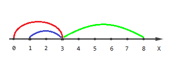
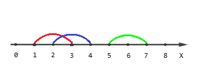

<h1 style='text-align: center;'> C. Covered Points Count</h1>

<h5 style='text-align: center;'>time limit per test: 3 seconds</h5>
<h5 style='text-align: center;'>memory limit per test: 256 megabytes</h5>

You are given $n$ segments on a coordinate line; each endpoint of every segment has integer coordinates. Some segments can degenerate to points. Segments can intersect with each other, be nested in each other or even coincide.

Your task is the following: for every $k \in [1..n]$, calculate the number of points with integer coordinates such that the number of segments that cover these points equals $k$. A segment with endpoints $l_i$ and $r_i$ covers point $x$ if and only if $l_i \le x \le r_i$.

#### Input

The first line of the input contains one integer $n$ ($1 \le n \le 2 \cdot 10^5$) — the number of segments.

The next $n$ lines contain segments. The $i$-th line contains a pair of integers $l_i, r_i$ ($0 \le l_i \le r_i \le 10^{18}$) — the endpoints of the $i$-th segment.

#### Output

Print $n$ space separated integers $cnt_1, cnt_2, \dots, cnt_n$, where $cnt_i$ is equal to the number of points such that the number of segments that cover these points equals to $i$.

## Examples

#### Input


```text
3  
0 3  
1 3  
3 8  

```
#### Output


```text
6 2 1   

```
#### Input


```text
3  
1 3  
2 4  
5 7  

```
#### Output


```text
5 2 0   

```
## Note

The picture describing the first example:



Points with coordinates $[0, 4, 5, 6, 7, 8]$ are covered by one segment, points $[1, 2]$ are covered by two segments and point $[3]$ is covered by three segments.

The picture describing the second example:



Points $[1, 4, 5, 6, 7]$ are covered by one segment, points $[2, 3]$ are covered by two segments and there are no points covered by three segments.


#### Tags 

#1700 #NOT OK #data_structures #implementation #sortings 

## Blogs
- [All Contest Problems](../Educational_Codeforces_Round_46_(Rated_for_Div._2).md)
- [Announcement](../blogs/Announcement.md)
- [Tutorial (en)](../blogs/Tutorial_(en).md)
