# https:_codeforces.com_blog_entry_60319

*(text courtesy of my colleague Chris Granade)*

A quantum oracle *O* is a "black box" operation that is used as input to another algorithm. Often, such operations are defined using a classical function *f*: {0, 1}*n* → {0, 1}*m* which takes *n*-bit binary input and produces an *m*-bit binary output. To do so, consider a particular binary input *x* = (*x*0, *x*1, ..., *x**n* - 1). We can label qubit states as 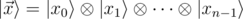.

We may first attempt to define *O* so that 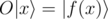, but this has a couple problems. First, *f* may have a different size of input and output (*n* ≠ *m*), such that applying *O* would change the number of qubits in the register. Second, even if *n* = *m*, the function may not be invertible: if *f*(*x*) = *f*(*y*) for some *x* ≠ *y*, then 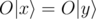 but 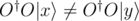. This means we won't be able to construct the adjoint operation 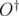, and oracles have to have an adjoint defined for them.

We can deal with both of these problems by introducing a second register of *m* qubits to hold our answer. Then we will define the effect of the oracle on all computational basis states: for all 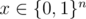 and 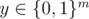, O(|x⟩⊗|y⟩)=|x⟩⊗|y⊕f(x)⟩. Now 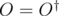 by construction, thus we have resolved both of the earlier problems.

Importantly, defining an oracle this way for each computational basis state 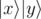 also defines how *O* acts for any other state. This follows immediately from the fact that *O*, like all quantum operations, is linear in the state that it acts on. Consider the Hadamard operation, for instance, which is defined by 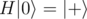 and 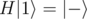. If we wish to know how *H* acts on 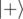, we can use that *H* is linear:

H|+⟩=12–√H(|0⟩+|1⟩)=12–√(H|0⟩+H|1⟩)=12–√(|+⟩+|−⟩)=|0⟩

In the case of defining our oracle *O*, we can similarly use that any state 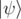 on *n* + *m* qubits can be written as

 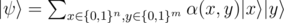Thus, the effect of the oracle *O* on this state is 

 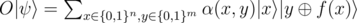