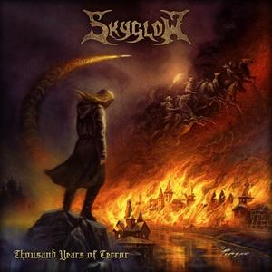

# Announcement

Hello, everyone!

We are a Death Metal band [Skyglow](https://codeforces.com/http://skyglowband.com/). Recently we released our first album. And since we happen to be sport programmers, we decided to make a Codeforces round in honor of this!

The round will take place on [Friday, July 13, 2018 at 20:35UTC+6](https://codeforces.com/https://www.timeanddate.com/worldclock/fixedtime.html?day=13&month=7&year=2018&hour=17&min=35&sec=0&p1=166). There will be five problems for each division, three of them will coincide. The problems were made up by me and [rembocoder](https://codeforces.com/profile/rembocoder "Master rembocoder"), the contest was also prepared with the help of [TeaPot](https://codeforces.com/profile/TeaPot "Grandmaster TeaPot"), [slavik](https://codeforces.com/profile/slavik "International Master slavik"), [mingaleg](https://codeforces.com/profile/mingaleg "Candidate Master mingaleg") and [niyaznigmatul](https://codeforces.com/profile/niyaznigmatul "International Grandmaster niyaznigmatul"). Thanks to [demon1999](https://codeforces.com/profile/demon1999 "International Grandmaster demon1999") and [winger](https://codeforces.com/profile/winger "International Grandmaster winger") for testing, our coordinator [arsijo](https://codeforces.com/profile/arsijo "International Grandmaster arsijo") and, of course, [MikeMirzayanov](https://codeforces.com/profile/MikeMirzayanov "Headquarters, MikeMirzayanov") for Codeforces and Polygon platforms.

You can listen to the album by following the link:

 * [https://skyglow.bandcamp.com/album/thousand-years-of-terror](https://codeforces.com/https://skyglow.bandcamp.com/album/thousand-years-of-terror)

It would be a great help if you repost us, even if you don't listen to this kind of music.

 * [https://vk.com/skyglowband?w=wall-134984483_323](https://codeforces.com/https://vk.com/skyglowband?w=wall-134984483_323)
* [https://www.facebook.com/skyglowband/posts/2100310513570956](https://codeforces.com/https://www.facebook.com/skyglowband/posts/2100310513570956)

We will present an album on a CD to every contestant who expresses a wish. (If there are many of such, we will choose several of them with the best result in the round). [Write me a private message](//codeforces.com/usertalk?other=SirShokoladina).

Good luck on the contest!

**UPD1.** We will present an album on a CD to the top 10 contestants who would like to get one. Just [send me a private message](//codeforces.com/usertalk?other=SirShokoladina) **before the contest** with your address, postal code and full name.

**UPD2.** Scoring distribution is as follows:  
 **Div2: 500-1000-1500-2000-2500**  
 **Div1: 500-1000-1500-2250-2500**

**UPD3.** We are still deciding if we should make this round rated or not. You can share your opinion about the round in the [Mike's blog](//codeforces.com/blog/entry/60571).

**UPD4.** We decided to sort the participants by the rating change. So the following users will receive a CD:   
 [riela](https://codeforces.com/profile/riela "Candidate Master riela"), +332   
 [DongwonShin](https://codeforces.com/profile/DongwonShin "Master DongwonShin"), +278   
 [Erdenebayar](https://codeforces.com/profile/Erdenebayar "Expert Erdenebayar"), +176   
 [DOlaBMOon](https://codeforces.com/profile/DOlaBMOon "Master DOlaBMOon"), +148   
 [Muhimin_Osim](https://codeforces.com/profile/Muhimin_Osim "Expert Muhimin_Osim"), +121   
 [ciphereck](https://codeforces.com/profile/ciphereck "Candidate Master ciphereck"), +117   
 [Dotiros](https://codeforces.com/profile/Dotiros "Specialist Dotiros"), +104   
 [luismo](https://codeforces.com/profile/luismo "Specialist luismo"), +94   
 [MaxZubec](https://codeforces.com/profile/MaxZubec "Expert MaxZubec"), +72   
 [whybee](https://codeforces.com/profile/whybee "Pupil whybee"), +70

**UPD5.** Congratulations to winners!

Div1:

 1. [yosupo](https://codeforces.com/profile/yosupo "Legendary Grandmaster yosupo")
2. [Egor](https://codeforces.com/profile/Egor "International Grandmaster Egor")
3. [fateice](https://codeforces.com/profile/fateice "Legendary Grandmaster fateice")
4. [Um_nik](https://codeforces.com/profile/Um_nik "Legendary Grandmaster Um_nik")
5. [ksun48](https://codeforces.com/profile/ksun48 "International Grandmaster ksun48")
6. [wxh010910](https://codeforces.com/profile/wxh010910 "Grandmaster wxh010910")
7. [zemen](https://codeforces.com/profile/zemen "International Grandmaster zemen")
8. [shpsi](https://codeforces.com/profile/shpsi "Grandmaster shpsi")
9. [mareksom](https://codeforces.com/profile/mareksom "International Grandmaster mareksom")
10. [mmaxio](https://codeforces.com/profile/mmaxio "International Grandmaster mmaxio")

Div2:

 1. [riela](https://codeforces.com/profile/riela "Candidate Master riela")
2. [Kato_Megumi](https://codeforces.com/profile/Kato_Megumi "Candidate Master Kato_Megumi")
3. [luis.trivelatto](https://codeforces.com/profile/luis.trivelatto "Master luis.trivelatto")
4. [yukuai26](https://codeforces.com/profile/yukuai26 "Candidate Master yukuai26")
5. [_D41_](https://codeforces.com/profile/_D41_ "Candidate Master _D41_")
6. [gls1196](https://codeforces.com/profile/gls1196 "Candidate Master gls1196")
7. [TaoSama](https://codeforces.com/profile/TaoSama "Candidate Master TaoSama")
8. [chenyuqi0215](https://codeforces.com/profile/chenyuqi0215 "Candidate Master chenyuqi0215")
9. [DearMargaret](https://codeforces.com/profile/DearMargaret "Candidate Master DearMargaret")
10. [Rena_Takeda](https://codeforces.com/profile/Rena_Takeda "Candidate Master Rena_Takeda")

**UPD6.** The [editorial](Tutorial_(en).md) was published!

