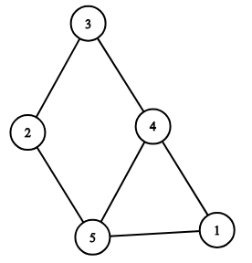

<h1 style='text-align: center;'> D. Relatively Prime Graph</h1>

<h5 style='text-align: center;'>time limit per test: 2 seconds</h5>
<h5 style='text-align: center;'>memory limit per test: 256 megabytes</h5>

Let's call an undirected graph $G = (V, E)$ relatively prime if and only if for each edge $(v, u) \in E$  $GCD(v, u) = 1$ (the greatest common divisor of $v$ and $u$ is $1$). If there is no edge between some pair of vertices $v$ and $u$ then the value of $GCD(v, u)$ doesn't matter. The vertices are numbered from $1$ to $|V|$.

Construct a relatively prime graph with $n$ vertices and $m$ edges such that it is connected and it contains neither self-loops nor multiple edges.

If there exists no valid graph with the given number of vertices and edges then output "Impossible".

If there are multiple answers then print any of them.

#### Input

The only line contains two integers $n$ and $m$ ($1 \le n, m \le 10^5$) — the number of vertices and the number of edges.

#### Output

If there exists no valid graph with the given number of vertices and edges then output "Impossible".

Otherwise print the answer in the following format:

The first line should contain the word "Possible".

The $i$-th of the next $m$ lines should contain the $i$-th edge $(v_i, u_i)$ of the resulting graph ($1 \le v_i, u_i \le n, v_i \neq u_i$). For each pair $(v, u)$ there can be no more pairs $(v, u)$ or $(u, v)$. The vertices are numbered from $1$ to $n$.

If there are multiple answers then print any of them.

## Examples

#### Input


```text
5 6  

```
#### Output


```text
Possible  
2 5  
3 2  
5 1  
3 4  
4 1  
5 4  

```
#### Input


```text
6 12  

```
#### Output


```text
Impossible  

```
## Note

Here is the representation of the graph from the first example: 


#### Tags 

#1700 #NOT OK #brute_force #constructive_algorithms #graphs #greedy #math 

## Blogs
- [All Contest Problems](../Educational_Codeforces_Round_47_(Rated_for_Div._2).md)
- [Announcement](../blogs/Announcement.md)
- [Tutorial (en)](../blogs/Tutorial_(en).md)
