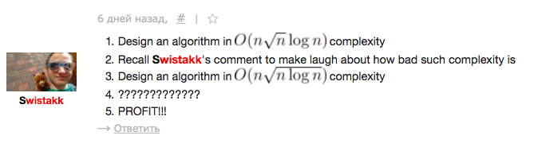

# Tutorial_(en)

[1011A - Stages](https://codeforces.com/contest/1011/problem/A "Codeforces Round 499 (Div. 2)")

Author: Mike Mirzayanov ([MikeMirzayanov](https://codeforces.com/profile/MikeMirzayanov "Headquarters, MikeMirzayanov")).

 **Tutorial**
### [1011A - Stages](https://codeforces.com/contest/1011/problem/A "Codeforces Round 499 (Div. 2)")

The problem can be solved by the following greedy algorithm.

Sort letters in increasing order. Let's try to add letters in this order. If the current letter is the first in the string, then add it to the answer. Otherwise, check: if the current letter is at least two positions later in the alphabet than the previous letter of the answer, add it to the response, otherwise go over to the next letter.

As soon as there are k letters in the answer, print it. If after this algorithm the answer has less than k letters, print -1.

Complexity: O(nlogn).

 **Solution**
```cpp
#include <bits/stdc++.h>

using namespace std;

int main()
{
    int n,k;
    cin>>n>>k;
    string s;
    cin>>s;
    sort(s.begin(),s.end());
    char last='a'-2;
    int ans=0;
    int len=0;
    for(int i=0;i<n;i++)
        if(s[i]>=last+2)
        {
            last=s[i];
            ans+=s[i]-'a'+1;
            len++;
            if(len>=k)
                cout<<ans,exit(0);
        }
    cout<<-1;
}
```
[1011B - Planning The Expedition](https://codeforces.com/contest/1011/problem/B "Codeforces Round 499 (Div. 2)")

Author: Mike Mirzayanov ([MikeMirzayanov](https://codeforces.com/profile/MikeMirzayanov "Headquarters, MikeMirzayanov")).

 **Tutorial**
### [1011B - Planning The Expedition](https://codeforces.com/contest/1011/problem/B "Codeforces Round 499 (Div. 2)")

Let ci be the number of food packages that equal to i. Calculate the array c.

For any d we can calculate the maximum number of people k, who can participate in the expedition for d days. To do this, we'll go over all the elements of the array c. Let now be considered ci. If ci≥d, we can decrease ci by d and increase k by 1, that is, take d daily food packages for one person. If still ci≥d, repeat the algorithm, and so on. That is for i-th iteration number k increases by ⌊cid⌋. After all the iterations the number k will be the required number of people.

It is clear that the answer does not exceed m (every day at least one food package is used).

Let's iterate d from m to 1, each time checking whether the answer can be equal d. To do this, we calculate the maximum number of people k, who can participate in the expedition for d days. If k≥n, then the answer is d. If no answer was received on any iteration, then the answer is 0.

Complexity: O(m2).

Bonus. Try to improve the complexity to O(mlogm).

 **Solution**
```cpp
#include <bits/stdc++.h>

using namespace std;

const int N = 100;

int main() {
    int n, m;
    cin >> n >> m;
    vector<int> c(N + 1);
    for (int i = 0; i < m; i++) {
        int a;
        cin >> a;
        c[a]++;
    }
    for (int d = N; d >= 1; d--) {
        vector<int> cc(c);
        int k = 0;
        for (int i = 1; i <= N; i++)
            while (cc[i] >= d) {
                k++;
                cc[i] -= d;
            }
        if (k >= n) {
            cout << d << endl;
            return 0;
        }
    }
    cout << 0 << endl;
}
```
[1011C - Fly](https://codeforces.com/contest/1011/problem/C "Codeforces Round 499 (Div. 2)") / [1010A - Fly](../problems/A._Fly.md "Codeforces Round 499 (Div. 1)")

Author: Vladislav Zavodnik ([VladProg](https://codeforces.com/profile/VladProg "Master VladProg")).

 **Tutorial**
### [1010A - Fly](../problems/A._Fly.md "Codeforces Round 499 (Div. 1)")

First, we learn how to determine if a rocket can fly the entire route. Consider an element from an array a[]a[] or b[]b[]. We denote it by tt. If t=1t=1 (that is, one ton of fuel can carry only one ton (cargo + fuel)), then fuel can only take it to ourselves, and we need to take a rocket and a useful cargo (the mass of which is positive). That is, if t=1t=1 at least for one tt, it is necessary to deduce −1−1, otherwise, do the following calculations.

It is clear that arrays a[]a[] and b[]b[] will be processed by the computer of the rocket in that order: a1,b2,a2,b3,a3,b4,a4,…,bn−1,an−1,bn,an,b1a1,b2,a2,b3,a3,b4,a4,…,bn−1,an−1,bn,an,b1. We will process this sequence from the end. Let at the current iteration the mass of the payload (including fuel that will not be used at this iteration) is ss tons, the current element from the array a[]a[] or b[]b[] is tt, the mass of fuel that will be used at this iteration (it must be found), is xx. We assign before the iterations s=ms=m. We form the equation:

total mass = mass that all fuel can transport

s+x=txs+x=tx

x=st−1x=st−1

By this formula, you can find fuel in this iteration. For the next iteration to the payload weight, you need to add mass of fuel (since this fuel needs to be brought to this iteration), that is, perform the assignment s=s+xs=s+x. In the end, it is necessary to deduce s−ms−m.

Complexity: O(n)O(n).

Bonus. In fact, it does not matter in which order to process arrays a[]a[] and b[]b[] (from the beginning, from the end or in general mixed): the answer from this will not change. Try to prove it by yourself.

 **Solution**
```cpp
#include<bits/stdc++.h>

using namespace std;

int main()
{
    int n,m;
    cin>>n>>m;
    int a[n];
    for(int i=0;i<n;i++)
    {
        cin>>a[i];
        if(a[i]<=1)
        {
            printf("-1n");
            exit(0);
        }
    }
    int b[n];
    for(int i=0;i<n;i++)
    {
        cin>>b[i];
        if(b[i]<=1)
        {
            printf("-1n");
            exit(0);
        }
    }
    double s=m;
    s+=s/(a[0]-1);
    for(int i=n-1;i>=1;i--)
    {
        s+=s/(b[i]-1);
        s+=s/(a[i]-1);
    }
    s+=s/(b[0]-1);
    printf("%.10lfn",s-m);
}

```
[1011D - Rocket](https://codeforces.com/contest/1011/problem/D "Codeforces Round 499 (Div. 2)") / [1010B - Rocket](../problems/B._Rocket.md "Codeforces Round 499 (Div. 1)")

Author: Vladislav Zavodnik ([VladProg](https://codeforces.com/profile/VladProg "Master VladProg")).

 **Tutorial**
### [1010B - Rocket](../problems/B._Rocket.md "Codeforces Round 499 (Div. 1)")

First we learn the sequence p[]. For this print the query "1" n times. If the answer is "0" (that is, the distance to Mars is equal to one), then immediately terminate the program. Otherwise, it is clear that the correct answer is "1" (that is, the distance to Mars is greater than one). If i-th answer of rocket is "1", then p[i]=1 (that is, the rocket answered the truth), otherwise p[i]=0 (untruth). On this, we will spend no more than n queries, within the given constraints it is 30.

Now you can find the number x using binary search. For each answer, you need to check: if the corresponding element of the sequence p equals to 0, then the answer sign must be changed. On this, we will spend no more than ⌈log2m⌉ queries, within the given constraints it is 30.

The total number of queries does not exceed n+⌈log2m⌉≤30+30=60.

Complexity: O(n+logm)

Bonus. Try to solve a similar problem but with a constraint 1≤m≤1073741853.

 **Solution**
```cpp
#include <bits/stdc++.h>

using namespace std;

int query(int y)
{
    cout<<y<<"n";
    fflush(stdout);
    int t;
    cin>>t;
    if(t==0||t==-2)
        exit(0);
    return t;
}

int main()
{
    int m,n;
    cin>>m>>n;
    int p[n];
    for(int i=0;i<n;i++)
    {
        int t=query(1);
        p[i]=t==1;
    }
    int l=2,r=m;
    for(int q=0;;q++)
    {
        int y=(l+r)/2;
        int t=query(y);
        if(!p[q%n])
            t*=-1;
        if(t==1)
            l=y+1;
        else
            r=y-1;
    }
}
```
[1011E - Border](https://codeforces.com/contest/1011/problem/E "Codeforces Round 499 (Div. 2)") / [1010C - Border](../problems/C._Border.md "Codeforces Round 499 (Div. 1)")

Author: Vladislav Zavodnik ([VladProg](https://codeforces.com/profile/VladProg "Master VladProg")).

 **Tutorial**
### [1010C - Border](../problems/C._Border.md "Codeforces Round 499 (Div. 1)")

Note that the condition "the last digit in the record of Natasha's tax amount in the number system with the base k will be d" is equivalent to the condition "the remainder of dividing the tax on k will be d".

Let g=GCD(a1,a2,…,an). It is stated that the original problem is equivalent to the problem where n=1 and the only banknote is g.

Evidence. We prove this with the help of the Bézout's identity. It follows that an equation of the form a1x1+a2x2+⋯+anxn=c, where at least one of the parameters a1,a2,…,an is not zero, has a solution in integers if and only if c⋮GCD(a1,a2,…,an). Then in this task Natasha can pay xi banknotes of the i-th nominal value for each i, where 1≤i≤n, and the amount of tax (a1x1+a2x2+⋯+anxn) can be any number c, multiple g. (Here some xi<0, But Natasha can add for each par a sufficiently large number, multiple k, that xi became greater than zero, the balance from dividing the amount of tax on k from this will not change.) Therefore, you can replace all pars with one par g and the answer from this will not change.

Now we can sort out all the numbers of the form gxmodk, where 0≤x<k (further the remainder of the sum, divided by k will cycle repeatedly) and output them in ascending order.

Complexity: O(n+logm+klogk), where m is the greatest ai.

Bonus. Try to improve the complexity to O(n+k).

 **Solution**
```cpp
#include<bits/stdc++.h>

using namespace std;

int gcd(int a,int b)
{
    if(a<b)
        swap(a,b);
    return (b==0)?a:gcd(b,a%b);
}

int main()
{
    int n,k;
    scanf("%d%d",&n,&k);
    int g=0;
    for(int i=0;i<n;i++)
    {
        int t;
        scanf("%d",&t);
        g=gcd(g,t);
    }
    set<int> ans;
    for(long long i=0,s=0;i<k;i++,s+=g)
        ans.insert(s%k);
    printf("%dn",ans.size());
    for(set<int>::iterator i=ans.begin();i!=ans.end();i++)
        printf("%d ",*i);
}
```
[1011F - Mars rover](https://codeforces.com/contest/1011/problem/F "Codeforces Round 499 (Div. 2)") / [1010D - Mars rover](../problems/D._Mars_rover.md "Codeforces Round 499 (Div. 1)")

Author: Vladislav Zavodnik ([VladProg](https://codeforces.com/profile/VladProg "Master VladProg")).

 **Tutorial**
### [1010D - Mars rover](../problems/D._Mars_rover.md "Codeforces Round 499 (Div. 1)")

Let's count the bit at each vertex. This can be done using depth-first search on this tree. Now for each vertex, let's check: whether the bit on the output of the scheme will change if the bit in the current vertex is changed. If all the vertices on the path from this vertex to the output of the scheme. If at least one of them does not change, then the output of the scheme does not change, and vice versa: if the output of the scheme is changed, then each vertex on the path under consideration will change. Now the solution can be implemented as follows. For each vertex, let's make a note: whether the bit on the output of the scheme will be changed if the bit on the current vertex is changed. For output of the scheme, this note is true. Now let's do the depth-first search on this tree. If note at the current vertex is equal to false, then at the inputs to it we make the note equal false, otherwise, for each input to this vertex, we do the following. Let's see if the current vertex is changed if the current input is changed. If it is changed, then at this input we will make the note equal true, otherwise false.

Complexity: O(n).

 **Solution**
```cpp
#pragma GCC optimize("O3")
#include<bits/stdc++.h>

using namespace std;

struct vertex
{
    char type;
    vector<int>in;
    bool val;
    bool change;
};

int n;
vector<vertex> g;

int dfs1(int v)
{
    switch(g[v].type)
    {
    case 'A':
        g[v].val = dfs1(g[v].in[0]) & dfs1(g[v].in[1]);
        break;
    case 'O':
        g[v].val = dfs1(g[v].in[0]) | dfs1(g[v].in[1]);
        break;
    case 'X':
        g[v].val = dfs1(g[v].in[0]) ^ dfs1(g[v].in[1]);
        break;
    case 'N':
        g[v].val = ! dfs1(g[v].in[0]);
        break;
    }
    return g[v].val;
}

void dfs2(int v)
{
    if(g[v].change==false)
        for(int i=0;i<g[v].in.size();i++)
            g[g[v].in[i]].change=false;
    else
        switch(g[v].type)
        {
        case 'A':
            if(g[v].val==(!g[g[v].in[0]].val&g[g[v].in[1]].val)) /// equal to if(g[g[v].in[1]].val==false)
                g[g[v].in[0]].change=false;
            else
                g[g[v].in[0]].change=true;
            if(g[v].val==(g[g[v].in[0]].val&!g[g[v].in[1]].val)) /// equal to if(g[g[v].in[0]].val==false)
                g[g[v].in[1]].change=false;
            else
                g[g[v].in[1]].change=true;
            break;
        case 'O':
            if(g[v].val==(!g[g[v].in[0]].val|g[g[v].in[1]].val)) /// equal to if(g[g[v].in[1]].val==true)
                g[g[v].in[0]].change=false;
            else
                g[g[v].in[0]].change=true;
            if(g[v].val==(g[g[v].in[0]].val|!g[g[v].in[1]].val)) /// equal to if(g[g[v].in[0]].val==true)
                g[g[v].in[1]].change=false;
            else
                g[g[v].in[1]].change=true;
            break;
        case 'X':
            if(g[v].val==(!g[g[v].in[0]].val^g[g[v].in[1]].val)) /// equal to if(false)
                g[g[v].in[0]].change=false;
            else
                g[g[v].in[0]].change=true;
            if(g[v].val==(g[g[v].in[0]].val^!g[g[v].in[1]].val)) /// equal to if(false)
                g[g[v].in[1]].change=false;
            else
                g[g[v].in[1]].change=true;
            break;
        case 'N':
            if(g[v].val==(!!g[g[v].in[0]].val)) /// equal to if(false)
                g[g[v].in[0]].change=false;
            else
                g[g[v].in[0]].change=true;
            break;
        }
    for(int i=0;i<g[v].in.size();i++)
        dfs2(g[v].in[i]);
}

int main()
{
    scanf("%d",&n);
    g.resize(n);
    for(int i=0;i<n;i++)
    {
        char c[4];
        scanf("%s",c);
        g[i].type=c[0];
        int x;
        switch(g[i].type)
        {
        case 'I':
            scanf("%d",&x);
            g[i].val=x;
            break;
        case 'N':
            scanf("%d",&x);
            g[i].in.push_back(x-1);
            break;
        default:
            scanf("%d",&x);
            g[i].in.push_back(x-1);
            scanf("%d",&x);
            g[i].in.push_back(x-1);
            break;
        }
    }
    dfs1(0);
    g[0].change=true;
    dfs2(0);
    for(int i=0;i<n;i++)
        if(g[i].type=='I')
            printf("%d",g[0].val^g[i].change);
}
```
[1010E - Store](../problems/E._Store.md "Codeforces Round 499 (Div. 1)")

Author: Vladislav Zavodnik ([VladProg](https://codeforces.com/profile/VladProg "Master VladProg")).

 **Tutorial**
### [1010E - Store](../problems/E._Store.md "Codeforces Round 499 (Div. 1)")

Consider 2 options:

* m=0. This means that Natasha does not know about any moment when the store was closed. Let's find the numbers xl=min(xi), xr=max(xi), yl=min(yi), yr=max(yi), zl=min(zi), zr=max(zi), where (xi,yi,zi) are moments when store is open. For each query (xt,yt,zt) answer "OPEN", if xl≤xt≤xr, yl≤yt≤yr, and zl≤zt≤zr. Answer "UNKNOWN" otherwise.
* m≠0. Let's find the numbers xl=min(xi), xr=max(xi), yl=min(yi), yr=max(yi), zl=min(zi), zr=max(zi), where (xi,yi,zi) are moments when store is open. If there is at least one moment (xj,yj,zj), when the store is closed, and xl≤xj≤xr, yl≤yj≤yr and zl≤zj≤zr, then the answer is "INCORRECT". Otherwise, let's create a compressed two-dimensional segment tree. The first coordinate is number of the month in the year, the second coordinate is number of the day in a month. At each vertex of the tree of segments we store a pair of numbers — the greatest such number of a second z, when the store was closed, in this day of this month, that z≤zr, and the smallest such number of a second z, when the store was closed, in this day of this month, that z≥zl. Now every query (xt,yt,zt) we will handle like this. If xl≤xt≤xr, yl≤yt≤yr and zl≤zt≤zr, answer "OPEN". Otherwise, consider the parallelepiped given by the coordinates of opposite vertices (xl,yl,zl) and (xr,yr,zr) and consider each vertex in turn (xp,yp,zp) the parallelepiped under consideration. Let's make the query in the segment tree (xp,xt), (yp,yt). Let the received answer is (zfirst,zsecond). If the number zfirst or number zsecond is between numbers zp and zt, this means that there is such a time point (xj,yj,zj), when the store is closed, that xj is between xp and xt (the month of the year when the store is closed, is between the month in the year when the store is open, and the month in the year in the query), yj is between yp and yt (the day in the month when the store is closed is between the day in the month when the store is open and the day in the month in the query), zj is between zp and zt (second in a day, when the store is closed, is between a second in a day, when the store is open and a second in a day in the query), hence the answer to the query is "CLOSED". If the condition is not satisfied for any vertex of the parallelepiped, the answer is "UNKNOWN".

Complexity: O(n+mlogm+klog2m).

 **Solution**
```cpp
#include<bits/stdc++.h>

using namespace std;

int xmax,ymax,zmax,n,m,k;

map< int , map< int , pair< int ,int > > > pmap;
vector< pair< int , map< int , pair< int ,int > > > > pvector;
vector< pair< vector< pair< int , pair< int , int > > > , vector< pair< int , int > > > > tree;
int oxl,oxr,oyl,oyr,ozl,ozr;

pair<int,int> comb(pair<int,int> p1,pair<int,int> p2)
{
    return make_pair(max(p1.first,p2.first),
                     min(p1.second,p2.second));
}

void build_y(int vx,int lxt, int rxt,int vy,int lyt, int ryt)
{
    if(lyt==ryt)
    {
        if(lxt==rxt)
            tree[vx].second[vy]=tree[vx].first[lyt].second;
        else
        {
            int sl,sr;
            sl=0,sr=tree[vx*2+1].first.size()-1;
            while(sr>sl)
            {
                int sm=(sl+sr)/2;
                if(tree[vx*2+1].first[sm].first>=tree[vx].first[lyt].first)
                    sr=sm;
                else
                    sl=sm+1;
            }
            pair<int,int> res1=(tree[vx*2+1].first[sl].first==tree[vx].first[lyt].first)?
                               (tree[vx*2+1].first[sl].second):
                                make_pair(0,(int)zmax+1);
            sl=0,sr=tree[vx*2+2].first.size()-1;
            while(sr>sl)
            {
                int sm=(sl+sr)/2;
                if(tree[vx*2+2].first[sm].first>=tree[vx].first[lyt].first)
                    sr=sm;
                else
                    sl=sm+1;
            }
            pair<int,int> res2=(tree[vx*2+2].first[sl].first==tree[vx].first[lyt].first)?
                               (tree[vx*2+2].first[sl].second):
                                make_pair(0,(int)zmax+1);
            tree[vx].second[vy]=comb(res1,res2);
        }
    }
    else
    {
        int myt=(lyt+ryt)/2;
        build_y(vx,lxt,rxt,vy*2+1,lyt,myt);
        build_y(vx,lxt,rxt,vy*2+2,myt+1,ryt);
        tree[vx].second[vy]=comb(tree[vx].second[vy*2+1],tree[vx].second[vy*2+2]);
    }
}

void build_x(int vx,int lxt, int rxt)
{
    if(lxt==rxt)
        tree[vx].first=vector< pair< int , pair< int , int > > >(pvector[lxt].second.begin(),pvector[lxt].second.end());
    else
    {
        int mxt=(lxt+rxt)/2;
        build_x(2*vx+1,lxt,mxt);
        build_x(2*vx+2,mxt+1,rxt);
        for(vector< pair< int , pair< int , int > > >::iterator i=tree[2*vx+1].first.begin(),j=tree[2*vx+2].first.begin();;)
        {
            if(i==tree[2*vx+1].first.end())
            {
                for(;j!=tree[2*vx+2].first.end();j++)
                    tree[vx].first.push_back(*j);
                break;
            }
            if(j==tree[2*vx+2].first.end())
            {
                for(;i!=tree[2*vx+1].first.end();i++)
                    tree[vx].first.push_back(*i);
                break;
            }
            if(i->first<j->first)
            {
                tree[vx].first.push_back(*i);
                i++;
            }
            else if(j->first<i->first)
            {
                tree[vx].first.push_back(*j);
                j++;
            }
            else
            {
                tree[vx].first.push_back(make_pair(i->first,comb(i->second,j->second)));
                i++;
                j++;
            }
        }
    }
    tree[vx].second.resize(tree[vx].first.size()*4);
    build_y(vx,lxt,rxt,0,0,tree[vx].first.size()-1);
}

pair<int,int> get_y(int vx, int vy, int lyt, int ryt, int lyc, int ryc)
{
    if(lyc>ryc)
        return make_pair(0,zmax+1);
    if(lyc==lyt&&ryt==ryc)
        return tree[vx].second[vy];
    int myt=(lyt+ryt)/2;
    return comb(get_y(vx,vy*2+1,lyt,myt,lyc,min(ryc,myt)),
                get_y(vx,vy*2+2,myt+1,ryt,max(lyc,myt+1),ryc));
}

pair<int,int> get_x(int vx, int lxt, int rxt, int lxc, int rxc, int ly, int ry)
{
    if(lxc>rxc)
        return make_pair(0,zmax+1);
    if(lxc==lxt&&rxt==rxc)
    {
        int sl,sr;
        sl=0,sr=tree[vx].first.size()-1;
        while(sr>sl)
        {
            int sm=(sl+sr)/2;
            if(tree[vx].first[sm].first>=ly)
                sr=sm;
            else
                sl=sm+1;
        }
        int lyc=sl;
        sl=0,sr=tree[vx].first.size()-1;
        while(sr>sl)
        {
            int sm=(sl+sr+1)/2;
            if(tree[vx].first[sm].first<=ry)
                sl=sm;
            else
                sr=sm-1;
        }
        int ryc=sr;
        return (tree[vx].first[lyc].first>=ly&&tree[vx].first[ryc].first<=ry)?
               get_y(vx,0,0,tree[vx].first.size()-1,lyc,ryc):
               make_pair(0,(int)zmax+1);
    }
    int mxt=(lxt+rxt)/2;
    return comb(get_x(vx*2+1,lxt,mxt,lxc,min(rxc,mxt),ly,ry),
                get_x(vx*2+2,mxt+1,rxt,max(lxc,mxt+1),rxc,ly,ry));
}

int main()
{
    scanf("%d%d%d%d%d%d",&xmax,&ymax,&zmax,&n,&m,&k);
    oxl=xmax;
    oxr=1;
    oyl=ymax;
    oyr=1;
    ozl=zmax;
    ozr=1;
    for(int i=0;i<n;i++)
    {
        int x,y,z;
        scanf("%d%d%d",&x,&y,&z);
        oxl=min(oxl,x);
        oxr=max(oxr,x);
        oyl=min(oyl,y);
        oyr=max(oyr,y);
        ozl=min(ozl,z);
        ozr=max(ozr,z);
    }
    for(int i=0;i<m;i++)
    {
        int x,y,z;
        scanf("%d%d%d",&x,&y,&z);
        if(oxl<=x&&x<=oxr&&oyl<=y&&y<=oyr&&ozl<=z&&z<=ozr)
        {
            printf("INCORRECTn");
            exit(0);
        }
        map< int , pair< int ,int > >::iterator it=pmap[x].insert(make_pair(y,make_pair(0,zmax+1))).first;
        if(z<=ozr)
            it->second.first=max(it->second.first,z);
        if(z>=ozl)
            it->second.second=min(it->second.second,z);
    }
    printf("CORRECTn");
    if(m>0)
    {
        pvector=vector< pair< int , map< int , pair< int ,int > > > >(pmap.begin(),pmap.end());
        tree.resize(pvector.size()*4);
        build_x(0,0,pvector.size()-1);
    }
    for(int i=0;i<k;i++)
    {
        int x,y,z;
        scanf("%d%d%d",&x,&y,&z);
        if(oxl<=x&&x<=oxr&&oyl<=y&&y<=oyr&&ozl<=z&&z<=ozr)
        {
            printf("OPENn");
            continue;
        }
        if(m==0)
        {
            printf("UNKNOWNn");
            continue;
        }
        bool closed=false;
        for(int ii=0;ii<=1;ii++)
            for(int jj=0;jj<=1;jj++)
            {
                if(closed)
                    break;
                int i=oxl+ii*(oxr-oxl);
                int j=oyl+jj*(oyr-oyl);
                int lx=min(x,i),rx=max(x,i);
                int sl,sr;
                sl=0,sr=pvector.size()-1;
                while(sr>sl)
                {
                    int sm=(sl+sr)/2;
                    if(pvector[sm].first>=lx)
                        sr=sm;
                    else
                        sl=sm+1;
                }
                int lxc=sl;
                sl=0,sr=pvector.size()-1;
                while(sr>sl)
                {
                    int sm=(sl+sr+1)/2;
                    if(pvector[sm].first<=rx)
                        sl=sm;
                    else
                        sr=sm-1;
                }
                int rxc=sr;
                if(pvector[lxc].first>=lx&&pvector[rxc].first<=rx)
                {
                    pair<int,int> p=get_x(0,0,pvector.size()-1,lxc,rxc,min(y,j),max(y,j));
                    if(min({z,ozl,ozr})<=p.first||max({z,ozl,ozr})>=p.second)
                        closed=true;
                }
            }
        if(closed)
            printf("CLOSEDn");
        else
            printf("UNKNOWNn");
    }
}
```
[1010F - Tree](../problems/F._Tree.md "Codeforces Round 499 (Div. 1)")

Authors: Ildar Gainullin ([300iq](https://codeforces.com/profile/300iq "Grandmaster 300iq")) and Dmitry Sayutin ([cdkrot](https://codeforces.com/profile/cdkrot "International Master cdkrot")).

 **Tutorial**
### [1010F - Tree](../problems/F._Tree.md "Codeforces Round 499 (Div. 1)")

Let bv=av−∑ato, (for each (v,to), such that to — is a son of v and tree have both vertices v and to), then all that we need is bv≥0 and ∑bv=x, so for fixed subset of vertices number of ways to arrange weights is just number of ways to partite x into such number of parts.

So let fi be number of ways to choose connected subtree of i vertices, that contains vertex 1, then answer is ∑fiCi−1x+i−1.

Then we need to calculate fi for each 1≤i≤n, and calculate Ci−1x+i−1 for each 1≤i≤n.

Let's use generating functions to calc fi.

Let dpv be generating function of ∑fi⋅xi, (if we will assume that v — root and we will look only at vertices inside subtree of v).

Then if vertex v — leaf, then dpv=x+1, if this vertex have one son, dpv=dptox+1, and if two, then dpv=dpldprx+1.

Then let maintain dpv as a sequence of polynomials a1,a2,…,ak, что dpv=(((a1+1)a2+1)…)ak+1).

Then if we have the representation of dpv in such format, we can find the exact value of polynomial in the sum of sizes of polynomials ⋅log2n.

For it you can note, that dpv is just a1a2a3…ak+a2a3…ak+…+ak+1.

And then with FFT you can calculate value and multiplication for left half (Pl(x) и Ql(x)), and for right half (Pr(x) и Qr(x)).

Then P(x)=(Pl(x)−1)Qr(x)+Pr(x), а Q(x)=Ql(x)Qr(x).

So, you can calculate exact value of dpv in T(n)=2T(n/2)+O(nlogn)=O(nlog2n) (Where n is sum of sizes of polynomials).

Then if v — leaf just add x into the sequence of polynomials.

If v have one son, then add x into the sequence of polynomials of a son, and take his sequence as a sequence for vertex v.

And if v have two sons, Let's take a son with the smaller size of a subtree, find its exact value as written, and add it into the sequence of another son.

Sum of sizes of smaller subtrees is O(nlogn), so we can find f in O(nlog3n).

Note, that you can find similar value when the tree is not binary too, for it you can find the exact value of all children without largest, and multiply it in O(nlog2(n)) with D&C.

To calculate Ci−1x+i−1 for each 1≤i≤n you can note, that when i=1 it is just 1, and to get a value for i+1 you need multiply current value on x+i−1 and divide on i.

Then you can find scalar multiplication of these two vectors, and solve the task in O(nlog3n).



 **Solution**
```cpp
#include <cmath>
#include <iostream>
#include <vector>
#include <algorithm>
#include <string>
#include <set>
#include <map>
#include <list>
#include <time.h>
#include <math.h>
#include <random>
#include <deque>
#include <queue>
#include <cassert>
#include <unordered_map>
#include <unordered_set>
#include <iomanip>
#include <bitset>
#include <sstream>

using namespace std;

typedef long long ll;

mt19937 rnd(228);

const int md = 998244353;

inline void add(int &a, int b) {
  a += b;
  if (a >= md) a -= md;
}

inline void sub(int &a, int b) {
  a -= b;
  if (a < 0) a += md;
}


inline int mul(int a, int b) {
#if !defined(_WIN32) || defined(_WIN64)
  return (int) ((long long) a * b % md);
#endif
  unsigned long long x = (long long) a * b;
  unsigned xh = (unsigned) (x >> 32), xl = (unsigned) x, d, m;
  asm(
    "divl %4; nt"
    : "=a" (d), "=d" (m)
    : "d" (xh), "a" (xl), "r" (md)
  );
  return m;
}

inline int power(int a, long long b) {
  int res = 1;
  while (b > 0) {
    if (b & 1) {
      res = mul(res, a);
    }
    a = mul(a, a);
    b >>= 1;
  }
  return res;
}

inline int inv(int a) {
  a %= md;
  if (a < 0) a += md;
  int b = md, u = 0, v = 1;
  while (a) {
    int t = b / a;
    b -= t * a; swap(a, b);
    u -= t * v; swap(u, v);
  }
  assert(b == 1);
  if (u < 0) u += md;
  return u;
}

namespace ntt {
  int base = 1;
  vector<int> roots = {0, 1};
  vector<int> rev = {0, 1};
  int max_base = -1;
  int root = -1;

  void init() {
    int tmp = md - 1;
    max_base = 0;
    while (tmp % 2 == 0) {
      tmp /= 2;
      max_base++;
    }
    root = 2;
    while (true) {
      if (power(root, 1 << max_base) == 1) {
        if (power(root, 1 << (max_base - 1)) != 1) {
          break;
        }
      }
      root++;
    }
  }

  void ensure_base(int nbase) {
    if (max_base == -1) {
      init();
    }
    if (nbase <= base) {
      return;
    }
    assert(nbase <= max_base);
    rev.resize(1 << nbase);
    for (int i = 0; i < (1 << nbase); i++) {
      rev[i] = (rev[i >> 1] >> 1) + ((i & 1) << (nbase - 1));
    }
    roots.resize(1 << nbase);
    while (base < nbase) {
      int z = power(root, 1 << (max_base - 1 - base));
      for (int i = 1 << (base - 1); i < (1 << base); i++) {
        roots[i << 1] = roots[i];
        roots[(i << 1) + 1] = mul(roots[i], z);
      }
      base++;
    }
  }

  void fft(vector<int> &a) {
    int n = (int) a.size();
    assert((n & (n - 1)) == 0);
    int zeros = __builtin_ctz(n);
    ensure_base(zeros);
    int shift = base - zeros;
    for (int i = 0; i < n; i++) {
      if (i < (rev[i] >> shift)) {
        swap(a[i], a[rev[i] >> shift]);
      }
    }
    for (int k = 1; k < n; k <<= 1) {
      for (int i = 0; i < n; i += 2 * k) {
        for (int j = 0; j < k; j++) {
          int x = a[i + j];
          int y = mul(a[i + j + k], roots[j + k]);
          a[i + j] = x + y - md;
          if (a[i + j] < 0) a[i + j] += md;
          a[i + j + k] = x - y + md;
          if (a[i + j + k] >= md) a[i + j + k] -= md;
        }
      }
    }
  }

  vector<int> multiply(vector<int> a, vector<int> b, int eq = 0) {
    int need = (int) (a.size() + b.size() - 1);
    int nbase = 0;
    while ((1 << nbase) < need) nbase++;
    ensure_base(nbase);
    int sz = 1 << nbase;
    a.resize(sz);
    b.resize(sz);
    fft(a);
    if (eq) b = a; else fft(b);
    int inv_sz = inv(sz);
    for (int i = 0; i < sz; i++) {
      a[i] = mul(mul(a[i], b[i]), inv_sz);
    }
    reverse(a.begin() + 1, a.end());
    fft(a);
    a.resize(need);
    while (!a.empty() && a.back() == 0) {
        a.pop_back();
    }
    return a;
  }

  vector<int> square(vector<int> a) {
    return multiply(a, a, 1);
  }
};

const int N = 1e5 + 1;

vector <vector <int> > polys[N];
int l[N], r[N];
int who[N];
int sz[N];

vector <int> slozh(const vector <int> &a, const vector <int> &b)
{
    int n = (int) a.size(), m = (int) b.size();
    vector <int> c(max(n, m));
    for (int i = 0; i < n; i++) add(c[i], a[i]);
    for (int i = 0; i < m; i++) add(c[i], b[i]);
    return c;
}

pair <vector <int>, vector <int> > eval(const vector <vector <int> > &a)
{
    if (a.size() == 1)
    {
        auto ret = a[0];
        ret[0]++;
        return {ret, a[0]};
    }
    else
    {
        int m = (int) a.size() / 2;
        vector <vector <int> > l, r;
        for (int i = 0; i < m; i++)
        {
            l.push_back(a[i]);
        }
        for (int i = m; i < (int) a.size(); i++)
        {
            r.push_back(a[i]);
        }
        auto lf = eval(l), rf = eval(r);
        add(lf.first[0], -1);
        auto P = slozh(ntt::multiply(lf.first, rf.second), rf.first);
        auto Q = ntt::multiply(lf.second, rf.second);
        return {P, Q};
    }
}

vector <int> g[N];

void dfs(int v, int pr)
{
    vector <int> go;
    int deg = 0;
    for (int to : g[v])
    {
        if (to != pr)
        {
            go.push_back(to);
            deg++;
        }
    }
    if (deg == 0)
    {
        polys[v].push_back({0, 1});
        sz[v] = 1;
        who[v] = v;
    }
    else
    {
        if (deg == 2)
        {
            l[v] = go[0];
            r[v] = go[1];
            dfs(l[v], v);
            dfs(r[v], v);
            sz[v] = sz[l[v]] + sz[r[v]] + 1;
            if (sz[l[v]] < sz[r[v]])
            {
                swap(l[v], r[v]);
            }
            auto go = eval(polys[who[r[v]]]).first;
            go.insert(go.begin(), 0);
            polys[who[l[v]]].push_back(go);
            who[v] = who[l[v]];
        }
        else
        {
            int son = go[0];
            dfs(son, v);
            sz[v] = sz[son] + 1;
            who[v] = who[son];
            polys[who[v]].push_back({0, 1});
        }
    }
}

vector <int> binom(ll n, int k)
{
    if (n == 0)
    {
        vector <int> ret(k + 1);
        ret[0] = 1;
        return ret;
    }
    else if (n % 2 == 0)
    {
        auto a = binom(n / 2, k);
        a = ntt::square(a);
        a.resize(k + 1);
        return a;
    }
    else
    {
        auto a = binom(n - 1, k);
        for (int i = k; i >= 0; i--)
        {
            if (i != 0)
            {
                add(a[i], a[i - 1]);
            }
        }
        return a;
    }
}

int main()
{
#ifdef ONPC
    freopen("a.in", "r", stdin);
#endif
    ios::sync_with_stdio(0);
    cin.tie(0);
    int n;
    cin >> n;
    ll x;
    cin >> x;
    vector <int> fact(n + 1), rev_fact(n + 1);
    fact[0] = 1;
    for (int i = 1; i <= n; i++)
    {
        fact[i] = mul(fact[i - 1], i);
    }
    for (int i = 0; i <= n; i++)
    {
        rev_fact[i] = inv(fact[i]);
    }
    for (int i = 1; i < n; i++)
    {
        int a, b;
        cin >> a >> b;
        a--, b--;
        g[a].push_back(b);
        g[b].push_back(a);
    }
    dfs(0, -1);
    auto solve = eval(polys[who[0]]).first;
    auto big_binoms = binom(x, n);
    for (int i = 0; i <= n; i++)
    {
        big_binoms[i] = mul(big_binoms[i], rev_fact[i]);
    }
    rev_fact.insert(rev_fact.begin(), 0);
    big_binoms = ntt::multiply(big_binoms, rev_fact);
    int ans = 0;
    for (int i = 1; i <= n; i++)
    {
        add(ans, mul(mul(solve[i], big_binoms[i]), fact[i - 1]));
    }
    cout << ans << 'n';
}
```
