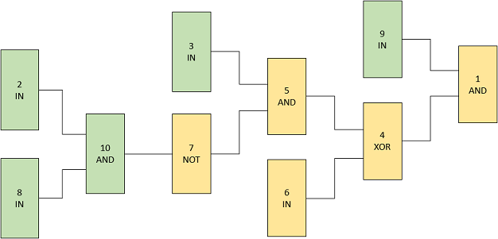

<h1 style='text-align: center;'> D. Mars rover</h1>

<h5 style='text-align: center;'>time limit per test: 5 seconds</h5>
<h5 style='text-align: center;'>memory limit per test: 256 megabytes</h5>

Natasha travels around Mars in the Mars rover. But suddenly it broke down, namely — the logical scheme inside it. The scheme is an undirected tree (connected acyclic graph) with a root in the vertex $1$, in which every leaf (excluding root) is an input, and all other vertices are logical elements, including the root, which is output. One bit is fed to each input. One bit is returned at the output.

There are four types of logical elements: [AND](https://en.wikipedia.org/wiki/Logical_conjunction) ($2$ inputs), [OR](https://en.wikipedia.org/wiki/Logical_disjunction) ($2$ inputs), [XOR](https://en.wikipedia.org/wiki/Exclusive_or) ($2$ inputs), [NOT](https://en.wikipedia.org/wiki/Negation) ($1$ input). Logical elements take values from their direct descendants (inputs) and return the result of the function they perform. Natasha knows the logical scheme of the Mars rover, as well as the fact that only one input is broken. In order to fix the Mars rover, she needs to change the value on this input.

For each input, determine what the output will be if Natasha changes this input.

### Input

The first line contains a single integer $n$ ($2 \le n \le 10^6$) — the number of vertices in the graph (both inputs and elements).

The $i$-th of the next $n$ lines contains a description of $i$-th vertex: the first word "AND", "OR", "XOR", "NOT" or "IN" (means the input of the scheme) is the vertex type. If this vertex is "IN", then the value of this input follows ($0$ or $1$), otherwise follow the indices of input vertices of this element: "AND", "OR", "XOR" have $2$ inputs, whereas "NOT" has $1$ input. The vertices are numbered from one.

It is guaranteed that input data contains a correct logical scheme with an output produced by the vertex $1$.

### Output

Print a string of characters '0' and '1' (without quotes) — answers to the problem for each input in the ascending order of their vertex indices.

## Example

### Input


```text
10  
AND 9 4  
IN 1  
IN 1  
XOR 6 5  
AND 3 7  
IN 0  
NOT 10  
IN 1  
IN 1  
AND 2 8  

```
### Output


```text
10110
```
## Note

The original scheme from the example (before the input is changed):



Green indicates bits '1', yellow indicates bits '0'.

If Natasha changes the input bit $2$ to $0$, then the output will be $1$.

If Natasha changes the input bit $3$ to $0$, then the output will be $0$.

If Natasha changes the input bit $6$ to $1$, then the output will be $1$.

If Natasha changes the input bit $8$ to $0$, then the output will be $1$.

If Natasha changes the input bit $9$ to $0$, then the output will be $0$.


#### Tags 

#2000 #NOT OK #dfs_and_similar #graphs #implementation #trees 

## Blogs
- [All Contest Problems](../Codeforces_Round_499_(Div._1).md)
- [Announcement](../blogs/Announcement.md)
- [Tutorial (en)](../blogs/Tutorial_(en).md)
