<h1 style='text-align: center;'> F. Tree</h1>

<h5 style='text-align: center;'>time limit per test: 7 seconds</h5>
<h5 style='text-align: center;'>memory limit per test: 256 megabytes</h5>

The Main Martian Tree grows on Mars. It is a binary tree (a rooted tree, with no more than two sons at each vertex) with $n$ vertices, where the root vertex has the number $1$. Its fruits are the Main Martian Fruits. It's summer now, so this tree does not have any fruit yet.

Autumn is coming soon, and leaves and branches will begin to fall off the tree. It is clear, that if a vertex falls off the tree, then its entire subtree will fall off too. In addition, the root will remain on the tree. Formally: the tree will have some connected subset of vertices containing the root.

After that, the fruits will grow on the tree (only at those vertices which remain). Exactly $x$ fruits will grow in the root. The number of fruits in each remaining vertex will be not less than the sum of the numbers of fruits in the remaining sons of this vertex. It is allowed, that some vertices will not have any fruits.

Natasha wondered how many tree configurations can be after the described changes. Since this number can be very large, output it modulo $998244353$.

Two configurations of the resulting tree are considered different if one of these two conditions is true:

* they have different subsets of remaining vertices;
* they have the same subset of remaining vertices, but there is a vertex in this subset where they have a different amount of fruits.
##### Input

The first line contains two integers: $n$ and $x$ ($1 \le n \le 10^5$, $0 \le x \le 10^{18}$) — the size of the tree and the number of fruits in the root.

The $i$-th of the following $(n-1)$ lines contains two integers $a_i$ and $b_i$ ($1 \le a_i, b_i \le n$) — vertices connected by the $i$-th edge of the tree.

It is guaranteed that the input data describes a correct binary tree with the root at the vertex $1$.

##### Output

Print one number — the number of configurations of the resulting tree modulo $998244353$.

## Examples

##### Input


```text
3 2  
1 2  
1 3  

```
##### Output


```text
13  

```
##### Input


```text
2 5  
1 2  

```
##### Output


```text
7  

```
##### Input


```text
4 10  
1 2  
1 3  
3 4  

```
##### Output


```text
441  

```
## Note

Consider the first example. 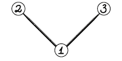

There are $2$ fruits at the vertex $1$. The following $13$ options are possible:

* there is no vertex $2$, there is no vertex $3$; 
* there is no vertex $2$, there are no fruits at the vertex $3$; 
* there is no vertex $2$, there is $1$ fruit at the vertex $3$; 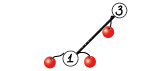
* there is no vertex $2$, there are $2$ fruits at the vertex $3$; 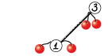
* there are no fruits at the vertex $2$, there is no vertex $3$; 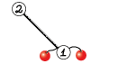
* there are no fruits at the vertex $2$, there are no fruits at the vertex $3$; 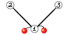
* there are no fruits at the vertex $2$, there is $1$ fruit at the vertex $3$; 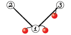
* there are no fruits at the vertex $2$, there are $2$ fruits at the vertex $3$; 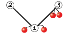
* there is $1$ fruit at the vertex $2$, there is no vertex $3$; 
* there is $1$ fruit at the vertex $2$, there are no fruits at the vertex $3$; 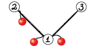
* there is $1$ fruit at the vertex $2$, there is $1$ fruit at the vertex $3$; 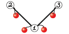
* there are $2$ fruits at the vertex $2$, there is no vertex $3$; 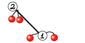
* there are $2$ fruits at the vertex $2$, there are no fruits at the vertex $3$. 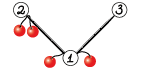

Consider the second example. There are $5$ fruits at the vertex $1$. The following $7$ options are possible:

* there is no vertex $2$;
* there are no fruits at the vertex $2$;
* there is $1$ fruit at the vertex $2$;
* there are $2$ fruits at the vertex $2$;
* there are $3$ fruits at the vertex $2$;
* there are $4$ fruits at the vertex $2$;
* there are $5$ fruits at the vertex $2$.


#### Tags 

#3400 #NOT OK #fft #graphs #trees 

## Blogs
- [All Contest Problems](../Codeforces_Round_499_(Div._1).md)
- [Announcement](../blogs/Announcement.md)
- [Tutorial (en)](../blogs/Tutorial_(en).md)
