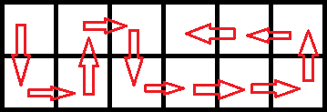
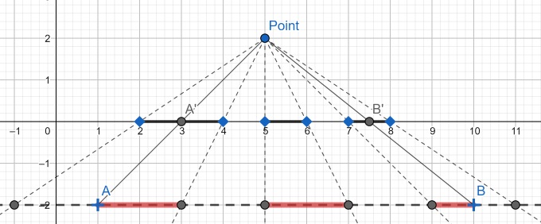
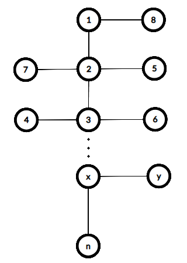

# Tutorial

[1016A - Death Note](../problems/A._Death_Note.md "Educational Codeforces Round 48 (Rated for Div. 2)")

 **Tutorial**
### [1016A - Death Note](../problems/A._Death_Note.md "Educational Codeforces Round 48 (Rated for Div. 2)")

In this problem all we need is to maintain the variable $res$ which will represent the number of names written on the current page. Initially this number equals zero. The answer for the $i$-th day equals $\lfloor\frac{res + a_i}{m}\rfloor$. This value represents the number of full pages we will write during the $i$-th day. After the answering we need to set $res := (res + a_i) \% m$, where operation $x \% y$ is taking $x$ modulo $y$.

 **Solution (Vovuh)**
```cpp
#include <bits/stdc++.h>

using namespace std;

int main() {
#ifdef _DEBUG
	freopen("input.txt", "r", stdin);
//	freopen("output.txt", "w", stdout);
#endif

	int n, m;
	cin >> n >> m;
	
	int r = 0;
	for (int i = 0; i < n; ++i) {
		int x;
		cin >> x;
		
		r += x;
		cout << r / m << ' ';
		r %= m;
	}
	cout << 'n';
	
	return 0;
}
```
[1016B - Segment Occurrences](../problems/B._Segment_Occurrences.md "Educational Codeforces Round 48 (Rated for Div. 2)")

 **Tutorial**Tutorial is loading... **Solution (PikMike)**
```cpp
#include <bits/stdc++.h>

#define forn(i, n) for (int i = 0; i < int(n); i++)

using namespace std;

const int N = 1000 + 7;

int pr[N];
bool ok[N];

int main() {
	int n, m, q;
	scanf("%d%d%d", &n, &m, &q);
	string s, t;
	static char buf[N];
	scanf("%s", buf);
	s = buf;
	scanf("%s", buf);
	t = buf;
	
	pr[0] = 0;
	forn(i, n - m + 1){
		bool fl = true;
		forn(j, m)
			if (s[i + j] != t[j])
				fl = false;
		ok[i] = fl;
		pr[i + 1] = pr[i] + ok[i];
	}
	for (int i = max(0, n - m + 1); i < n; ++i){
		pr[i + 1] = pr[i];
	}
	
	forn(i, q){
		int l, r;
		scanf("%d%d", &l, &r);
		--l, r -= m - 1;
		printf("%dn", r >= l ? pr[r] - pr[l] : 0);
	}
	return 0;
}

```
[1016C - Vasya And The Mushrooms](../problems/C._Vasya_And_The_Mushrooms.md "Educational Codeforces Round 48 (Rated for Div. 2)")

 **Tutorial**
### [1016C - Vasya And The Mushrooms](../problems/C._Vasya_And_The_Mushrooms.md "Educational Codeforces Round 48 (Rated for Div. 2)")

A route visiting each cell exactly once can always be denoted as follows: several (possibly zero) first columns of the glade are visited in a zigzag pattern, then Vasya goes to the right until the end of the glade, makes one step up or down and goes left until he visits all remaining cells:

  There are *n* - 1 such routes. To calculate the weight of collected mushrooms quickly, we will precompute three arrays for the first row of the glade — *sum*123, *sum*321 and *sum*111. *sum*123 will be used to compute the weight of mushrooms collected when Vasya moves to the right until the last column of the glade, *sum*321 — when Vasya moves to the left from the last column, and *sum*111 — to handle the growth of mushrooms.


Also we have to compute the same arrays for the second row of the glade.

Let's iterate on the number of columns Vasya will pass in a zigzag pattern and maintain the weight of mushrooms he will collect while doing so. Then we have to add the weight of the mushrooms Vasya will gather while moving to the right, and then — while moving to the left. The first can be handled by arrays *sum*123 and *sum*111, the second — by arrays *sum*321 and *sum*111.

 **Solution (Ajosteen)**
```cpp
#include <bits/stdc++.h>

using namespace std;

const int N = 300 * 1000 + 9;

int n;
int a[2][N];
long long sum123[2][N];
long long sum321[2][N];
long long sum111[2][N];

int main() {
	//freopen("input.txt", "r", stdin);
	
	scanf("%d", &n);
	for(int i = 0; i < 2; ++i)
		for(int j = 0; j < n; ++j)
			scanf("%d", &a[i][j]);
	
	for(int i = 0; i < 2; ++i)
		for(int j = n - 1; j >= 0; --j){
			sum123[i][j] = sum123[i][j + 1] + (j + 1) * 1LL * a[i][j];
			sum321[i][j] = sum321[i][j + 1] + (n - j) * 1LL * a[i][j];
			sum111[i][j] = sum111[i][j + 1] + a[i][j];
		}
		
/*	for(int i = 0; i < 2; ++i)
		for(int j = n - 1; j >= 0; --j){
			cout << i << ' ' << j << " : ";
			cout << sum123[i][j] << "  " << sum321[i][j] << "  " << sum111[i][j] << endl;
		}			*/
		
	long long res = 0, sum = 0;
	for(int i = 0, j = 0; j < n; ++j, i ^= 1){
		long long nres = sum;
		nres += sum123[i][j] + j * 1LL * sum111[i][j];
		nres += sum321[i ^ 1][j] + (j + n) * 1LL * sum111[i ^ 1][j];
		res = max(res, nres);
		
		sum += a[i][j] * 1ll * (j + j + 1);
		sum += a[i ^ 1][j] * 1ll * (j + j + 2);
	}
	
	for(int j = 0; j < n; ++j) res -= a[0][j] + a[1][j];
	printf("%I64dn", res);
	
    return 0;
}                             	
```
[1016D - Vasya And The Matrix](../problems/D._Vasya_And_The_Matrix.md "Educational Codeforces Round 48 (Rated for Div. 2)")

 **Tutorial**
### [1016D - Vasya And The Matrix](../problems/D._Vasya_And_The_Matrix.md "Educational Codeforces Round 48 (Rated for Div. 2)")

If , then there is no suitable matrix. The operation  means xor.

Otherwise, we can always construct a suitable matrix by the following method: the first element of the first line will be equal to . The second element of the first line is *b*2, the third element is *b*3, the last one is *b**m*.

The first element of the second line will be *a*2, the first element of the third line is *a*3, the first element of the last line is *a**n*. The rest of the elements will be zero.

It is not difficult to verify that the matrix obtained satisfies all the restrictions.

 **Solution (Ajosteen)**
```cpp
#include <bits/stdc++.h>
#include "testlib.h"

using namespace std;

const int N = 109;

int n, m;
int a[N], b[N];
int res[N][N];

int main() {
	int cur = 0;
	cin >> n >> m;
	for(int i = 0; i < n; ++i)
		cin >> a[i], cur ^= a[i];
	for(int i = 0; i < m; ++i)
		cin >> b[i], cur ^= b[i];
	
	if(cur != 0){
		puts("NO");
		return 0;
	}
	
	puts("YES");
	for(int i = 1; i < m; ++i) 
		cur ^= b[i];
	cur ^= a[0];
	
	cout << cur << ' ';
	for(int i = 1; i < m; ++i)
		cout << b[i] << ' ';
	cout << endl;
	for(int i = 1; i < n; ++i){
		cout << a[i] << ' ';
		for(int j = 1; j < m; ++j)
			cout << 0 << ' ';
		cout << endl;
	}
    return 0;
}                             	
```
[1016E - Rest In The Shades](../problems/E._Rest_In_The_Shades.md "Educational Codeforces Round 48 (Rated for Div. 2)")

 **Tutorial**
### [1016E - Rest In The Shades](../problems/E._Rest_In_The_Shades.md "Educational Codeforces Round 48 (Rated for Div. 2)")

Let's calculate the answer for a fixed point $P$. If you project with respect of $P$ each segment of the fence to the line containing light source you can see that the answer is the length of intersection of fence projection with segment $(A, B)$ of the trajectory light source.

  Key idea is the fact that the length of each fence segment is multiplied by the same coefficient $k = \frac{P_y + |s_y|}{P_y}$.

On the other hand, fence segments whose projections lie inside $(A, B)$ form a subsegment in the array of segments, so its total length can be obtained with partial sums. And at most two fence segment are included in the answer partially, their positions can be calculated with lower_bound if you project points $A$ and $B$ on $OX$ axis. 

So now you can answer the query with $O(\log{n})$ time (and quite small hidden constant) and resulting complexity is $O(n + q \log{n})$.

 **Solution (adedalic)**
```cpp
#include<bits/stdc++.h>

using namespace std;

#define fore(i, l, r) for(int i = int(l); i < int(r); i++)

#define x first
#define y second

typedef long long li;
typedef long double ld;
typedef pair<li, li> pt;

const int INF = int(1e9);
const li INF64 = li(1e18);
const double EPS = 1e-9;

const int N = 200 * 1000 + 555;

li sy, a, b;
int n, q;
pt s[N], p[N];

inline bool read() {
	if(!(cin >> sy >> a >> b))
		return false;
	assert(cin >> n);
	fore(i, 0, n)
		assert(scanf("%lld%lld", &s[i].x, &s[i].y) == 2);
	assert(cin >> q);
	fore(i, 0, q)
		assert(scanf("%lld%lld", &p[i].x, &p[i].y) == 2);
	return true;
}

int getGE(ld x) {
	for(int pos = max(int(lower_bound(s, s + n, pt(li(x), -1)) - s) - 2, 0); pos < n; pos++)
		if(x <= s[pos].x)
			return pos;
	return n;
}

li ps[N];

li getSum(int l, int r) {
	li ans = r > 0 ? ps[r - 1] : 0;
	ans -= l > 0 ? ps[l - 1] : 0;
	return ans;
}

inline void solve() {
	fore(i, 0, n) {
		ps[i] = s[i].y - s[i].x;
		if(i > 0)
			ps[i] += ps[i - 1];
	}
	
	fore(i, 0, q) {
		ld lx = p[i].x + (a - p[i].x) * (ld(p[i].y) / (p[i].y - sy));
		ld rx = p[i].x + (b - p[i].x) * (ld(p[i].y) / (p[i].y - sy));
		
		int posL = getGE(lx);
		int posR = getGE(rx) - 1;
		
		ld sum = getSum(posL, posR);
		if(posL > 0)
			sum += max(ld(0.0), s[posL - 1].y - max((ld)s[posL - 1].x, lx));
		if(posR >= 0)
			sum += max(ld(0.0), min((ld)s[posR].y, rx) - s[posR].x);
		
		sum *= ld(p[i].y - sy) / p[i].y;
		printf("%.15fn", double(sum));
	}
}

int main() {
#ifdef _DEBUG
	freopen("input.txt", "r", stdin);
	int tt = clock();
#endif
	cout << fixed << setprecision(15);
	
	if(read()) {
		solve();
		
#ifdef _DEBUG
		cerr << "TIME = " << clock() - tt << endl;
		tt = clock();
#endif
	}
	return 0;
}
```
[1016F - Road Projects](../problems/F._Road_Projects.md "Educational Codeforces Round 48 (Rated for Div. 2)")

 **Tutorial**
### [1016F - Road Projects](../problems/F._Road_Projects.md "Educational Codeforces Round 48 (Rated for Div. 2)")

The first solution (editorial by PikMike)

Firtsly, we can notice that we get the most profit by placing the edge in a same position, no matter the query. Moreover, once you have calculated the minimum difference you can apply to the shortest path $dif_{min}$ by adding edge of the weight $0$, you can answer the queries in $O(1)$ each. Let the current shortest distance between $1$ and $n$ be $curd$. Then the answer to some query $x$ is $min(curd, curd - mind + x)$. 

Let's proceed to proofs of the following. Consider any of the optimal positions for the edge of weight $0$. Then weight $1$ will add $1$ to the answer in this position (if the path isn't $curd$ already but that is trivial). Let there be another position such that the answer in it is less than the current one. That means that the answer for weight $0$ in it is less by $1$ which is smaller than the first one we got, which leads to contradiction. The second fact can deduced from the first one.

Then let me introduce the next bold statement. We root the tree with vertex $1$. Then if there exists such a vertex in that it's not an ancestor of vertex $n$ and the number of vertices in its subtree (inclusive) is greater than $1$ then $dif_{min} = 0$. That is simple: just put the edge between the parent of this vertex and any of vertices of the subtree, there always be such that the edge doesn't exist yet. That won't change the shortest path, no matter which $x$ it is.

Then, we have a graph of the following kind:



That is the simple path between $1$ and $n$ and some vetices on it have additional children leaves. Finally, let's proceed to the solution.

We want to choose such a pair of vertices that the sum of edge on a path between them, which are also a part of the path between $1$ and $n$ plus the weights of the newly included to shortest path edges (if any) is minimal possible. Let's precalc $d_v$ — the sum of weights of edges from vertex $1$ to vertex $v$ and $p_v$ — parent of vertex $v$. Let $w(v, u)$ be the weight of an edge between $v$ and $u$. Then we end up with the four basic cases for these vertices $v$ and $u$ with $v$ having greater or equal number of edges on path to $1$ than $u$: each of the form (whether $v$ belongs to the simple path between $1$ and $n$, whether $u$ belongs to it).

* $u$ doesn't belong: the answer is $d_v + w(p_u, u) - d[p_u]$;
* $u$ belongs, $v$ doesn't: $d_u + w(p_v, v) - d[p_v]$;
* both belongs: $d_v - d_u$.

Each of these formulas can be broken down to parts with exacly one of the vertices. Let's call them $pt_v$ and $pt_u$. That means minimizing the result is be the same as minimizing each of the parts.

We run depth-first search on vertices which belong to a simple path between $1$ and $n$ inclusive. Maintain the minimum value of $pt_u$ you have already passed by. Try connecting each vertex with this $u$ and also parent of the parent of the current vertex using all the possible formulas and updating $dif_{min}$ with the resulting value.

Finally, after the precalc is finished, asnwer the queries in $O(1)$ with $dif_{min}$.

Overall complexity: $O(n + q)$.

The second solution (editorial by BledDest)

Let's denote the distance from vertex $1$ to vertex $x$ in the tree as $d_1(x)$. Similarly, denote the distance from $n$ to $x$ in the tree as $d_n(x)$.

Suppose we try to add a new edge between vertices $x$ and $y$ with length $w$. Then two new paths from $1$ to $n$ are formed: one with length $d_1(x) + w + d_n(y)$, and another with length $d_1(y) + w + d_n(x)$. Then the new length of shortest path becomes $min(d_1(n), d_1(x) + w + d_n(y), d_1(y) + w + d_n(x))$. So if we find two non-adjacent vertices such that $min(d_1(x) + d_n(y), d_1(y) + d_n(x))$ is maximum possible, then it will always be optimal to add an edge between these two vertices.

How can we find this pair of vertices? Firstly, let's suppose that $d_1(x) + d_n(y) \le d_1(y) + d_n(x)$ — when we pick vertex $x$, we will try to pair it only with vertices $y$ corresponding to the aforementioned constraint. This can be done by sorting vertices by the value of $d_1(x) - d_n(x)$ and then for each vertex $x$ pairing it only with vertices that are later than $x$ in the sorted order.

How do we find the best pair for $x$? The best pair could be just the vertex with maximum possible $d_n(y)$, but it is not allowed to connect a vertex with itself or its neighbour. To handle it, we may maintain a set of possible vertices $y$, delete all neighbours of $x$ from it, pick a vertex with maximum $d_n$, and then insert all neighbours of $x$ back into the set.

This solution works in $O(n \log n + q)$ time.

 **The first solution (PikMike)**
```cpp
#include <bits/stdc++.h>

#define forn(i, n) for (int i = 0; i < int(n); i++)

using namespace std;

const long long INF64 = (long long)(1e18);
const int N = 1000 * 1000 + 13;

int n, m;
vector<pair<int, int>> g[N];
long long d[N];
int siz[N];
int tin[N], tout[N], T;
int pr[N];

void calc(int v, int p){
	pr[v] = p;
	tin[v] = T++;
	siz[v] = 1;
	for (auto it : g[v]){
		int u = it.first;
		int w = it.second;
		if (u == p) continue;
		d[u] = d[v] + w;
		calc(u, v);
		siz[v] += siz[u];
	}
	tout[v] = T++;
}

inline int isp(int v, int u){
	return tin[v] <= tin[u] && tout[v] >= tout[u];
}

long long dif;
long long mn;

void dfs(int v, int p){
	dif = min(dif, max(0ll, -(mn - d[v])));
	if (p != -1 && pr[p] != -1)
		dif = min(dif, max(0ll, -(d[pr[p]] - d[v])));
	
	for (auto it : g[v]){
		int u = it.first;
		int w = it.second;
		if (u == p) continue;
		if (!isp(u, n - 1)){
			dif = min(dif, max(0ll, -(mn + w - d[v])));
			mn = max(mn, w + d[v]);
			if (p != -1)
				dif = min(dif, max(0ll, -(w - d[v] + d[p])));
		}
	}
	
	for (auto it : g[v]){
		int u = it.first;
		if (u == p) continue;
		if (isp(u, n - 1))
			dfs(u, v);
	}
}

int main() {
	scanf("%d%d", &n, &m);
	forn(i, n - 1){
		int v, u, w;
		scanf("%d%d%d", &v, &u, &w);
		--v, --u;
		g[v].push_back(make_pair(u, w));
		g[u].push_back(make_pair(v, w));
	}
	
	T = 0;
	calc(0, -1);
	
	long long cur = d[n - 1];
	dif = INF64;
	mn = -INF64;
	
	forn(i, n)
		if (!isp(i, n - 1) && siz[i] > 1)
			dif = 0;
	
	if (dif > 0)
		dfs(0, -1);
	
	forn(i, m){
		int x;
		scanf("%d", &x);
		printf("%lldn", min(cur, cur - dif + x));
	}
	
	return 0;
}

```
 **The second solution (BledDest)**
```cpp
#include<bits/stdc++.h>

using namespace std;

vector<vector<pair<int, int> > > g;
vector<long long> d;
vector<long long> d1;
vector<long long> dn;

int n, q;

bool read()
{
	scanf("%d %d", &n, &q);
	g.resize(n);
	d.resize(n);
	for(int i = 0; i < n - 1; i++)
	{
		int x, y, w;
		scanf("%d %d %d", &x, &y, &w);
		--x;
		--y;
		g[x].push_back(make_pair(y, w));
		g[y].push_back(make_pair(x, w));
	}
	return true;
}

void dfs(int x, int p = -1, long long dist = 0)
{
	d[x] = dist;
	for (auto e : g[x])
		if (p != e.first)
			dfs(e.first, x, e.second + dist);
}

void solve()
{
	dfs(0);
	d1 = d;
	dfs(n - 1);
	dn = d;
	set<pair<long long, int> > dists_n;
	vector<pair<long long, int> > order;
	for(int i = 0; i < n; i++)
	    order.push_back(make_pair(d1[i] - dn[i], i));
	sort(order.begin(), order.end());
	for(int i = 0; i < n; i++)
	    dists_n.insert(make_pair(dn[i], i));
	vector<int> pos(n);
	for(int i = 0; i < n; i++)
		pos[order[i].second] = i;
	long long T = (long long)(1e18);
	for(int i = 0; i < n; i++)
	{
		int v = order[i].second;
		dists_n.erase(make_pair(dn[v], v));
		for (auto e : g[v])
			if (pos[e.first] > pos[v])
				dists_n.erase(make_pair(dn[e.first], e.first));
		if (!dists_n.empty())
			T = min(T, d1[n - 1] - d1[v] - dists_n.rbegin()->first);
		for (auto e : g[v])
			if (pos[e.first] > pos[v])
				dists_n.insert(make_pair(dn[e.first], e.first));
	}
	for(int i = 0; i < q; i++)
	{
		int x;
		scanf("%d", &x);
		printf("%lldn", d1[n - 1] - max(0ll, T - x));
	}
}

int main()
{
#ifdef _DEBUG
	freopen("input.txt", "r", stdin);
	freopen("output.txt", "w", stdout);
#endif
	if (read())
	{
		solve();
	}
}
```
[1016G - Appropriate Team](../problems/G._Appropriate_Team.md "Educational Codeforces Round 48 (Rated for Div. 2)")

 **Tutorial**
### [1016G - Appropriate Team](../problems/G._Appropriate_Team.md "Educational Codeforces Round 48 (Rated for Div. 2)")

At first, $X \mid Y$ must be met (since $X \mid v$ and $v \mid Y$). Now let $Y = p_1^{py_1} p_2^{py_2} \dots p_z^{py_z}$ and $X = p_1^{px_1} p_2^{px_2} \dots p_z^{px_z}$. From now on let's consider only $p_k$ such that $px_k < py_k$.

Now let's look at $a_i$: $X \mid a_i$ must be met. Let $a_i = p_1^{pa_1} p_2^{pa_2} \dots p_l^{pa_l} \cdot a'$. Since $GCD(v, a_i) = X$, if $pa_k > px_k$ then $v$ must have $p_k$ to the power of $px_k$ in its factorization; otherwise power of $p_k$ can be any non-negative integer $\ge px_k$. It leads us to the bitmask of restrictions $min_i$ ($min_i[k] = (pa_k > px_k)$) with size equal to the number of different prime divisors of $Y$.

In the same way let's process $a_j$. Of course, $a_j \mid Y$ and if $pa_k < py_k$ then $v$ must have $p_k$ to the power of $py_k$ in its factorization. This is another restriction bitmask $max_j$ ($max_j[k] = (pa_k < py_k)$).

So, for any pair $(i, j)$ there exists $v$ if and only if $min_i\ \text{AND}\ max_j = 0$. Since we look only at $p_k$ where $px_k < py_k$ then $v$ can't have power of $p_k$ equal to $px_k$ and $py_k$ at the same time. For any other $p$ it is enough to have power of $p$ in $v$ equal to the power of $p$ in $Y$ (even if it's equal to $0$).

So, for each $max_j$ we need to know the number of $a_i$ such that $min_i$ is a submask of $\text{NOT}\ max_j$. So we just need to calculate sum of submasks for each mask; it can be done with $O(n\cdot 2^n)$ or $O(3^n)$.

Finally, how to factorize number $A$ up to $10^{18}$. Of course, Pollard algorithm helps, but there is another way, which works sometimes. Let's factorize $A$ with primes up to $10^6$. So after that if $A > 1$ there is only three cases: $A = p$, $A = p^2$ or $A = p \cdot q$. $A = p^2$ is easy to check ($\text{sqrtl}$ helps). Otherwise, just check $GCD$ with all $a_i$, $X$ and $Y$: if you have found $GCD \neq 1$ and $GCD \neq A$, then $A = p \cdot q$ and you have found $p$. Otherwise you can assume that $A = p$, because this probable mistake doesn't break anything in this task.

Result complexity is $O(A^{\frac{1}{3}} + n \log{A} + z \cdot 2^z)$ where $z$ is the number of prime divisors of $Y$ $(z \le 15)$.

 **Solution (adedalic)**
```cpp
#include<bits/stdc++.h>

using namespace std;

#define fore(i, l, r) for(int i = int(l); i < int(r); i++)
#define sz(a) int((a).size())

#define x first
#define y second

typedef long long li;
typedef pair<li, li> pt;

const int INF = int(1e9);
const li INF64 = li(1e18);

const int N = 200 * 1000 + 555;
int n; li x, y;
li a[N];

inline bool read() {
	if(!(cin >> n >> x >> y))
		return false;
	fore(i, 0, n)
		assert(scanf("%lld", &a[i]) == 1);
	return true;
}

li gcd(li a, li b) {
	while(a > 0) {
		b %= a;
		swap(a, b);
	}
	return b;
}

vector<pt> factorize(li v) {
	vector<pt> f;
	for(li x = 2; x <= 1'000'000 && x * x <= v; x++) {
		int cnt = 0;
		while(v % x == 0)
			v /= x, cnt++;
		if(cnt > 0)
			f.emplace_back(x, cnt);
	}
	if(v > 1) {
		for(li s = max(1ll, (li)sqrtl(v) - 2); s * s <= v; s++)
			if(s * s == v) {
				f.emplace_back(s, 2);
				v = 1;
				break;
			}
		if(v > 1) {
			vector<li> cnd(a, a + n);
			cnd.push_back(x);
			cnd.push_back(y);
			
			for(li c : cnd) {
				li g = gcd(v, c);
				if(g != 1 && g != v) {
					li a = g, b = v / g;
					if(a > b)
						swap(a, b);
						
					f.emplace_back(a, 1);
					f.emplace_back(b, 1);
					v = 1;
					break;
				}
			}
			if(v > 1)
				f.emplace_back(v, 1), v = 1;
		}
	}
	return f;
}

int d[(1 << 18) + 3];

inline void solve() {
	if(y % x != 0) {
		puts("0");
		return;
	}
	
	vector<pt> fy = factorize(y);
	vector<pt> fx;
	li cx = x;
	for(auto p : fy) {
		int cnt = 0;
		while(cx % p.x == 0)
			cx /= p.x, cnt++;
		fx.emplace_back(p.x, cnt);
	}
	
	vector<li> ps;
	vector<pt> bb;
	
	fore(i, 0, sz(fy)) {
		if(fx[i].y < fy[i].y) {
			ps.push_back(fy[i].x);
			bb.emplace_back(fx[i].y, fy[i].y);
		}
	}
	
	fore(i, 0, n) {
		if(a[i] % x != 0)
			continue;
		
		int mask = 0;
		li ca = a[i];
		fore(j, 0, sz(ps)) {
			int cnt = 0;
			while(ca % ps[j] == 0)
				ca /= ps[j], cnt++;
			assert(cnt >= bb[j].x);
			
			mask |= (cnt > bb[j].x) << j;
		}
		d[mask]++;
	}
	
	for(int i = 0; i < sz(ps); i++) {
		fore(mask, 0, 1 << sz(ps))
			if((mask >> i) & 1)
				d[mask] += d[mask ^ (1 << i)];
	}
	
	li ans = 0;
	fore(i, 0, n) {
		if(y % a[i] != 0)
			continue;
		
		int mask = 0;
		li ca = a[i];
		fore(j, 0, sz(ps)) {
			int cnt = 0;
			while(ca % ps[j] == 0)
				ca /= ps[j], cnt++;
			assert(cnt <= bb[j].y);
			
			mask |= (cnt < bb[j].y) << j;
		}
		ans += d[mask ^ ((1 << sz(ps)) - 1)];
	}
	cout << ans << endl;
}

int main() {
#ifdef _DEBUG
	freopen("input.txt", "r", stdin);
	int tt = clock();
#endif
	cout << fixed << setprecision(15);
	
	if(read()) {
		solve();
		
#ifdef _DEBUG
		cerr << "TIME = " << clock() - tt << endl;
		tt = clock();
#endif
	}
	return 0;
}
```
