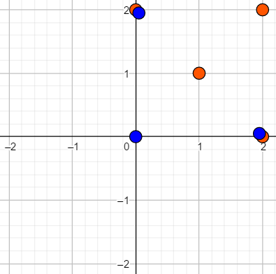
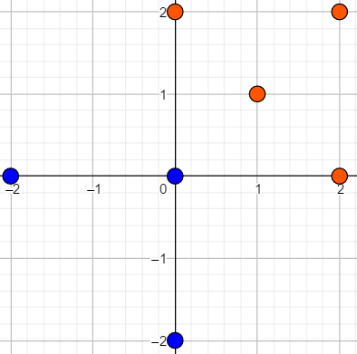
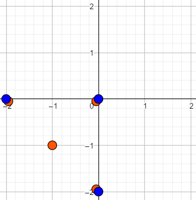

<h1 style='text-align: center;'> E. The Supersonic Rocket</h1>

<h5 style='text-align: center;'>time limit per test: 1 second</h5>
<h5 style='text-align: center;'>memory limit per test: 256 megabytes</h5>

After the war, the supersonic rocket became the most common public transportation.

Each supersonic rocket consists of two "engines". Each engine is a set of "power sources". The first engine has $n$ power sources, and the second one has $m$ power sources. A power source can be described as a point $(x_i, y_i)$ on a 2-D plane. All points in each engine are different.

You can manipulate each engine separately. There are two operations that you can do with each engine. You can do each operation as many times as you want.

1. For every power source as a whole in that engine: $(x_i, y_i)$ becomes $(x_i+a, y_i+b)$, $a$ and $b$ can be any real numbers. In other words, all power sources will be shifted.
2. For every power source as a whole in that engine: $(x_i, y_i)$ becomes $(x_i \cos \theta - y_i \sin \theta, x_i \sin \theta + y_i \cos \theta)$, $\theta$ can be any real number. In other words, all power sources will be rotated.

The engines work as follows: after the two engines are powered, their power sources are being combined (here power sources of different engines may coincide). If two power sources $A(x_a, y_a)$ and $B(x_b, y_b)$ exist, then for all real number $k$ that $0 \lt k \lt 1$, a new power source will be created $C_k(kx_a+(1-k)x_b,ky_a+(1-k)y_b)$. Then, this procedure will be repeated again with all new and old power sources. After that, the "power field" from all power sources will be generated (can be considered as an infinite set of all power sources occurred).

A supersonic rocket is "safe" if and only if after you manipulate the engines, destroying any power source and then power the engine, the power field generated won't be changed (comparing to the situation where no power source erased). Two power fields are considered the same if and only if any power source in one field belongs to the other one as well.

Given a supersonic rocket, check whether it is safe or not.

#### Input

The first line contains two integers $n$, $m$ ($3 \le n, m \le 10^5$) — the number of power sources in each engine.

Each of the next $n$ lines contains two integers $x_i$ and $y_i$ ($0\leq x_i, y_i\leq 10^8$) — the coordinates of the $i$-th power source in the first engine.

Each of the next $m$ lines contains two integers $x_i$ and $y_i$ ($0\leq x_i, y_i\leq 10^8$) — the coordinates of the $i$-th power source in the second engine.

It is guaranteed that there are no two or more power sources that are located in the same point in each engine.

#### Output

Print "YES" if the supersonic rocket is safe, otherwise "NO".

You can print each letter in an arbitrary case (upper or lower).

## Examples

#### Input


```text
3 4  
0 0  
0 2  
2 0  
0 2  
2 2  
2 0  
1 1  

```
#### Output


```text
YES  

```
#### Input


```text
3 4  
0 0  
0 2  
2 0  
0 2  
2 2  
2 0  
0 0  

```
#### Output


```text
NO  

```
## Note

The first sample:

  Those near pairs of blue and orange points actually coincide. First, manipulate the first engine: use the second operation with $\theta = \pi$ (to rotate all power sources $180$ degrees).

The power sources in the first engine become $(0, 0)$, $(0, -2)$, and $(-2, 0)$.

  Second, manipulate the second engine: use the first operation with $a = b = -2$.

The power sources in the second engine become $(-2, 0)$, $(0, 0)$, $(0, -2)$, and $(-1, -1)$.

  You can examine that destroying any point, the power field formed by the two engines are always the solid triangle $(0, 0)$, $(-2, 0)$, $(0, -2)$.

In the second sample, no matter how you manipulate the engines, there always exists a power source in the second engine that power field will shrink if you destroy it. 


#### Tags 

#2400 #NOT OK #geometry #hashing #strings 

## Blogs
- [All Contest Problems](../Codeforces_Round_502_(in_memory_of_Leopoldo_Taravilse,_Div._1_+_Div._2).md)
- [announcement (en)](../blogs/announcement_(en).md)
- [Разбор (англ.) (en)](../blogs/Разбор_(англ.)_(en).md)
