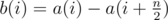
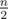
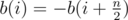
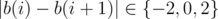
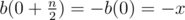
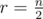
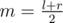
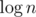
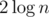

# Tutorial

Thank your for participation!

Problem D2A (New Building) was authored and prepared by [Burunduk2](https://codeforces.com/profile/Burunduk2 "Expert Burunduk2").

Problem D2B (Badge) was authored and prepared by me, the version in SIS's olympiad contained the version with *n* ≤ 105.

Problem D1A (Elections), D1B (Hat), D1D (Large Triangle) were authored by [achulkov2](https://codeforces.com/profile/achulkov2 "Expert achulkov2"), with D1A prepared by [Schemtschik](https://codeforces.com/profile/Schemtschik "Candidate Master Schemtschik"), D1B by [achulkov2](https://codeforces.com/profile/achulkov2 "Expert achulkov2") and D1D prepared by [achulkov2](https://codeforces.com/profile/achulkov2 "Expert achulkov2") and [craborac](https://codeforces.com/profile/craborac "International Grandmaster craborac").

Problem D1C (Sergey's Problem) was authored and prepared by [Morokei](https://codeforces.com/profile/Morokei "Master Morokei").

Problem D1E (Raining Season) was authored and prepared by [izban](https://codeforces.com/profile/izban "International Grandmaster izban").

Editorials were written by [izban](https://codeforces.com/profile/izban "International Grandmaster izban") and [VArtem](https://codeforces.com/profile/VArtem "International Grandmaster VArtem")

 
### [1020A - New Building for SIS](../problems/A._New_Building_for_SIS.md "Codeforces Round 503 (by SIS, Div. 2)")

In this problem you need to find a shortest path between some locations in a building. You need to look at some cases to solve this problem. First, if locations are in the same tower (*t**a* = *t**b*), you don't need to use a passages between two towers at all, and answer is *f**a* - *f**b*. In other case, you have to use some passage between towers. Obviously, you need to use only passage on one floor. The easiest way to do this is to write down interesting floors in array — the floor where you start, the floor where you end your path, first and last floors with passages. After that you can choose interesting floor *x* where you will use a passage, check if there is a passage at this floor (*a* ≤ *x* ≤ *b*), and update answer with an expression like |*t**a* - *t**b*| + |*f**a* - *x*| + |*f**b* - *x*|.

Another method is to choose a floor where you use a passage by case handling. If you start on the floor *f**a*, and there is a passage, you can just use this passage. Otherwise, you choose between floors *a* and *b*, whichever is closer to the start.

 
### [1020B - Badge](../problems/B._Badge.md "Codeforces Round 503 (by SIS, Div. 2)")

In this problem you are given a graph, with one outgoing edge from each vertex. You are asked which vertex is first to be visited twice, if you start in some vertex, and go by outgoing edge from current vertex until you visited some vertex twice.

The problem can be solved by straightforward implementation. You choose a starting vertex (which student is first to get a hole in their badge), and keep the current vertex, and for all vertices how many times it was visited. After transition to the next vertex you just check if it has been already visited, and update visited mark for it.

This solution works in O(n2), and is very easy in implementation. It can be optimized to O(n), but it was not necessary in this problem. It an easy and useful exercise left to reader.

 
### [1019A - Elections](https://codeforces.com/contest/1019/problem/A "Codeforces Round 503 (by SIS, Div. 1)")

Let's iterate over final number of votes for The United Party of Berland. We can see that all opponents should get less votes than our party, and our party should get at least our chosen number of votes.

We can sort all voters by their costs, and solve the problem in two passes. First, if we need to get x votes, we should definitely buy all cheap votes for parties that have at least x votes. Second, if we don't have x votes yet, we should by the cheapest votes to get x votes. We can see that this solution is optimal: consider the optimal answer, and see how many votes The United Party got. We tried such number of votes, and we tried to achieve this number of votes by cheapest way, so we couldn't miss the optimal answer. This can be implemented in O(n2logn) or even O(nlogn).

 
### [1019B - The hat](https://codeforces.com/contest/1019/problem/B "Codeforces Round 503 (by SIS, Div. 1)")

Let *a*(*i*) be a number given to the *i*-th student. Let's introduce function . As *n* is even,  is integer, and *b*(*i*) is defined correctly. Notice two facts: first, , and second, . The problem is to find an *i* such that *b*(*i*) = 0. 

Second note leads us to observation that all *b*(*i*) have the same oddity. So, let's find *b*(0), and if it is odd, then there is no answer, and we need to print  - 1 — all *b*(*i*) have the same oddity (odd), and zero, as a number of different oddity, won't appear in *b*(*i*).

Otherwise, suppose we know *b*(0), and it is equal to *x* (without loss of generality *x* > 0). Notice that . As we remember from second observation that all *b*(*i*) have the same oddity, and neighboring numbers differ by no more than 2, we can use discrete continuity. 

Lemma: if you have two indices *i* and *j* with values *b*(*i*) and *b*(*j*), then on segment between *i* and *j* there are all values with the same oddity from *min*(*b*(*i*), *b*(*j*)) to *max*(*b*(*i*), *b*(*j*)). Indeed, as neighboring *b* differ by no more than 2, we couldn't skip any number with the same oddity.

Now we can use a binary search. At the start *l* = 0, , and values *b*(*l*) and *b*(*r*) are even numbers with the different signs. By lemma, on segment between *l* and *r* there is a zero that we want to find. Let's take . If *b*(*m*) = 0, we found the answer. Otherwise, based on sign of *b*(*m*) we can replace one of *l*, *r* in binary search to *m*, and reduce the problem to the same with smaller size. There will be no more than  iterations, and as calculation of *b*(*i*) requires two queries, we solved the problem in  queries.

 
### [1019C - Sergey's problem](https://codeforces.com/contest/1019/problem/C "Codeforces Round 503 (by SIS, Div. 1)")

Let's build the solution by induction. Suppose we have to solve the problem for n vertices and we can solve this problem for all k (k<n). Take an arbitrary vertex A. Remove A from the graph, as well as all vertices that A has an outgoing edge to. Resulting graph has less than n vertices, so by induction, we can build the solution for it. Let's call the answer set for the new graph M. After this we have two cases: either there is an edge from set M to vertex A or there is not. If there is an edge from M to A, then M is a correct answer for initial graph, because every removed vertex can be reached from M in at most two steps. Otherwise, we can add A to M and, again, this set will satisfy the required condition. This also proves the answer always exists.

How to implement it? Let's iterate over all vertices in order from 1 to n and remember whether each vertex is currently present in the graph or not. Whenever we encounter a currently present vertex u, we save u and mark u and all vertices reachable from u in one step as removed. After that, we go over all saved vertices in reverse order and add them to answer set if it's not reachable from the answer set in one step.

This solutions works in O(V+E) time and space.

 
### [1019D - Large Triangle](https://codeforces.com/contest/1019/problem/D "Codeforces Round 503 (by SIS, Div. 1)")

Let's fix one of edge of the triangle. We need to find a third point so the area of triangle is equal to s. Notice that area of triangle is proportional to scalar product of the normal vector to the chosen edge and radius-vector of third point. So, if we had all other points sorted by scalar product with normal to the edge, we could find the third point by binary search. It is the main goal of the solution.

There are O(n2) interesting directions — two normal vectors to each of edges, defined by all pairs of points. For each pair of points you can see that for some directions one of points has larger scalar product with this direction, and for some other direction another point has larger scalar product. We can see that points ai and aj have the same scalar product with vector rotate90(ai−aj) — with normal vector edge defined by these two points. If you look at all directions on unit circle, this vector and the opposite vector change the order of points ai and aj in sorted order by scalar product. Also, as there are no three points lying on one line, these two points will be neighboring in sorting order by this direction.

So, we can maintain the sorting order. Let's take all events on unit circle as all vectors of type rotate90(ai−aj), and for every such event swap two neighboring points ai and aj in sorting order. After swap we can do a binary search for third point to find a required triangle with area s. This works in O(n2logn) time.

 
### [1019E - Raining season](https://codeforces.com/contest/1019/problem/E "Codeforces Round 503 (by SIS, Div. 1)")

Let's use centroid decomposition on edges of the tree to solve this task.

Centroid decomposition on edges is about finding an edge that divides a tree of n vertices into two subtrees, each of which contains no more than cn vertices for some fixed constant c<1. It is easy to see that such decomposition has only logarithmic depth in terms of initial number of nodes.

There is a problem — it is easy to construct an example, where it is impossible to choose such edge. For example, star tree with n vertices and n−1 leaves is fine for that — every edge has a leaf as one of its ends. To solve this problem, we can add new vertices and edges to the tree. Let's fix arbitrary root of the tree, and make tree binary: if some vertex v has more than two children — u1,u2,…,uk, we may replace vertex v to vertex v1 with children u1 and v2, v2 with children u2 and v3, and so on. Edge between vi and ui has the same length as in initial tree between v and ui, and edge between vi and vi+1 has length 0.

It is easy to see that the distance between any pair of vertices in new tree is the same as the distance between them in initial tree. Also, the degree of the each vertex is at most three, so we can take the centroid of the new tree, and there will be a subtree of centroid with [n3;n2] vertices, so, we will wind an edge that we need in centroid decomposition on edges.

After choosing an edge for decomposition, we should solve the problem recursively for subtrees, and find the diameters which contain the chosen edge. It is quite easy — we can calculate a linear function of length of path from . After that we need to take one linear function from both subtrees and get the sum of these functions.

We can say that if length of path looks like linear function at+b, then we have a point (a,b) on plane. Then it is obvious that we should only keep points on the convex hull of this set. Instead of choosing pairs of vertices in subtrees of edge we can just build a Minkowski sum of their convex hulls — we will get exactly the diameters that contain the chosen edge in linear time.

After computing the convex hulls of diameters containing each edge in decomposition, we can put all these points in one big array and build one big convex hull for all these points again. This way we get all interesting diameters in the tree. To get the length of diameter in time t, we have to find the most distant point on convex hull in direction (t,1).

Building the convex hull for all points for diameters containing the edge of decomposition works in O(klogk), where k is size of current connected component. With knowledge that we have logarithmic depth of decomposition, overall complexity is O(nlog2n).

