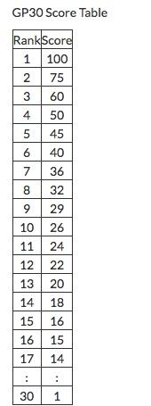
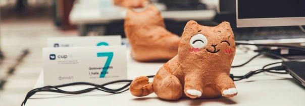

# Codeforces_Round_504

Hi!

August 17, [Friday, August 17, 2018 at 20:35UTC+6](https://codeforces.com/https://www.timeanddate.com/worldclock/fixedtime.html?day=17&month=8&year=2018&hour=17&min=35&sec=0&p1=166), there will be a rated Codeforces round #504. Some of the problems will be from VK Cup 2018 finals, and [awoo](https://codeforces.com/profile/awoo "Candidate Master awoo") and [vovuh](https://codeforces.com/profile/vovuh "Candidate Master vovuh") have prepared other tasks for the full round.

The problems of this round are proposed, prepared and tested by: [MikeMirzayanov](https://codeforces.com/profile/MikeMirzayanov "Headquarters, MikeMirzayanov"), [awoo](https://codeforces.com/profile/awoo "Candidate Master awoo"), [vovuh](https://codeforces.com/profile/vovuh "Candidate Master vovuh"), [Errichto](https://codeforces.com/profile/Errichto "International Grandmaster Errichto"), [Lewin](https://codeforces.com/profile/Lewin "Grandmaster Lewin"), [Endagorion](https://codeforces.com/profile/Endagorion "International Grandmaster Endagorion"), [Um_nik](https://codeforces.com/profile/Um_nik "Legendary Grandmaster Um_nik"), [YakutovDmitriy](https://codeforces.com/profile/YakutovDmitriy "International Master YakutovDmitriy"), [budalnik](https://codeforces.com/profile/budalnik "International Master budalnik"), [izban](https://codeforces.com/profile/izban "International Grandmaster izban"), [Belonogov](https://codeforces.com/profile/Belonogov "International Grandmaster Belonogov"), [scanhex](https://codeforces.com/profile/scanhex "Grandmaster scanhex"), [300iq](https://codeforces.com/profile/300iq "Grandmaster 300iq"), [qoo2p5](https://codeforces.com/profile/qoo2p5 "Grandmaster qoo2p5"), [Livace](https://codeforces.com/profile/Livace "Master Livace").

There will be prizes from VK social network in this round as well! The participants who took the first 30 places of this round and the round #505, also partially based on the tasks of VK Cup 2018 Finals, will get GP30 points.

Participants are sorted by sum of points for both rounds (if the participant did not participate in one of the rounds, the points scored for it are assumed to be equal to zero), with the maximum time for both rounds from the beginning of the round to the last submission that passed the pretests as tie-break.

The top 10 participants will receive a plush Persik!

There is no country nor language restriction, everyone can win a prize. One don't have to have participated in VK Cup to receive the prize. Exact selection algorithm will be announced before the start of the round.

Good luck!

