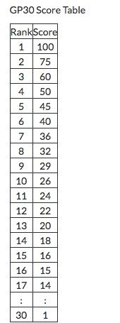
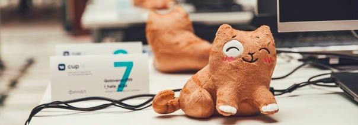

# A_(en)

Hello.

On [Sunday, August 19, 2018 at 19:35UTC+6](https://codeforces.com/https://www.timeanddate.com/worldclock/fixedtime.html?day=19&month=8&year=2018&hour=16&min=35&sec=0&p1=166), Codeforces Round #505 takes place. This is a paired round to #504.

Some problems are taken from VK Cup 2018 Finals ([ashmelev](https://codeforces.com/profile/ashmelev "Grandmaster ashmelev"), [Errichto](https://codeforces.com/profile/Errichto "International Grandmaster Errichto"), [Lewin](https://codeforces.com/profile/Lewin "Grandmaster Lewin")) and some are proposed by me. I'd like to thank my fellows — Dima ([cdkrot](https://codeforces.com/profile/cdkrot "International Master cdkrot")) who is actually coordinating this round, Kolya ([KAN](https://codeforces.com/profile/KAN "Grandmaster KAN")) who brought me here, and also Grisha ([vintage_Vlad_Makeev](https://codeforces.com/profile/vintage_Vlad_Makeev "International Grandmaster vintage_Vlad_Makeev")) and Ildar ([300iq](https://codeforces.com/profile/300iq "Grandmaster 300iq")) just for being nice.

I'd also like to express my gratitude to [MikeMirzayanov](https://codeforces.com/profile/MikeMirzayanov "Headquarters, MikeMirzayanov") for multiple bug fixes and awesome Codeforces!

There will be **seven** problems will the following scoring:   
 500 — 1000 — 1500 — 1750 — 2250 — 2750 — 3500

**UPD.** The system testing is over. [Editorial](//codeforces.comTutorial.md) (with problem E now) 

Congratz to the winners!

 1. [Swistakk](https://codeforces.com/profile/Swistakk "Legendary Grandmaster Swistakk") (after all these years, yay)
2. [DearMargaret](https://codeforces.com/profile/DearMargaret "Unrated, DearMargaret")
3. [Kostroma](https://codeforces.com/profile/Kostroma "International Grandmaster Kostroma")
4. [Benq](https://codeforces.com/profile/Benq "International Grandmaster Benq")
5. [AwD](https://codeforces.com/profile/AwD "Grandmaster AwD")
6. [xumingkuan](https://codeforces.com/profile/xumingkuan "Grandmaster xumingkuan")
7. [webmaster](https://codeforces.com/profile/webmaster "International Grandmaster webmaster")
8. [TLE](https://codeforces.com/profile/TLE "International Grandmaster TLE")
9. [Egor](https://codeforces.com/profile/Egor "International Grandmaster Egor")
10. [kriii](https://codeforces.com/profile/kriii "International Grandmaster kriii")

As in the previous round, thanks to VK social network, GP30 scores will be distributed among the best participants.

Participants are sorted by sum of points for both rounds (if the participant did not participate in one of the rounds, the points scored for it are assumed to be equal to zero), with the maximum time for both rounds from the beginning of the round to the last submission that passed the pretests as tie-break.

Let me remind you that top 10 participants with respect to GP30 score will receive a plush Persik.

Hope you enjoy. Good luck and have fun!

