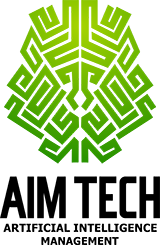

# Анонс

Hi, Codeforces!

AIM Tech Codeforces Round 5 will take place on [Monday, August 27, 2018 at 22:35UTC+6](https://codeforces.com/https://www.timeanddate.com/worldclock/fixedtime.html?day=27&month=8&year=2018&hour=19&min=35&sec=0&p1=166).

The round is prepared by AIM Tech employees: [Kostroma](https://codeforces.com/profile/Kostroma "Legendary Grandmaster Kostroma"), [riadwaw](https://codeforces.com/profile/riadwaw "Grandmaster riadwaw"), [Edvard](https://codeforces.com/profile/Edvard "Candidate Master Edvard"), [yarrr](https://codeforces.com/profile/yarrr "Candidate Master yarrr"), [zemen](https://codeforces.com/profile/zemen "International Grandmaster zemen"), [Errichto](https://codeforces.com/profile/Errichto "International Grandmaster Errichto"), [malcolm](https://codeforces.com/profile/malcolm "Master malcolm"), [gchebanov](https://codeforces.com/profile/gchebanov "International Master gchebanov"), [VadymKa](https://codeforces.com/profile/VadymKa "Expert VadymKa") and [zeliboba](https://codeforces.com/profile/zeliboba "Grandmaster zeliboba").

Round will take place during Petrozavodsk Summer Camp, which is sponsored by our company.

Thanks to Mike Mirzayanov([MikeMirzayanov](https://codeforces.com/profile/MikeMirzayanov "Headquarters, MikeMirzayanov")) for brilliant platforms Polygon and Codeforces and problem coordinator Nikolay Kalinin ([KAN](https://codeforces.com/profile/KAN "Grandmaster KAN")). Many thanks to [Golovanov399](https://codeforces.com/profile/Golovanov399 "International Grandmaster Golovanov399"), [Arterm](https://codeforces.com/profile/Arterm "International Grandmaster Arterm"), [winger](https://codeforces.com/profile/winger "International Grandmaster winger") for round testing!

Our company specialises in proprietary trading, the key concepts in our work are big data, low latency and high frequency. Our team mainly consists of graduates from the Moscow State University (MSU) and Moscow Institute of Physics and Technology (MIPT). You could read more on our website [aimtech.com](https://codeforces.com/http://aimtech.com).

Participants of combined round will be given 8 problems and **2:15** to solve them.

Last three problems have almost the same difficulty, so we advise read all of them.

**Prizes from round 502 in memory of Leopoldo Taravilse will be distributed in this round.**

**Top-25 will get 100$ each, following 46 will get 50$ each.**

Scoring 500-750-1250-2000-2500-3250-3250-3500

We wish you good luck and high ~~frequency~~ rating!

Thank you for participation, congratulations to the winners!

 1. [LHiC](https://codeforces.com/profile/LHiC "Legendary Grandmaster LHiC")
2. [jqdai0815](https://codeforces.com/profile/jqdai0815 "Legendary Grandmaster jqdai0815")
3. [bmerry](https://codeforces.com/profile/bmerry "International Grandmaster bmerry")
4. [Um_nik](https://codeforces.com/profile/Um_nik "Legendary Grandmaster Um_nik")
5. [Egor](https://codeforces.com/profile/Egor "International Grandmaster Egor")
6. [Benq](https://codeforces.com/profile/Benq "Legendary Grandmaster Benq")
7. [tqyaaaaang](https://codeforces.com/profile/tqyaaaaang "International Grandmaster tqyaaaaang")
8. [DearMargaret](https://codeforces.com/profile/DearMargaret "International Grandmaster DearMargaret")
9. [Marcin_smu](https://codeforces.com/profile/Marcin_smu "International Grandmaster Marcin_smu")
10. [Swistakk](https://codeforces.com/profile/Swistakk "Legendary Grandmaster Swistakk")

[Editorial](//codeforces.com/blog/entry/61493)

[Short editorial by bmerry](//codeforces.com/blog/entry/61450?#comment-454481)

Information about prizes and analysis will be published later.

