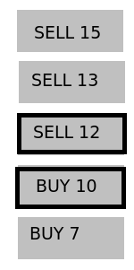

<h1 style='text-align: center;'> D. Order book</h1>

<h5 style='text-align: center;'>time limit per test: 2 seconds</h5>
<h5 style='text-align: center;'>memory limit per test: 256 megabytes</h5>

Let's consider a simplified version of order book of some stock. The order book is a list of orders (offers) from people that want to buy or sell one unit of the stock, each order is described by direction (BUY or SELL) and price.

At every moment of time, every SELL offer has higher price than every BUY offer. 

In this problem no two ever existed orders will have the same price.

The lowest-price SELL order and the highest-price BUY order are called the best offers, marked with black frames on the picture below.

  The presented order book says that someone wants to sell the product at price $12$ and it's the best SELL offer because the other two have higher prices. The best BUY offer has price $10$. There are two possible actions in this orderbook: 

1. Somebody adds a new order of some direction with some price.
2. Somebody accepts the best possible SELL or BUY offer (makes a deal). It's impossible to accept not the best SELL or BUY offer (to make a deal at worse price). After someone accepts the offer, it is removed from the orderbook forever.

It is allowed to add new BUY order only with prices less than the best SELL offer (if you want to buy stock for higher price, then instead of adding an order you should accept the best SELL offer). Similarly, one couldn't add a new SELL order with price less or equal to the best BUY offer. For example, you can't add a new offer "SELL $20$" if there is already an offer "BUY $20$" or "BUY $25$" — in this case you just accept the best BUY offer.

You have a damaged order book log (in the beginning the are no orders in book). Every action has one of the two types:

1. "ADD $p$" denotes adding a new order with price $p$ and unknown direction. The order must not contradict with orders still not removed from the order book.
2. "ACCEPT $p$" denotes accepting an existing best offer with price $p$ and unknown direction.

The directions of all actions are lost. Information from the log isn't always enough to determine these directions. Count the number of ways to correctly restore all ADD action directions so that all the described conditions are satisfied at any moment. Since the answer could be large, output it modulo $10^9 + 7$. If it is impossible to correctly restore directions, then output $0$.

##### Input

The first line contains an integer $n$ ($1 \le n \le 363\,304$) — the number of actions in the log.

Each of the next $n$ lines contains a string "ACCEPT" or "ADD" and an integer $p$ ($1 \le p \le 308\,983\,066$), describing an action type and price. 

All ADD actions have different prices. For ACCEPT action it is guaranteed that the order with the same price has already been added but has not been accepted yet.

##### Output

##### Output

 the number of ways to restore directions of ADD actions modulo $10^9 + 7$.

## Examples

##### Input


```text
6  
ADD 1  
ACCEPT 1  
ADD 2  
ACCEPT 2  
ADD 3  
ACCEPT 3  

```
##### Output


```text
8  

```
##### Input


```text
4  
ADD 1  
ADD 2  
ADD 3  
ACCEPT 2  

```
##### Output


```text
2  

```
##### Input


```text
7  
ADD 1  
ADD 2  
ADD 3  
ADD 4  
ADD 5  
ACCEPT 3  
ACCEPT 5  

```
##### Output


```text
0  

```
## Note

In the first example each of orders may be BUY or SELL.

In the second example the order with price $1$ has to be BUY order, the order with the price $3$ has to be SELL order.


#### Tags 

#2100 #NOT OK #combinatorics #data_structures #greedy 

## Blogs
- [All Contest Problems](../AIM_Tech_Round_5_(rated,_Div._1_+_Div._2).md)
- [Анонс](../blogs/Анонс.md)
- [Tutorial (en)](../blogs/Tutorial_(en).md)
