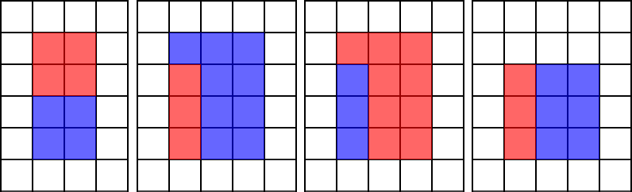
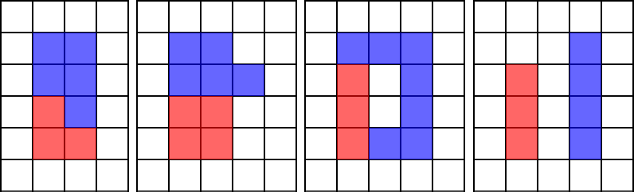

<h1 style='text-align: center;'> F. Multicolored Markers</h1>

<h5 style='text-align: center;'>time limit per test: 3 seconds</h5>
<h5 style='text-align: center;'>memory limit per test: 256 megabytes</h5>

There is an infinite board of square tiles. Initially all tiles are white.

Vova has a red marker and a blue marker. Red marker can color $a$ tiles. Blue marker can color $b$ tiles. If some tile isn't white then you can't use marker of any color on it. Each marker must be drained completely, so at the end there should be exactly $a$ red tiles and exactly $b$ blue tiles across the board.

Vova wants to color such a set of tiles that:

* they would form a rectangle, consisting of exactly $a+b$ colored tiles;
* all tiles of at least one color would also form a rectangle.

Here are some examples of correct colorings:

  Here are some examples of incorrect colorings:

  Among all correct colorings Vova wants to choose the one with the minimal perimeter. What is the minimal perimeter Vova can obtain?

It is guaranteed that there exists at least one correct coloring.

####### Input

A single line contains two integers $a$ and $b$ ($1 \le a, b \le 10^{14}$) — the number of tiles red marker should color and the number of tiles blue marker should color, respectively.

####### Output

Print a single integer — the minimal perimeter of a colored rectangle Vova can obtain by coloring exactly $a$ tiles red and exactly $b$ tiles blue.

It is guaranteed that there exists at least one correct coloring.

## Examples

####### Input


```text
4 4  

```
####### Output


```text
12  

```
####### Input


```text
3 9  

```
####### Output


```text
14  

```
####### Input


```text
9 3  

```
####### Output


```text
14  

```
####### Input


```text
3 6  

```
####### Output


```text
12  

```
####### Input


```text
506 2708  

```
####### Output


```text
3218  

```
## Note

The first four examples correspond to the first picture of the statement.

## Note

 that for there exist multiple correct colorings for all of the examples.

In the first example you can also make a rectangle with sides $1$ and $8$, though its perimeter will be $18$ which is greater than $8$.

In the second example you can make the same resulting rectangle with sides $3$ and $4$, but red tiles will form the rectangle with sides $1$ and $3$ and blue tiles will form the rectangle with sides $3$ and $3$.


#### Tags 

#2000 #NOT OK #binary_search #brute_force #math #number_theory 

## Blogs
- [All Contest Problems](../Codeforces_Round_506_(Div._3).md)
- [Announcement](../blogs/Announcement.md)
- [Tutorial #1 (ru)](../blogs/Tutorial_1_(ru).md)
- [Tutorial #2 (en)](../blogs/Tutorial_2_(en).md)
