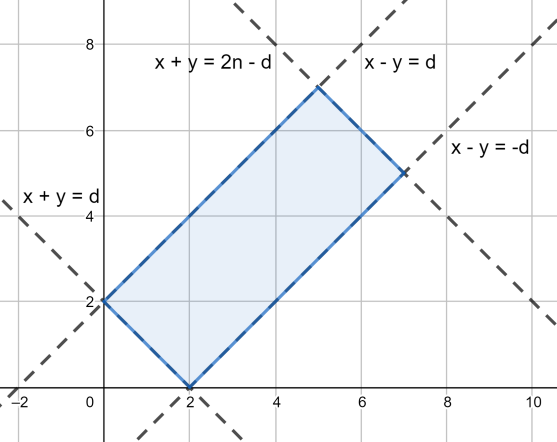

# Tutorial

[1030A - In Search of an Easy Problem](../problems/A._In_Search_of_an_Easy_Problem.md "Technocup 2019 - Elimination Round 1")

 **Tutorial**
### [1030A - In Search of an Easy Problem](../problems/A._In_Search_of_an_Easy_Problem.md "Technocup 2019 - Elimination Round 1")

Codebait. Comforting problem.

Find $\max\limits_{i=1..n}{(\text{answer}_i)}$, if it's equal to $1$ then answer is HARD, otherwise — EASY.

 **Solution**
```cpp
#include<bits/stdc++.h>

using namespace std;

int main() {
	int n; cin >> n;
	
	int curMax = 0;
	for(int i = 0; i < n; i++) {
		int curAns; cin >> curAns;
		curMax = max(curMax, curAns);
	}
	puts(curMax > 0 ? "HARD" : "EASY");
	return 0;
}
```
[1030B - Vasya and Cornfield](../problems/B._Vasya_and_Cornfield.md "Technocup 2019 - Elimination Round 1")

 **Tutorial**
### [1030B - Vasya and Cornfield](../problems/B._Vasya_and_Cornfield.md "Technocup 2019 - Elimination Round 1")

For each point $(x, y)$ let's look at values of two diagonals: $x + y$ and $x - y$. Borders of the cornfield, in fact, give limits to this values in the next way: $d \le x + y \le 2n - d$ and $-d \le x - y \le d$ — that's all we need to check. There is a picture below for the further explanation.

   **Solution**
```cpp
#include<bits/stdc++.h>

using namespace std;

int n, d;
int m;

int main() {
	ios_base::sync_with_stdio(false);
    cin.tie(NULL);

	cin >> n >> d;
	cin >> m;
	for(int i = 0; i < m; ++i){
		int x, y;
		cin >> x >> y;
		
		bool ok = true;
		if(!((x - y) <= d && (x - y) >= -d)) 
			ok = false;
		if(!((x + y) <= n + n - d && (x + y) >= d))
			ok = false;

		if(ok) puts("YES");
		else puts("NO");
	}
	return 0;
}
```
[1030C - Vasya and Golden Ticket](../problems/C._Vasya_and_Golden_Ticket.md "Technocup 2019 - Elimination Round 1")

 **Tutorial**
### [1030C - Vasya and Golden Ticket](../problems/C._Vasya_and_Golden_Ticket.md "Technocup 2019 - Elimination Round 1")

Let's iterate over all possible lengths $len$ of the first segment of the partition. Now, knowing this length, we also can calculate sum $S$ of each segment. Now we can form partition with greedy solution: starting from position $len + 1$ we will find maximal prefix (strictly, segment starting at $len + 1$) with sum lower or equal to $S$, cut it and again. If all formed segments have sums equal to $S$ then it's valid partition and answer is "YES".

Otherwise, there is no valid length of the first segment, there is no valid partition, so answer is "NO".

 **Solution**
```cpp
#include<bits/stdc++.h>

using namespace std;

int n;
string s;

int main() {
	ios_base::sync_with_stdio(false);
    cin.tie(NULL);

	cin >> n >> s;
	int sum = 0;
	for(int i = 0; i < n - 1; ++i){
		sum += s[i] - '0';
		
		bool ok = true;
		int pos = i + 1;
		int sum2 = 0;
		while(pos < n){
			sum2 = s[pos++] - '0';
			while(pos < n && sum2 + s[pos] - '0' <= sum){
				sum2 += s[pos] - '0';
				++pos;
			}
			if(sum2 != sum) ok = false;
		}
		
		if(sum2 != sum) ok = false;
		if(ok){
			puts("YES");
			return 0;
		}
	}
	
	puts("NO");	
	return 0;
}
```
[1030D - Vasya and Triangle](../problems/D._Vasya_and_Triangle.md "Technocup 2019 - Elimination Round 1")

 **Tutorial**
### [1030D - Vasya and Triangle](../problems/D._Vasya_and_Triangle.md "Technocup 2019 - Elimination Round 1")

Doubled area of any triangle with integer coordinates is always integer. That's why if $2 n m $ is not divisible by $k$ then there is no valid triangle.

Otherwise, it's always possible to find required triangle. We will construct the answer with next algorithm. At first, if $k$ is even then divide it by $2$. Next, find $g = \gcd(k, n)$, where $\gcd(x, y)$ is greatest common divisor of $x$ and $y$. Denote $k' = \frac{k}{g}$ and assign $a = \frac{n}{g}$ as length of the first side. Next assign $b = \frac{m}{k'}$ as length of the second side. Now, if $k$ was odd we need to multiply one of the sides by $2$. If $a < n$ then $a = 2a$, otherwise $b = 2b$. $b$ still won't be greater than $m$ since if $a = n$ then $b$ was strictly lower than $m$.

The answer is the triangle with vertices $(0, 0), (a, 0), (0, b)$. You can check that its area is equal to $\frac{nm}{k}$.

 **Solution**
```cpp
#include<bits/stdc++.h>

using namespace std;

long long gcd(long long a, long long b){
	return a? gcd(b % a, a) : b;
}

int main() {
	//freopen("input.txt", "r", stdin);
	
    long long n, m, k;
    cin >> n >> m >> k;
    
    bool isEven = k % 2 == 0;
    long long p = n * m;
	if(isEven) k /= 2;
	
	if(p % k != 0){
		cout << "NO" << endl;
		return 0;
	}
	
	long long x = gcd(n, k);
	k /= x;
	long long a = n / x;
		
	x = gcd(m, k);
	k /= x;
	assert(k == 1);
	long long b = m / x;
		
	
	if(!isEven){
		if(a < n)
			a += a;
		else{
			assert(b < m);
			b += b;
		}
	}
	
	cout << "YES" << endl;
	cout << "0 0n";
	cout << 0 << ' ' << b << endl;
	cout << a << ' ' << 0 << endl;
	
	return 0;
}
```
[1030E - Vasya and Good Sequences](../problems/E._Vasya_and_Good_Sequences.md "Technocup 2019 - Elimination Round 1")

 **Tutorial**
### [1030E - Vasya and Good Sequences](../problems/E._Vasya_and_Good_Sequences.md "Technocup 2019 - Elimination Round 1")

Since we can swap any pair of bits in the number, so all we need to know is just the number of ones in its binary representation. Let create array $b_1, b_2, \dots , b_n$, where $b_i$ is number of ones in binary representation of $a_i$. Forget about array $a$, we will work with array $b$.

Let's find a way to decide whether fixed segment is good or not. It can be proven that two conditions must be met. At first, sum of $b_i$ at this segment should be even. At second, maximal element should be lower or equal to the sum of all other elements. 

We will iterate over left borders of subsegments in descending order and for each left border $l$ calculate number of right borders $r$ such that $[l, r]$ is good.

Let's, as first, "forget" about condition on maximum and calculate $cntAll(l)$ — number of right borders $r$, such that sum on segment $[l,r]$ is even and left border $l$ is fixed. We can calculate it by counting $S_0$ and $S_1$ — the number of suffixes of array with even sum of $b_i$ and number of suffixes with odd sum. If the current sum $\sum\limits_{i=l}^{n}{b_i}$ is even then $cntAll(l) = S_0$ since $\sum\limits_{i=l}^{r}{b_i} = \sum\limits_{i=l}^{n}{b_i} - \sum\limits_{i=r+1}^{n}{b_i}$. If $\sum\limits_{i=l}^{n}{b_i}$ is odd then $cntAll(l) = S_1$.

Since we forgot about condition on maximum, some bad segments were counted. Since $a_i \le 10^{18}$ then $b_i < 61$. That's why if length of the segment $\ge 61$, condition on the maximum is always true. So, for a fixed $l$ we can iterate over all right borders in the $[l, l + 61]$ and subtract number of segments with even sum and too large maximum (since these segments were counted in the answer).

 **Solution**
```cpp
#include<bits/stdc++.h>

using namespace std;

const int N = int(3e5) + 9;

int n;
long long a[N];
int b[N];
int cnt[2][N];

int main() {
	ios_base::sync_with_stdio(false);
    cin.tie(NULL);

	cin >> n;
	for(int i = 0; i <n; ++i){
		cin >> a[i];
		b[i] = __builtin_popcountll(a[i]);	
	}
	
	long long res = 0;
	int sufSum = 0;
	cnt[0][n] = 1;
	for(int i = n - 1; i >= 0; --i){
		int sum = 0, mx = 0;
		int lstJ = i;
		int add = 0;
		for(int j = i; j < n && j - i < 65; ++j){
			sum += b[j];
			mx = max(mx, b[j]);
			if(mx > sum - mx && sum % 2 == 0) --add;
			lstJ = j;
		}		
		
		sufSum += b[i];
		add += cnt[sufSum & 1][i + 1];
		res += add;	
		
		cnt[0][i] = cnt[0][i + 1];
		cnt[1][i] = cnt[1][i + 1];
		if(sufSum & 1) ++cnt[1][i];
		else ++cnt[0][i];
	}
	
	cout << res << endl;
	return 0;
}
```
[1030F - Putting Boxes Together](../problems/F._Putting_Boxes_Together.md "Technocup 2019 - Elimination Round 1")

 **Tutorial**
### [1030F - Putting Boxes Together](../problems/F._Putting_Boxes_Together.md "Technocup 2019 - Elimination Round 1")

Firstly, let's prove that it's always optimal to leave one of the boxes untouched. By contradiction: if all boxes will move, so some left part will move right and right part will move left. Let the total cost of shifting the whole left part by one be equal to $S_l$ and cost of the right part be $S_r$. We can replace the move of one of the parts by extra move of the other part, so we can change $\max(S_l, S_r)$ by $\min(S_l, S_r)$ — total cost doesn't increase — contradiction. 

Let $S(l, r) = \sum\limits_{i=l}^{r}{w_i}$. Then, secondly, let's prove that for some segment $[l, r]$ it's always optimal to choose untouched box $k$ such that $S(l, k-1) \le \frac{S(l, r)}{2}$, but $S(l, k) \ge \frac{S(l, r)}{2}$. Again: if it is not true then either $S(l,k - 1) > \frac{S(l, r)}{2}$ or $S(k+1, r) > \frac{S(l, r)}{2}$. And we again can replace either $S(l, k - 1)$ by $S(k, r)$ or $S(k + 1, r)$ by $S(l, k)$. Total cost is decreasing — contradiction.

So, finally, all we need is to process the following queries: for given $[l, r]$ find maximum $k$ that $S(l, k-1) \le \frac{S(l, r)}{2}$, but $S(l, k) > \frac{S(l, r)}{2}$ ($>$ or $\ge$ doesn't really matter). It can be done with binary search + BIT in $O(\log^2 n)$ time or by "descending" down the Segment Tree in $O(\log n)$ time.

Next part is how to calculate the answer for the known $k$. Since the cost of moving box $i$ to the right place is equal to $w_i (a_k - a_i - (k - i))$ if $i < k$ and $w_i (a_i - a_k - (i - k))$ otherwise so, if we shift from $a_i$ to $a_i - i$ then the cost to move all left indices are equal to $\sum\limits_{i=l}^{k-1}{w_i (a_k - a_i)} = a_k \cdot S(l, k-1) - \sum\limits_{i=l}^{k-1}{w_i a_i}$. The right part transforms in the same way. Since answer is modulo $10^9 + 7$ we can calculate $\sum\limits_{i=l}^{k-1}{(w_i a_i \mod 10^9 + 7)}$ using another BIT.

Result complexity is $O(n \log n + q \log^2 n)$ or $O((n + q) \log n)$ (which isn't really faster in this task).

 **Fenwick Solution**
```cpp
#include<bits/stdc++.h>

using namespace std;

#define fore(i, l, r) for(int i = int(l); i < int(r); i++)
typedef long long li;

const int MOD = int(1e9) + 7;

int norm(int a) {
	if(a >= MOD)
		a -= MOD;
	if(a < 0)
		a += MOD;
	return a;
}

int norm(const li &a) {
	return norm(int(a % MOD));
}

int mul(int a, int b) {
	return int((a * 1ll * b) % MOD);
}

const int N = 200 * 1000 + 555;

int n, q;
int a[N], w[N];

inline bool read() {
	if(!(cin >> n >> q))
		return false;
	fore(i, 0, n)
		assert(scanf("%d", &a[i]) == 1);
	fore(i, 0, n)
		assert(scanf("%d", &w[i]) == 1);
	return true;
}

li fW[N], fAW[N];

void inc(li f[N], int pos, li val) {
	for(; pos < N; pos |= pos + 1)
		f[pos] += val;
}

li sum(li f[N], int pos) {
	li ans = 0;
	for(; pos >= 0; pos = (pos & (pos + 1)) - 1)
		ans += f[pos];
	return ans;
}

li getSum(li f[N], int l, int r) {
	return sum(f, r - 1) - sum(f, l - 1);
}

int getNSum(li f[N], int l, int r) {
	return norm(sum(f, r - 1) - sum(f, l - 1));
}

inline void solve() {
	fore(i, 0, n) {
		a[i] -= i;
		inc(fW, i, w[i]);
		inc(fAW, i, mul(a[i], w[i]));
	}
	
	fore(_, 0, q) {
		int x, y;
		assert(scanf("%d%d", &x, &y) == 2);
		if(x < 0) {
			x = -x - 1;
			inc(fW, x, -w[x]);
			inc(fAW, x, -mul(a[x], w[x]));
			
			w[x] = y;
			inc(fW, x, w[x]);
			inc(fAW, x, mul(a[x], w[x]));
		} else {
			x--;
			li sum = getSum(fW, x, y);
			
			int lf = x, rg = y;
			while(rg - lf > 1) {
				int mid = (lf + rg) >> 1;
				if(2 * getSum(fW, x, mid) > sum)
					rg = mid;
				else
					lf = mid;
			}
			assert(x <= lf && lf < y);
			
			int ans = norm(mul(a[lf], getNSum(fW, x, lf)) - getNSum(fAW, x, lf));
			ans = norm(ans + norm(getNSum(fAW, lf, y) - mul(a[lf], getNSum(fW, lf, y))) );
			printf("%dn", ans);
		}
	}
}

int main() {
#ifdef _DEBUG
	freopen("input.txt", "r", stdin);
	int tt = clock();
#endif
	cout << fixed << setprecision(15);
	
	if(read()) {
		solve();
		
#ifdef _DEBUG
		cerr << "TIME = " << clock() - tt << endl;
		tt = clock();
#endif
	}
	return 0;
}
```
 **Segment Tree Solution**
```cpp
#include<bits/stdc++.h>

using namespace std;

#define fore(i, l, r) for(int i = int(l); i < int(r); i++)
#define sz(a) int((a).size())

#define x first
#define y second

typedef long long li;

template<class A, class B> ostream& operator <<(ostream& out, const pair<A, B> &p) {
	return out << "(" << p.x << ", " << p.y << ")";
}

template<class A> ostream& operator <<(ostream& out, const vector<A> &v) {
	out << "[";
	fore(i, 1, int(v.size())) {
		if(i) out << ", ";
		out << v[i];
	}
	return out << "]";
}

const int INF = int(1e9);
const li INF64 = li(1e18);

const int MOD = int(1e9) + 7;

int norm(int a) {
	while(a >= MOD)
		a -= MOD;
	while(a < 0)
		a += MOD;
	return a;
}

int norm(const li &a) {
	return norm(int(a % MOD));
}

int mul(int a, int b) {
	return int((a * 1ll * b) % MOD);
}

const int N = 300 * 1000 + 555;

int n, q;
int a[N], w[N];

inline bool read() {
	if(!(cin >> n >> q))
		return false;
	fore(i, 0, n)
		assert(scanf("%d", &a[i]) == 1);
	fore(i, 0, n)
		assert(scanf("%d", &w[i]) == 1);
	return true;
}

li TW[4 * N], TAW[4 * N];

void addVAl(li T[4 * N], int v, int l, int r, int pos, int val) {
	if(l + 1 == r) {
		assert(l == pos);
		T[v] += val;
		return;
	}
	int mid = (l + r) >> 1;
	if(pos < mid)
		addVAl(T, 2 * v + 1, l, mid, pos, val);
	else
		addVAl(T, 2 * v + 2, mid, r, pos, val);
	T[v] = T[2 * v + 1] + T[2 * v + 2];
}

li getSum(li T[4 * N], int v, int l, int r, int lf, int rg) {
	if(l == lf && r == rg)
		return T[v];
	int mid = (l + r) >> 1;
	li ans = 0;
	if(lf < mid)
		ans += getSum(T, 2 * v + 1, l, mid, lf, min(mid, rg));
	if(rg > mid)
		ans += getSum(T, 2 * v + 2, mid, r, max(lf, mid), rg);
	return ans;
}

int getNSum(li T[4 * N], int l, int r) {
	if(l >= r) return 0;
	return int(getSum(T, 0, 0, n, l, r) % MOD);
}

pair<int, li> getPos(int v, int l, int r, int lf, int rg, li val) {
	if(l == lf && r == rg) {
		if(TW[v] <= val)
			return make_pair(INF, TW[v]);
		if(l + 1 == r)
			return make_pair(l, 0);
	}
	int mid = (l + r) >> 1;
	
	int res = INF;
	li sum = 0;
	if(lf < mid) {
		auto cur = getPos(2 * v + 1, l, mid, lf, min(mid, rg), val);
		res = min(res, cur.x);
		sum += cur.y;
	}
	if(rg > mid && res == INF) {
		auto cur = getPos(2 * v + 2, mid, r, max(lf, mid), rg, val - sum);
		res = min(res, cur.x);
		sum += cur.y;
	}
	return make_pair(res, sum);
}

inline void solve() {
	fore(i, 0, n) {
		a[i] -= i;
		addVAl(TW, 0, 0, n, i, w[i]);
		addVAl(TAW, 0, 0, n, i, mul(a[i], w[i]));
	}
	
	fore(_, 0, q) {
		int x, y;
		assert(scanf("%d%d", &x, &y) == 2);
		if(x < 0) {
			x = -x - 1;
			addVAl(TW, 0, 0, n, x, -w[x]);
			addVAl(TAW, 0, 0, n, x, -mul(a[x], w[x]));
			
			w[x] = y;
			addVAl(TW, 0, 0, n, x, w[x]);
			addVAl(TAW, 0, 0, n, x, mul(a[x], w[x]));
		} else {
			x--;
			li sum = getSum(TW, 0, 0, n, x, y);
			int pos = getPos(0, 0, n, x, y, sum / 2).x;
			assert(x <= pos && pos < y);
			
			int ans = norm(mul(a[pos], getNSum(TW, x, pos)) - getNSum(TAW, x, pos));
			ans = norm(ans + norm(getNSum(TAW, pos, y) - mul(a[pos], getNSum(TW, pos, y))) );
			printf("%dn", ans);
		}
	}
}

int main() {
#ifdef _DEBUG
	freopen("input.txt", "r", stdin);
	int tt = clock();
#endif
	cout << fixed << setprecision(15);
	
	if(read()) {
		solve();
		
#ifdef _DEBUG
		cerr << "TIME = " << clock() - tt << endl;
		tt = clock();
#endif
	}
	return 0;
}
```
[1030G - Linear Congruential Generator](../problems/G._Linear_Congruential_Generator.md "Technocup 2019 - Elimination Round 1")

 **Tutorial**
### [1030G - Linear Congruential Generator](../problems/G._Linear_Congruential_Generator.md "Technocup 2019 - Elimination Round 1")

Each generator $f_i^{(k)}$ can be represented as functional graph so the number of different values equal to the legth of the cycle $c$ plus the length of pre-period $pp$. Generalizing on tuples leads to next observation: number of different tuples equals to $\max\limits_{i = 1..n}(pp_i) + \mathop{\text{lcm}}\limits_{i = 1..n}(c_i)$.

 ———— Some proof ———— Let's take a look at some generator $f_i$ to find out its possible $c_i$ and $pp_i$. If $a_i = 0$ then $f_i = x_i, b_i, b_i, b_i, \dots$. the $c_i = 1$ and $pp_i = 0$ or $pp_i = 1$. If $a_i = 1$ then $f_i^{(k)} = (x_i + (k - 1) b_i) \mod p_i$. Since $p_i$ is a prime then $c_i = 1$ or $c_i = p_i$ and $pp_i = 0$.

If $a_i > 1$ then exists $a_i^{-1}$ and $(a_i - 1)^{-1}$, thus $pp_i = 0$. Since there is not pre-period we need to find minimal positive $k$ such that $$x_i \equiv a_i^k x_i + b_i \sum\limits_{j = 0}^{k-1}{a_i^j} \Leftrightarrow x_i \equiv a_i^k x_i + b_i (a_i^k - 1) \cdot (a_i - 1)^{-1} \Leftrightarrow (a_i^k - 1) x_i + b_i (a_i^k - 1) \cdot (a_i - 1)^{-1} \equiv 0 \\\ \Leftrightarrow (a_i^k - 1) (x_i + b_i \cdot (a_i - 1)^{-1}) \equiv 0 \mod p_i.$$

Since $p_i$ is a prime if $a \cdot b \equiv 0$ then $a \equiv 0$ or $b \equiv 0$. So if $(x_i + b_i \cdot (a_i - 1)^{-1}) \equiv 0$ and since it doesn't depend on $k$ then $k = 1$, so $c_i = 1$ and $pp_i = 0$. Otherwise, $(a_i^k - 1) \equiv 0$ and by Lagrange's theorem $k \mid (p_i - 1)$. Finally, since $p_i$ is a prime there exist $a_i$ such that $k = p_i - 1$.

 ———— End of some proof ———— At the end we can understand that only three cases are matter: $(c_i = 1, pp_i = 1)$, $(c_i = p_i, pp_i = 0)$ and $(c_i = p_i - 1, pp_i = 0)$.

Here some greedy ideas works: it always optimal try at first $(p_i, 0)$, then $(p_i - 1, 0)$ and only then $(1, 1)$; we can process elements in the descending order. But there is one problem: since we maximaize $\max\limits_{i = 1..n}(pp_i) + \mathop{\text{lcm}}\limits_{i = 1..n}(c_i)$ then there are cases, where we can make $\max\limits_{i = 1..n}(pp_i) = 1$ without lowering $\mathop{\text{lcm}}\limits_{i = 1..n}(c_i)$. Here comes two approaches:

The first solution (hard to prove correctness, the proven complexity):

Let's add to some structure $p_i$ in non ascending order: let's maintain $\text{lcm}$ as pairs: maximal power of prime $a_j$ and number of maximums $cnt_j$ for each prime number up to $2 \cdot 10^6$ .

For each $p_i$ we will try to add it as $p_i$ to the $\text{lcm}$. If this structure already have $p_i$ then we will add it as $p_i - 1$, so we need factorization of $p_i - 1$.

After that we will iterate over all $p_i$ again and check "can we remove it from structure without decreasing $\text{lcm}$". We will check it in the next way: for index $i$ just check for each prime divisor $pd_j$ of $p_i - 1$ if it was added as $p_i - 1$ (or of $p_i$ if it was added as $p_i$) is it true that ($a_{pd_j}$ > power of $pd_j$) or ($a_{pd_j}$ = power of $pd_j$ and $cnt_{pd_j} > 1$). 

If we can remove some index $i$ so we can make $\max(pp_i) = 1$ — profit. Otherwise, it's impossible to get $\max(pp_i) = 1$. Here should be proof of correctness, but it is quite complicated (but I proved this solution to KAN and he agreed (hm, notorious coincidence)).

At the end, we need factorization of all numbers up to $2 \cdot 10^6$ it can be done with Sieve of Eratosthenes if we will remember minimal divisor for each number. So, the result complexity is $O((n + MAX) \log(n))$.

The second solution (the proven correctness, hard to prove the complexity):

Let's maintain same structure for $\text{lcm}$ but with some modification: we don't need $cnt_j$ but for each prime we will have a flag $mark_j$ — does this prime is occupied by $p_i$ from the input. Now, let's get to know a way to add arbitrary prime $p_i$ from the input to this structure. Name this function as $insert(v)$. If the structure doesn't have $v$ — just add it (recalc $a_v$ and $mark_v$ flag). Otherwise, we'll move to $v - 1$ and for each prime divisor $pd_k$ of $v - 1$ we'll try to update $pd_k$ in the structure — final trick is next: if we update $pd_k$ which have $mark_{pd_k}$ we will unmark it call a $insert(pd_k)$ recursively.

Now we can insert some $p_i$. We will at first find maximum $a_j$ for each prime. Then we will make $n$ quieries — calculate $\text{lcm}$ without $p_i$. This queries can be processed with dynamic connectivity. Final question is to evaluate number of operation done by $insert(v)$. We can limit it with number of prime divisors of all different primes we can reach from each $v$ up to $2 \cdot 10^6$. It was less than $D = 30$.

So result complexity is $O(n \log(n) \cdot D)$.

P.S.: Main correct is the second solution.

 **Dynamic Connectivity Solution**
```cpp
#include<bits/stdc++.h>

using namespace std;

#define fore(i, l, r) for(int i = int(l); i < int(r); i++)
#define sz(a) int((a).size())

#define x first
#define y second

typedef long long li;
typedef pair<int, int> pt;

template<class A, class B> ostream& operator <<(ostream& out, const pair<A, B> &p) {
	return out << "(" << p.x << ", " << p.y << ")";
}

template<class A> ostream& operator <<(ostream& out, const vector<A> &v) {
	out << "[";
	fore(i, 0, sz(v)) {
		if(i) out << ", ";
		out << v[i];
	}
	return out << "]";
}

const int MOD = int(1e9) + 7;

int mul(int a, int b) {
	return int(a * 1ll * b % MOD);
}

int binPow(int a, int k) {
	int ans = 1;
	while(k > 0) {
		if(k & 1) ans = mul(ans, a);
		a = mul(a, a);
		k >>= 1;
	}
	return ans;
}

const int M = 2000 * 1000 + 555;
const int N = 200 * 1000 + 555;

int n, p[N];

inline bool read() {
	if(!(cin >> n))
		return false;
	fore(i, 0, n)
		assert(scanf("%d", &p[i]) == 1);
	return true;
}

int minD[M];
vector<pt> ps[M];

void precalc() {
	iota(minD, minD + M, 0);
	fore(i, 2, M) {
		if(minD[i] < i)
			continue;
		
		for(li j = i * 1ll * i; j < M; j += i)
			minD[j] = min(minD[j], i);
	}
	
	fore(i, 2, M) {
		int v = i;
		ps[i].clear();
		
		while(v > 1) {
			int md = minD[v];
			if(ps[i].empty() || ps[i].back().x != md)
				ps[i].emplace_back(md, 0);
			ps[i].back().y++;
			v /= md;
		}
	}
}

int baseA[M], cntNotZero = 0;

int a[M];
int mark[M];

void insert(int v) {
	if(a[v] < 1) {
		a[v] = 1;
		mark[v] = 1;
		return;
	}
	for(auto p : ps[v - 1]) {
		a[p.x] = max(a[p.x], p.y);
		if(mark[p.x]) {
			mark[p.x] = 0;
			insert(p.x);
		}
	}
}

vector<int*> pnt;
vector<int> val;

void upd(int &pos, int nval) {
	pnt.push_back(&pos);
	val.push_back(pos);
	
	pos = nval;
}

void roll_back() {
	*(pnt.back()) = val.back();
	pnt.pop_back();
	val.pop_back();
}

bool ok[N];
int cntSame = 0;
vector<int> Top[4 * N];

void addOp(int v, int l, int r, int lf, int rg, int val) {
	if(l == lf && r == rg) {
		Top[v].push_back(val);
		return;
	}
	int mid = (l + r) >> 1;
	if(lf < mid)
		addOp(2 * v + 1, l, mid, lf, min(mid, rg), val);
	if(rg > mid)
		addOp(2 * v + 2, mid, r, max(lf, mid), rg, val);
}

void insertDC(int v) {
	if(a[v] < 1) {
		upd(a[v], 1);
		upd(mark[v], 1);
		if(a[v] == baseA[v])
			upd(cntSame, cntSame + 1);
		return;
	}
	for(auto p : ps[v - 1]) {
		if(a[p.x] < p.y) {
			upd(a[p.x], p.y);
			if(a[p.x] == baseA[p.x])
				upd(cntSame, cntSame + 1);
		}
		if(mark[p.x]) {
			upd(mark[p.x], 0);
			insertDC(p.x);
		}
	}
}

void calcAns(int v, int l, int r) {
	int curOp = sz(pnt);
	for(int cv : Top[v])
		insertDC(cv);
	
	if(l + 1 == r) {
		ok[l] = cntSame == cntNotZero;
	} else {
		int mid = (l + r) >> 1;
		calcAns(2 * v + 1, l, mid);
		calcAns(2 * v + 2, mid, r);
	}
	while(sz(pnt) > curOp)
		roll_back();
}

inline void solve() {
	memset(baseA, 0, sizeof baseA);
	memset(a, 0, sizeof a);
	memset(mark, 0, sizeof mark);
	
	fore(i, 0, n)
		insert(p[i]);
		
	cntNotZero = 0;
	fore(i, 0, M) {
		baseA[i] = a[i];
		cntNotZero += a[i] > 0;
	}
	
	memset(a, 0, sizeof a);
	memset(mark, 0, sizeof mark);
	fore(i, 0, n) {
		if(i > 0)
			addOp(0, 0, n, 0, i, p[i]);
		if(i + 1 < n)
			addOp(0, 0, n, i + 1, n, p[i]);
	}
	calcAns(0, 0, n);
	
	int lcm = 1;
	fore(i, 1, M)
		lcm = mul(lcm, binPow(i, baseA[i]));
	int add = 0;
	fore(i, 0, n)
		if(ok[i])
			add = 1;
	cout << (lcm + add) % MOD << endl;
}

int main() {
#ifdef _DEBUG
	freopen("input.txt", "r", stdin);
	int tt = clock();
#endif
	cout << fixed << setprecision(15);
	
	precalc();
	if(read()) {
		solve();
		
#ifdef _DEBUG
		cerr << "TIME = " << clock() - tt << endl;
		tt = clock();
#endif
	}
	return 0;
}
```
 **Greedy Solution**
```cpp
#include<bits/stdc++.h>

using namespace std;

#define fore(i, l, r) for(int i = int(l); i < int(r); i++)
#define sz(a) int((a).size())

#define x first
#define y second

typedef long long li;
typedef pair<int, int> pt;

const int MOD = int(1e9) + 7;

int mul(int a, int b) {
	return int(a * 1ll * b % MOD);
}

int binPow(int a, int k) {
	int ans = 1;
	while(k > 0) {
		if(k & 1) ans = mul(ans, a);
		a = mul(a, a);
		k >>= 1;
	}
	return ans;
}

const int M = 2000 * 1000 + 555;

int minD[M];
vector<pt> ps[M];

inline void precalc() {
	iota(minD, minD + M, 0);
	
	fore(val, 2, M) {
		if(minD[val] < val)
			continue;
			
		for(li j = val * 1ll * val; j < M; j += val)
			minD[j] = min(minD[j], val);
	}
	
	fore(i, 2, M) {
		int v = i;
		ps[i].clear();
		
		while(v > 1) {
			int md = minD[v];
			if(ps[i].empty() || ps[i].back().x != md)
				ps[i].emplace_back(md, 0);
			ps[i].back().y++;
			v /= md;
		}
	}
}

int n;
vector<int> p;

inline bool read() {
	if(!(cin >> n))
		return false;
	p.assign(n, 0);
	fore(i, 0, n)
		assert(scanf("%d", &p[i]) == 1);
	return true;
}

int a[M], cnt[M];

inline void solve() {
	sort(p.begin(), p.end(), greater<int>());
	
	for(int& cp : p) {
		if(a[cp] == 0) {
			a[cp] = 1;
			cnt[cp] = 1;
		} else {
			cp--;
			for(auto np : ps[cp]) {
				if(a[np.x] < np.y) {
					a[np.x] = np.y;
					cnt[np.x] = 1;
				} else if(a[np.x] == np.y)
					cnt[np.x]++;
			}
		}
	}
	
	int add = 0;
	for(int cp : p) {
		bool un = false;
		for(auto np : ps[cp])
			un |= (a[np.x] == np.y && cnt[np.x] == 1);
		if(!un)
			add = 1;
	}
	
	int lcm = 1;
	fore(i, 2, M)
		lcm = mul(lcm, binPow(i, a[i]));
	cout << (lcm + add) % MOD << endl;
}

int main(){
#ifdef _DEBUG
	freopen("input.txt", "r", stdin);
	int t = clock();
#endif
	cout << fixed << setprecision(10);

	precalc();
	if(read()) {
		solve();	
		
#ifdef _DEBUG
		cerr << "TIME = " << clock() - t << endl;
#endif
	}
	return 0;
}
```
[1053E - Euler tour](https://codeforces.com/contest/1053/problem/E "Codeforces Round 512 (Div. 1, based on Technocup 2019 Elimination Round 1)")

 **Tutorial**
### [1053E - Euler tour](https://codeforces.com/contest/1053/problem/E "Codeforces Round 512 (Div. 1, based on Technocup 2019 Elimination Round 1)")

First let's try to find some conditions whether it is possible to recover correct euler tour. Of course for every euler tour $a_i$ $\neq$ $a_{i+1}$ and $a_1$ $=$ $a_{2n-1}$ (because we start and finish in root). Moreover if there exist four index $i_1$ $<$ $i_2$ $<$ $i_3$ $<$ $i_4$ such that $a_{i_1}$ $=$ $a_{i_3}$ and $a_{i_2}$ $=$ $a_{i_4}$ and $a_{i_1}$ $\neq$ $a_{i_2}$ than answer is $NO$ (because vertex is an ancestor of another o there is no relation between them). There is one more tricky condition - parity of positions of all occurences of element $x$ is the same. Also, between two equal elements with distance $2k$ there can be at most $k$ distinct elements.

It turns out that those conditions are sufficient - we will prove it by constructing an answer.

So first let's observe that if we have to equal elements it means that there is subtree between them - we can solve it independently from the rest of a tree and then forget about this subtree. So as long as we have two equal elements $i$ $<$ $j$ than we can first solve euler tour between them and then delete elements $i+1,i+2...,j$. So now we want to solve euler tour where no element occur more than once. Let's say that this tour has length $2k-1$ then if we have less than $k$ elements we can replace any $0$ with any unused elements.

Now if there are three elements in a row with values $x,y,0$ or $0,y,x$ than we can replace them with $x,y,x$ and forget about it. If we get rid of all triplets like this than we have tour in form of $a_1,0,a_2,0,...,0,a_k$. It's easy to observe that we can replace every $0$ with our root (subtree's root). There is a special case when we don't have any root (if solving for whole tree), than we have to find any vertex which can be root and then solve our problem. Straightforward implementation will be $O(n^2)$ but it can be easily reduced to $O(nlogn)$ and it can be even reduced to $O(n)$, but $O(nlogn)$ was enough to be accepted.

More details about reducing $O(n^2)$ to $O(n)$ in code.

 **Solution**
```cpp
#include <bits/stdc++.h>

using namespace std;

#define st first
#define nd second
#define PII pair <int, int>

const int N = 1e6 + 7;

int n;
int in[N];
int ans[N];
bool used[N];
vector <int> unused;

int cnt;
deque <PII> cur;
vector <PII> getEqual;

set <int> S;
vector <int> place[N];
vector <pair <int, int> > order;

bool check(){
	if(in[1] != 0 && in[n + n - 1] != 0 && in[1] != in[n + n - 1])
		return false;
	
	for(int i = 1; i + 1 < n + n; ++i)
		if(in[i] == in[i + 1] && in[i] != 0)
			return false;
	
	for(int i = 1; i < n + n; ++i){
		if(in[i] == 0)
			continue;

		if(place[in[i]].size() == 0)
			order.push_back({i, in[i]});
		place[in[i]].push_back(i);
	}
	
	for(int i = 1; i <= n; ++i)
		for(int j = 1; j < place[i].size(); ++j)
			if(place[i][j]%2 != place[i][j - 1]%2)
				return false;
	
	S.insert(n + n);
	sort(order.begin(), order.end());
	
	for(auto v: order){
		auto it = S.lower_bound(v.first);
		if(*it < place[v.second].back())
			return false;
		
		for(int c: place[v.second])
			S.insert(c);
	}
	
	return true;
}

inline int get(){
    if(unused.size() == 0){
        puts("no");
        exit(0);
    }

	int ret = unused.back();
	unused.pop_back();
	return ret;
}

void go(){
	deque <PII> help;
	while(help.size() + cur.size() >= 3){
		if(help.size() < 3){
			help.push_back(cur.front());
			cur.pop_front();
			continue;
		}
		
		PII v1 = help.back(); help.pop_back();
		PII v2 = help.back(); help.pop_back();
		PII v3 = help.back(); help.pop_back();
		
		if(v1.st == 0 && v2.st != 0 && v3.st != 0){
			ans[v1.nd] = v3.st;
			help.push_back(v3);
		}
		else{
			help.push_back(v3);
			help.push_back(v2);
			help.push_back(v1);
		}
		
		if(cur.size() == 0)
			break;
		
		help.push_back(cur.front());
		cur.pop_front();
	}
	
	while(help.size()){
		cur.push_back(help.front());
		help.pop_front();
	}
}

void solve(int root){
	int need = (cur.size() + 1) / 2 - cnt;
	if(need < 0){
	    puts("no");
	    exit(0);
	}
	deque <PII> help;
	
	while(cur.size()){
		auto v = cur.front();
		cur.pop_front();

		if(need > 0 && v.st == 0){
			--need;
			v.st = get();
			ans[v.nd] = v.st;
		}
		
		help.push_back(v);
	}
	
	while(help.size()){
		cur.push_front(help.front());
		help.pop_front();
	}

	go();
	if(root == -1 && cur.back().st == 0){
		root = cur.front().st;
		ans[cur.back().nd] = root;

		cur.pop_front();
		cur.pop_back();
		solve(root);
		return;
	}
	
	reverse(cur.begin(), cur.end());
	go();
	
	while(cur.size() > 0){
		auto v = cur.front();
		cur.pop_front();
		
		if(v.st == 0)
			ans[v.nd] = root;
	}
	
}

int main(){
	scanf("%d", &n);
	for(int i = 1; i < n + n; ++i){
		scanf("%d", &in[i]);
		used[in[i]] = true;
	}
	
	if(!check()){
		puts("no");
		return 0;
	}
	
	if(in[1] != 0)
		in[n + n - 1] = in[1];
	else if(in[n + n - 1] != 0)
		in[1] = in[n + n - 1];
	
	for(int i = 1; i <= n; ++i){
		if(!used[i])
			unused.push_back(i);
		used[i] = false;
	}
	
	for(int i = 1; i < n + n; ++i)
		ans[i] = in[i];
	
	for(int i = 1; i < n + n; ++i){
		if(in[i] == 0){
			getEqual.push_back({in[i], i});
			continue;
		}

		if(used[in[i]]){
			cnt = 0;
			while(getEqual.back().st != in[i]){
				if(getEqual.back().st > 0){
					++cnt;
					used[getEqual.back().st] = false;
				}

				cur.push_front(getEqual.back());
				getEqual.pop_back();
			}
			
			solve(in[i]);
			continue;
		}
		
		getEqual.push_back({in[i], i});
		used[in[i]] = true;
	}
	
	cnt = 0;
	while(getEqual.size()){
		if(getEqual.back().st > 0){
			++cnt;
			used[getEqual.back().st] = false;
		}

		cur.push_front(getEqual.back());
		getEqual.pop_back();
	}
	
	solve(-1);
	puts("yes");
	for(int i = 1; i < n + n; ++i)
		printf("%d%c", ans[i], i == n + n - 1 ? 'n' : ' ');
	return 0;
}
```
