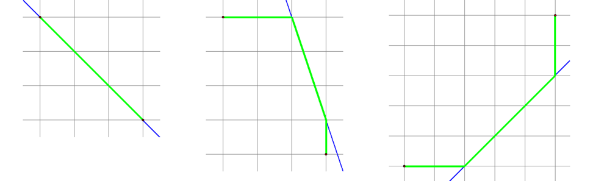
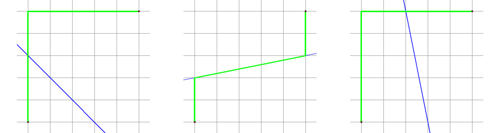
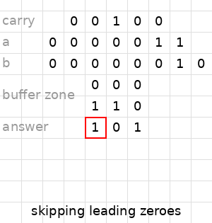

# Tutorial_2_(en)

We are sorry that you were having troubles with access to Codeforces.

 **Problem A of elimination/div2**
### [1032A - Kitchen Utensils](../problems/A._Kitchen_Utensils.md "Technocup 2019 - Elimination Round 3")

Suppose we've found the minimum possible number $p$ of dishes served for each person. If the input contains utensils of $t$ types exactly, it's clear that the total number of utensils used is at least $p \cdot t \cdot k$ and the number of utensils stolen is at least $p \cdot t \cdot k - n$. Moreover, it's easy to construct an example with this exact number of stolen utensils having our $n$ objects served.

It is also easy to note that the minimum $p$ is equal to the ratio of the maximum number of utensils of one type and the number of guests, rounded up.

 **Problem B of elimination/div2**
### [1032B - Personalized Cup](../problems/B._Personalized_Cup.md "Technocup 2019 - Elimination Round 3")

Let's iterate over all possible pairs $(a, b)$ with $1 \leq a \leq 5$ and $1 \leq b \leq 20$ to find the optimal one satisfying the inequality $a \cdot b \geq |s|$. So now we need to place the characters of $s$ in the same relative order through the table. Possibly, several cells will remain unused, but we will distribute them over the table and place at most one asterisk in every row.

One can show that we will have at most one asterisk in each row, because otherwise we would have been able to reduce the value of $b$.

 **Problem C of elimination/div2**
### [1032C - Playing Piano](../problems/C._Playing_Piano.md "Technocup 2019 - Elimination Round 3")

Let $dp[i][j]$ be $-1$ if we cannot play the first $i$ notes in such a way that the $i$-th note is played by the $j$-th finger, otherwise let this be the number of the previous finger in any of possible fingerings. This $dp$ can be easily calculated for about $5n\cdot 5$ operations.

 **Problem D of elimination/div2 = problem A of div1**
### [1032D - Barcelonian Distance](../problems/D._Barcelonian_Distance.md "Technocup 2019 - Elimination Round 3")

One way is to handle some cases: intersect the line with the border of the bounding box of $(x_1, y_1)$ and $(x_2, y_2)$, and relax answer by some values depending on the mutual location of intersection points, as on the pics below. Another way is to intersect horizontal and vertical lines through $(x_1, y_1)$ and $(x_2, y_2)$, intersect them with the $ax + by + c = 0$ line, consider the obtained 6 points as vertices of a graph, add all horizontal and vertical edges in this graph, run Floyd/Ford-Bellman/Dijkstra algorithm.

    **Problem E of elimination/div2 = problem B of div1**
### [1032E - The Unbearable Lightness of Weights](../problems/E._The_Unbearable_Lightness_of_Weights.md "Technocup 2019 - Elimination Round 3")

Suppose the numbers $a_{1}, a_{2}, \ldots, a_{n}$ can have only up to two different values. Then we can unambiguously determine the masses of all the weights (e.g., suppose there are $t$ weights with a mass of $w$ each, then we can ask our friend about a set of $t$ weights with a total mass of $t \cdot w$; the only thing he can do is to return all the weights with the mass $w$, so we can reveal the masses of all the weights).

If the masses of the weights have at least three different values then the only thing we can do is to determine several weights of the same mass (because if the friend tells us a set having distinct masses, we cannot distinguish them from one another; the same holds for the set of remaining weights). So we need to ask our friend such values $(k, m)$ that the only way to obtain the mass $m$ using $k$ weights is to take $k$ weights of mass $\frac{m}{k}$ each.

So now we have reduced our problem to finding for every $w \leq \sum\limits_{i = 1}^{n} a_{i}$ and every number of weights $k \leq n$ the number of ways (regardless of the order of the weights) to obtain a mass of $w$ using precisely $k$ weights. This value $cnt(w, k)$ can be computed via a simple dynamic programming.

Finally, the answer will be equal to the maximum such $k$ that for some $b$ there exist at least $k$ weights with mass $b$ each and the mass $k \cdot b$ can be obtained uniquely.

One should note that it's sufficient to calculate, say, $\min(2, cnt(w, k))$ instead of $cnt(w, k)$ since the latter can be quite large.

 **Problem F of elimination/div2 = problem C of div1**
### [1032F - Vasya and Maximum Matching](../problems/F._Vasya_and_Maximum_Matching.md "Technocup 2019 - Elimination Round 3")

Firstly let's understand when the maximum matching in the tree is unique — and it is unique if and only if it's perfect (i. e. every vertex having at least one incident edge is saturated). So the problem is reduced to counting the number of ways to split the tree so that each component having size $2$ or more has a perfect matching.

Let's use dynamic programming to do this. Let $dp_{v,0 \dots 2}$ be the number of ways to delete edges in the subtree of $v$ so that in this subtree every component is valid (if its size is more than $1$, then it has a perfect matching). The second parameter can take one of three values:

$dp_{v,0}$ — $v$ can be used for the matching (but it's not necessary to do it).

$dp_{v,1}$ — $v$ is already used in the matching.

$dp_{v,2}$ — $v$ is not used in the matching yet, but we have to match it to some vertex.

Then

$dp_{v, 0} = \prod\limits_{to}{dp_{to, 0}} + \sum\limits_{to} (dp_{to, 1} \cdot \prod\limits_{to', to' \ne to}(dp_{to', 0} + dp_{to', 2}) )$,

$dp_{v, 1} = \prod\limits_{to}(dp_{to, 0} + dp_{to, 2})$,

$dp_{v, 2} = \sum\limits_{to} (dp_{to, 1} \cdot \prod\limits_{to', to' \ne to}(dp_{to', 0} + dp_{to', 2}) )$,

where $to$ and $to'$ are children of $v$.

 **Problem G of elimination/div2 = problem D of div1**
### [1032G - Chattering](../problems/G._Chattering.md "Technocup 2019 - Elimination Round 3")

Let us for a moment think that parrots stand in a line. We want to compute a series of values $r_{i, k}$ and $l_{i, k}$. $l_{i, k}$ is the index of the leftmost parrot that will chatter in $2^k$ seconds after the $i$-th parrot starts chattering. $r_{i, k}$ is defined similarly. Clearly, $l_{i, 0} = i - a_i$ and $r_{i, 0} = i + a_i$.

We calculate $l_{i, k}$ using the values with lesser $k$. Precisely, $l_{i, k} = \min l_{t, k-1}$, where $t$ goes in range $[l_{i, k-1}, r_{i, k-1}]$. Explanation: the $i$-th parrot triggered some $t$-th parrot in $2^{k-1}$ seconds, then the $t$-th parrot triggered some other parrot in next $2^{k-1}$ seconds. Thus we want to find such $t$ that the leftmost parrot triggered by $t$ is minimum possible.

We use a segment tree or a sparse table on the values of the $(k-1)$-th level to compute the value of the DP on the $k$-th level.

The idea for the solution on a circle is essentially the same, but you must consider segments more carefully. One rather simple way to do it is to duplicate all the parrots, now numbering them $\dots, -2, -1, 0, 1, \dots, n-1, n, n+1, \dots$ such that the numbers with the same remainder modulo $n$ denote the same parrot. Then we can bound the values for $l_{i, k}$ and $r_{i, k}$ between $-n$ and $2n$. Now a range query over a circle transforms to a constant number of range queries over a segment.

Time complexity: $O(n \log^2 n)$.

 **Problem E of div1**
### [1078E - Negative Time Summation](https://codeforces.com/contest/1078/problem/E "Codeforces Round 522 (Div. 1, based on Technocup 2019 Elimination Round 3)")

Disclaimer: there seem to be solutions much simpler than the author's. You can read some passed codes.

Let's define our workplace as follows: we will take 6 rows, containing (in order from up to down): carry bits, bits of $a$, bits of $b$, two lines of some buffer garbage and the line with the answer. Consequently, these strings have $y$-coordinates from $2$ to $-3$.

Now our plan is to do the following:

* add leading zeroes to the left of $a$ and $b$,
* go back to the right end of numbers,
* a little more than $30$ times (say, $32$) do the following:
	+ add a zero carry bit, if necessary,
	+ calculate $xor(carry, a_i, b_i)$, which is the $i$-th digit of the result,
	+ calculate $maj(carry, a_i, b_i)$, which is the new carry ($maj$ is the majority function which returns $1$ iff at least $2$ of $3$ arguments are $1$),
	+ move one cell to the left to the next digits.

To do this we can implement some helper functions. Let inv(dir) be the direction opposite to dir (for example, inv(l) = r):

move_if_1(dir) = <dir><inv(dir)>st

This means that after running the subprogram, say, lrst, robot goes one cell to the left iff it was standing on $1$, otherwise it doesn't do anything. Let's write some other subprograms:

move_if_0(dir) = <dir><inv(dir)>t

move_if_not_empty(dir) = <dir>s<inv(dir)>t

copy(dir) = <dir>10<inv(dir)>t

The last subprogram copies a symbol one cell to the given direction. It's important that it's the first function which works properly only when the robot is standing on a non-empty cell.

Explaining how to build a maj and xor of three arguments seems really hard to me, but the idea is as follows: we (ab)use the fact that these functions are symmetric (that is, their result doesn't depend on the order of the arguments), so if we have three bits one under another and we want to obtain some $f(x, y, z)$ somewhere under them, we can first copy them one, two and three times, respectively, place necessary bits in the buffer zone and then do something like

move_if_1(r) d move_if_1(r) d move_if_1(r) d do_something

In the end we should obtain something like this (if numbers were no more than two bits long):

  Here is a [gif](https://codeforces.com/https://i.imgur.com/AkYVBRN.gif) with our algorithm adding 2 to 3 if the length was no more than 2.

