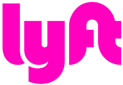

# Announcement_(en)

Hungry for yet another contest? On [Sunday, October 7, 2018 at 17:05 UTC](https://codeforces.com/https://www.timeanddate.com/worldclock/fixedtime.html?day=7&month=10&year=2018&hour=20&min=5&sec=0&p1=166) the [Lyft Level 5 Challenge](https://codeforces.com/blog/entry/61816) will start with the Round 1! This is a **combined round** having 7 problems and lasting 2 hours, and it will be **rated**. 

The top **100** participants of this round will win a Lyft Level 5 Challenge **t-shirt**. The top 30 contestants located in the San Francisco Bay area will be invited to the Final Round.

In the **Final Round** the top three onsite contestants will fight for the cash prizes:

 * First place: $2000
* Second place: $1000
* Third place: $500

  

 [Interested in an internship or a job at Lyft?](https://codeforces.com/userForm/4c469455caa2eeca)  Many thanks to:

 * [arsijo](https://codeforces.com/profile/arsijo "International Grandmaster arsijo") for the round coordination,
* [fhlasek](https://codeforces.com/profile/fhlasek "Grandmaster fhlasek"), [KAN](https://codeforces.com/profile/KAN "Grandmaster KAN"), [Nazikk](https://codeforces.com/profile/Nazikk "Master Nazikk"), [Sonechko](https://codeforces.com/profile/Sonechko "Candidate Master Sonechko"), [stanislav.bezkorovainyi](https://codeforces.com/profile/stanislav.bezkorovainyi "Candidate Master stanislav.bezkorovainyi"), [MaxZubec](https://codeforces.com/profile/MaxZubec "Candidate Master MaxZubec") for testing the round
* [MikeMirzayanov](https://codeforces.com/profile/MikeMirzayanov "Headquarters, MikeMirzayanov") for Codeforces and Polygon platforms
* Lyft for sponsoring the round
* [Alice](https://codeforces.com/profile/Alice "Expert Alice") and [Bob](https://codeforces.com/profile/Bob "Unrated, Bob") for playing a crucial role in some of the statements

I'll be on the [community Discord server](https://codeforces.com/blog/entry/52778) shortly after the contest to discuss the problems.

**UPDATE 1:** The scoring distribution will be 500-1000-1500-2250-2750-3250-4000. 

**UPDATE 2:** The contest is over and there is an [editorial](Tutorial_(en).md).

**UPDATE 3:** Congratulations to the winners:

 1. [tourist](https://codeforces.com/profile/tourist "Legendary Grandmaster tourist")
2. [V--o_o--V](https://codeforces.com/profile/V--o_o--V "International Grandmaster V--o_o--V")
3. [DearMargaret](https://codeforces.com/profile/DearMargaret "Legendary Grandmaster DearMargaret")
4. [Errichto](https://codeforces.com/profile/Errichto "International Grandmaster Errichto")
5. [300iq](https://codeforces.com/profile/300iq "International Grandmaster 300iq")
