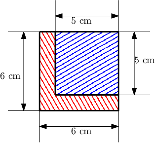
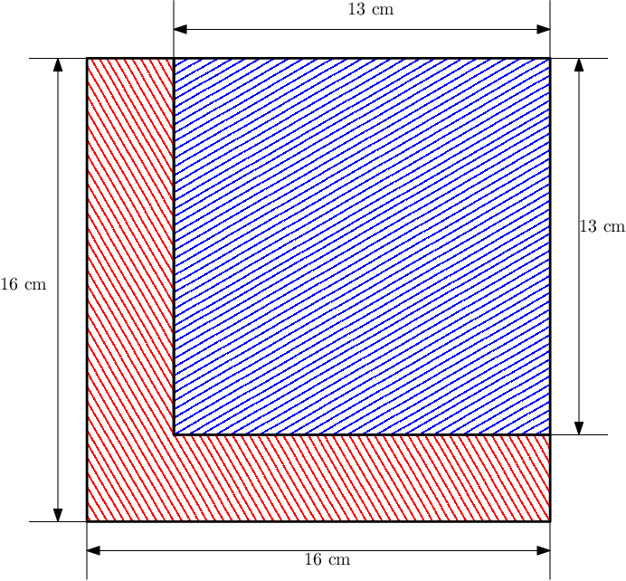

<h1 style='text-align: center;'> B. Square Difference</h1>

<h5 style='text-align: center;'>time limit per test: 2 seconds</h5>
<h5 style='text-align: center;'>memory limit per test: 256 megabytes</h5>

Alice has a lovely piece of cloth. It has the shape of a square with a side of length $a$ centimeters. Bob also wants such piece of cloth. He would prefer a square with a side of length $b$ centimeters (where $b < a$). Alice wanted to make Bob happy, so she cut the needed square out of the corner of her piece and gave it to Bob. Now she is left with an ugly L shaped cloth (see pictures below).

Alice would like to know whether the area of her cloth expressed in square centimeters is [prime.](https://en.wikipedia.org/wiki/Prime_number) Could you help her to determine it?

### Input

The first line contains a number $t$ ($1 \leq t \leq 5$) — the number of test cases.

Each of the next $t$ lines describes the $i$-th test case. It contains two integers $a$ and $b~(1 \leq b < a \leq 10^{11})$ — the side length of Alice's square and the side length of the square that Bob wants.

### Output

Print $t$ lines, where the $i$-th line is the answer to the $i$-th test case. Print "YES" (without quotes) if the area of the remaining piece of cloth is prime, otherwise print "NO".

You can print each letter in an arbitrary case (upper or lower).

## Example

### Input


```text
4  
6 5  
16 13  
61690850361 24777622630  
34 33  

```
### Output


```text
YES  
NO  
NO  
YES  

```
## Note

The figure below depicts the first test case. The blue part corresponds to the piece which belongs to Bob, and the red part is the piece that Alice keeps for herself. The area of the red part is $6^2 - 5^2 = 36 - 25 = 11$, which is prime, so the answer is "YES".

  In the second case, the area is $16^2 - 13^2 = 87$, which is divisible by $3$.

  In the third case, the area of the remaining piece is $61690850361^2 - 24777622630^2 = 3191830435068605713421$. This number is not prime because $3191830435068605713421 = 36913227731 \cdot 86468472991 $.

In the last case, the area is $34^2 - 33^2 = 67$.


#### Tags 

#1100 #NOT OK #math #number_theory 

## Blogs
- [All Contest Problems](../Lyft_Level_5_Challenge_2018_-_Elimination_Round.md)
- [Announcement (en)](../blogs/Announcement_(en).md)
- [Tutorial (en)](../blogs/Tutorial_(en).md)
