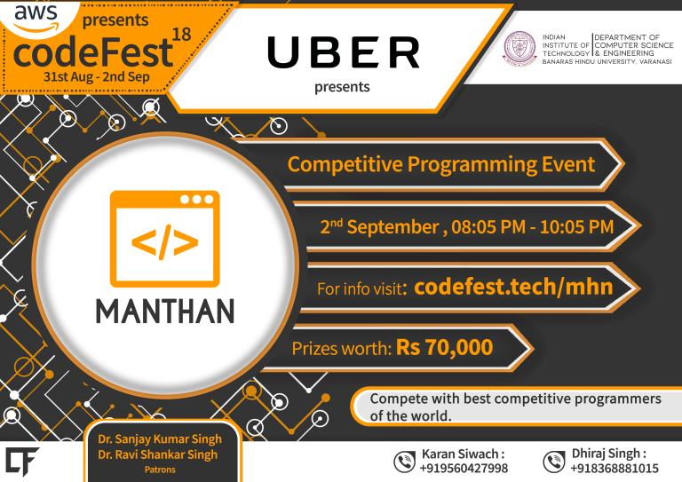

# Announcement_(en)

Hello Codeforces,

Manthan, Codefest'18 will take place on [Sunday, September 2, 2018 at 20:35UTC+6](https://codeforces.com/https://www.timeanddate.com/worldclock/fixedtime.html?day=2&month=9&year=2018&hour=17&min=35&sec=0&p1=166) with a duration of 2 hours (tentative). The round is rated for both Div1 and Div2 participants and will consist of 8 problems.

The Department of Computer Science and Engineering, IIT (BHU) is conducting Codefest from 31st August-2nd September. Manthan (मंथन in Hindi, meaning Brainstorming), the algorithmic programming contest under the banner of Codefest, is being held as a special Codeforces round. The round follows regular Codeforces rules.

The round has been prepared by [hitman623](https://codeforces.com/profile/hitman623 "Master hitman623"), [karansiwach360](https://codeforces.com/profile/karansiwach360 "Expert karansiwach360"), [GT_18](https://codeforces.com/profile/GT_18 "Candidate Master GT_18"), [Ezio07](https://codeforces.com/profile/Ezio07 "Expert Ezio07"), [Enigma27](https://codeforces.com/profile/Enigma27 "Candidate Master Enigma27"), [csgocsgo](https://codeforces.com/profile/csgocsgo "Expert csgocsgo") and me ([dhirajfx3](https://codeforces.com/profile/dhirajfx3 "Candidate Master dhirajfx3")). Special thanks to [TooDumbToWin](https://codeforces.com/profile/TooDumbToWin "Master TooDumbToWin") and [DeshiBasara](https://codeforces.com/profile/DeshiBasara "Master DeshiBasara") for their contribution in the preparation of the round.

We express our heartiest thanks to [KAN](https://codeforces.com/profile/KAN "Grandmaster KAN"), [vintage_Vlad_Makeev](https://codeforces.com/profile/vintage_Vlad_Makeev "International Grandmaster vintage_Vlad_Makeev"), [300iq](https://codeforces.com/profile/300iq "International Grandmaster 300iq"), [isaf27](https://codeforces.com/profile/isaf27 "Grandmaster isaf27") and [cdkrot](https://codeforces.com/profile/cdkrot "Grandmaster cdkrot") for their help in preparing the contest and [MikeMirzayanov](https://codeforces.com/profile/MikeMirzayanov "Headquarters, MikeMirzayanov") for the awesome Codeforces and Polygon platforms!

**Prizes**
==========

Overall 1st place: **INR 25000**, Overall 2nd place: **INR 18000**, Overall 3rd place: **INR 12000**

1st place in India: **INR 10,000**

1st place in IIT(BHU) Varanasi: **INR 4,000** 1st place in freshman/sophomore year, IIT(BHU) Varanasi: **INR 1,000**

About Codefest: [Codefest](https://codeforces.com/http://codefest.tech) is the annual coding festival of the Department of Computer Science and Engineering, IIT (BHU) Varanasi, which is held online and is open to participation by all! Register on the Codefest website now! Total prizes worth ₹500,000/- up for grabs with events covering domains from Math, Machine Learning, Natural Language Processing and Capture The Flag style competitions. Go to the Codefest website to find out more!

As usual, the scoring distribution will be announced just before the round.

**UPD1**: Scoring 500-750-1000-1500-2250-3000-3500-4000

**UPD2**: **Following are the winners of the contest**

**1.** [tourist](https://codeforces.com/profile/tourist "Legendary Grandmaster tourist")

**2.** [DearMargaret](https://codeforces.com/profile/DearMargaret "International Grandmaster DearMargaret")

**3.** [LHiC](https://codeforces.com/profile/LHiC "Legendary Grandmaster LHiC")

**Best in India**

[amit_swami](https://codeforces.com/profile/amit_swami "Grandmaster amit_swami")

Good luck and have fun!

**UPD3**: **Link to [editorial](Tutorial_(en).md)**

