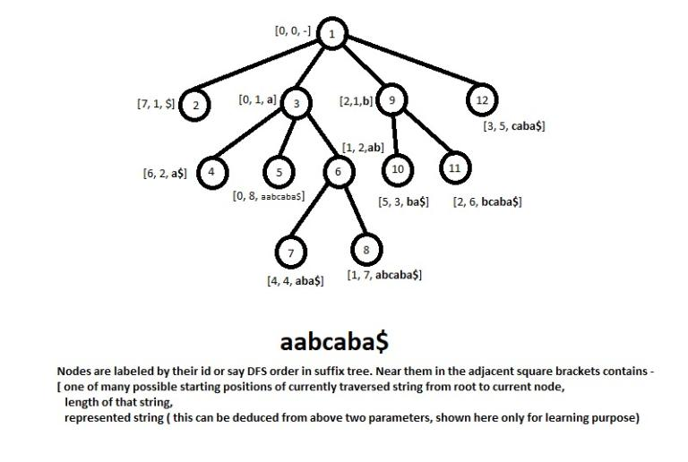

# Tutorial_(en)

### [1037A - Packets](../problems/A._Packets.md "Manthan, Codefest 18 (rated, Div. 1 + Div. 2)")

The best possible way to distribute the coins is to create packets with coins 1,2,4,…2k with maximum possible k such that 2⋅2k−1≤n. Using them, we can make all possible numbers which can be written using first k+1 bits in binary representation. For representing the remaining numbers, we must include n−2⋅2k+1 remaining coins in one packets.

**Problem Authors**: [GT_18](https://codeforces.com/profile/GT_18 "Candidate Master GT_18"), [karansiwach360](https://codeforces.com/profile/karansiwach360 "Expert karansiwach360")

**Author`s Code**: [42406878](https://codeforces.com/contest/1037/submission/42406878 "Submission 42406878 by ab_code")

**Code Complexity**: *O*(*LogN*)

 
### [1037B - Reach Median](../problems/B._Reach_Median.md "Manthan, Codefest 18 (rated, Div. 1 + Div. 2)")

For changing the median of the array, sort the given array and then the best possible candidate for making median is the middle element, because it will be better to reduce the numbers before the middle element as they are smaller and increase the numbers after the middle element as they are larger.

**Problem Authors**: [csgocsgo](https://codeforces.com/profile/csgocsgo "Expert csgocsgo"), [karansiwach360](https://codeforces.com/profile/karansiwach360 "Expert karansiwach360")

**Author`s Code**: [42406891](https://codeforces.com/contest/1037/submission/42406891 "Submission 42406891 by ab_code")

**Code Complexity**: *O*(*NLogN*)

 
### [1037C - Equalize](../problems/C._Equalize.md "Manthan, Codefest 18 (rated, Div. 1 + Div. 2)")

This can be seen that to minimize the cost, we should use the swap operation only when there are two consecutive positions(and with opposite values) to fix. For all other positions to fix, we can use the flip operation.

**Problem Authors**: [csgocsgo](https://codeforces.com/profile/csgocsgo "Expert csgocsgo"), [Ezio07](https://codeforces.com/profile/Ezio07 "Expert Ezio07")

**Author`s Code**: [42406848](https://codeforces.com/contest/1037/submission/42406848 "Submission 42406848 by ab_code")

**Code Complexity**: *O*(*N*)

 
### [1037D - Valid BFS?](../problems/D._Valid_BFS_.md "Manthan, Codefest 18 (rated, Div. 1 + Div. 2)")

We can store the neighbors of the nodes in their adjacency lists. After that, we can sort the adjacency lists of all the nodes in the order in which they are present in the input BFS Sequence.

Now we can do the standard BFS traversal starting from node 1 and check if this BFS traversal is same as the input BFS Sequence. If its not, the answer will be "No". 

**Problem Author**: [Ezio07](https://codeforces.com/profile/Ezio07 "Expert Ezio07")

**Author`s Code**: [42406857](https://codeforces.com/contest/1037/submission/42406857 "Submission 42406857 by ab_code")

**Code Complexity**: *O*(*NLogN*)

 
### [1037E - Trips](../problems/E._Trips.md "Manthan, Codefest 18 (rated, Div. 1 + Div. 2)")

Scan the list of all the edges and create a set S of pair<int,int> (degree of node, id of node), now keep deleting elements from set till degree of smallest element of S is less than k, while deleting a node u, update the set S using adjacency list of u i.e. all elements v which are in S and adj(u)

1. delete (degree[v],v)

2. degree[v] = degree[v] - 1

3. insert(degree[v],v)

Now iterate the edges scanned in reverse order and subtract the degree of nodes by 1 and update S as described above if both nodes of edge are in S. Take the size of S after each step as solution.

**Problem Authors**: [dhirajfx3](https://codeforces.com/profile/dhirajfx3 "Candidate Master dhirajfx3"), [GT_18](https://codeforces.com/profile/GT_18 "Candidate Master GT_18"), [TooDumbToWin](https://codeforces.com/profile/TooDumbToWin "Master TooDumbToWin")

**Author`s Code**: [42406908](https://codeforces.com/contest/1037/submission/42406908 "Submission 42406908 by ab_code")

**Code Complexity**: *O*(*NLogN*)

 
### [1037F - Maximum Reduction](../problems/F._Maximum_Reduction.md "Manthan, Codefest 18 (rated, Div. 1 + Div. 2)")

For each element a[i], find maximum r such that a[i]>a[j] for every i≤j≤r and minimum l such that a[i]>a[j] for every l≤j≤i.

Now, let us count the no. of times a[i] contributes to our answer, which can be calculated as (the no. of subsegments of length k which contain i)+(the no. of subsegments of length 2∗k which contain i) + ... + (the no. of subsegments of length k∗[n/k] which contain i) where each subsegment should be between [l,r].

Let x=i−l,y=r−i,x<y then above sum can be represented as k+2k+3k+4k…nk(nk≤x)+x+x+x…m times (m=(x+y)/k−n)+x−k+x−2k+x−3k … until 0 which equals k∗n∗(n+1)/2+m∗x+n∗x−k∗h∗(h+1)/2 where n=x/k, m=(x+y)/k−n, h=x/k.

The last part is mostly mathematical with some case work.

**Problem Authors**: [karansiwach360](https://codeforces.com/profile/karansiwach360 "Expert karansiwach360"), [hitman623](https://codeforces.com/profile/hitman623 "Master hitman623")

**Author`s Code**: [42406921](https://codeforces.com/contest/1037/submission/42406921 "Submission 42406921 by ab_code")

**Code Complexity**: *O*(*N*)

 
### [1037G - A Game on Strings](../problems/G._A_Game_on_Strings.md "Manthan, Codefest 18 (rated, Div. 1 + Div. 2)")

Say, we have a string s. For each character, say c, s has c at k positions (a1,a2,...,ak).

Now, if we calculate grundy for strings s[ai+1:a(i+1)−1] for 1≤i<k, and also for every prefix and suffix for such strings, we can calculate the result using grundy.

For a query [l,r], we can iterate on the character removed in first move, and the resultant grundy number can be calculated using range xor of the precomputed grundys.

To precalculate grundys, we can compute grundy in sorted order of length and treat them as separate queries.

**Problem Authors**: [300iq](https://codeforces.com/profile/300iq "International Grandmaster 300iq")

**Author`s Code**: [42406934](https://codeforces.com/contest/1037/submission/42406934 "Submission 42406934 by ab_code")

**Code Complexity**: *O*(262 * *N* + 26 * *Q*)

 
### [1037H - Security](../problems/H._Security.md "Manthan, Codefest 18 (rated, Div. 1 + Div. 2)")

The solution does the following:

1. Build the suffix tree of the whole string (we can construct a suffix tree in O(|S|log|S|) time using Suffix Array and LCP Array or in O(|S|) using any well known algorithm like Ukkonen's algorithm).

2. Note that in a suffix tree, any path from root to leaf is a suffix of the given string. Since we have appended an additional character at the end of S, whose ascii value is smaller than all the literals of string S, we have |S|+1 leaves in our suffix tree.

3. For example consider the suffix tree of aabcaba. It will look like image shown.

4. Create appropriate type segment tree for the leaves from left to right storing starting position of that leaves. 

i.e segment tree for S=aabcaba is [7,6,0,4,1,5,2,3] (starting positions are using 0 based indexing for string S).

5. To answer the request LRX, start descending with this string in the suffix tree from root. To make the larger string we can end the descent process and go on the other edge (which contains a larger symbol), to do this we need to have at least one valid suffix in this subtree -

Valid suffix: it's beginning i should be L≤i, i≤R and if you stand in the vertex of subtree with length len, then i+len≤R, that is i≤R−len.

So the request is too see if any leaf in subtree of matching character from current node has at least on value L≤i≤R−len.

The rest is to handle the descent, i.e for example if going to a node with match character from current node, in the middle if we encounter the character to be greater than corresponding character of X, then we will stop the descent process, or if the character of S is smaller than corresponding character of X, then we must ascend till we find a node having valid suffix and matching character greater than corresponding character of S. 

Complexity of the solution is O(|x|log(n)∗26) per request.

Consider processing the query for S=aabcaba:

2 5 abca

Modify for 0 based indexes i.e. 1 4 abca 

Matching character a, 1≤i≤5: The node 3 matches with a, its subtree have leaves with [6,0,4,1] values and [1,4] are acceptable, so we can ascend.

Matching character b, 1≤i≤4: The node 6 matches with b, its subtree have leaves with [4,1] both are acceptable values for i, so we can ascend to node 6.

Matching character c, 1≤i≤3: The node 8 matches with c, has leaf with value 1, and it is valid, now we start matching subsequent characters to reach node 8,

match c, 1≤i≤2

match a, 1≤i≤1

match $ , 1≤i≤0 (can't match so start ascent process)

Current node 6: No node with character > c exists, so move to its parent 3.

Current node 3: No node with character > b exists, so move to its parent 1.

Current node 1: Node 9 has starting character b, which is greater than a, also the subtree of node 9 contains leaves with values [5,2], 1≤i≤5, so we can take b and print the currently traversed string so far.

**Problem Authors**: [dhirajfx3](https://codeforces.com/profile/dhirajfx3 "Candidate Master dhirajfx3"), [DeshiBasara](https://codeforces.com/profile/DeshiBasara "Master DeshiBasara")

**Author`s Code**: [42406942](https://codeforces.com/contest/1037/submission/42406942 "Submission 42406942 by ab_code")

**Code Complexity**: *O*(|*x*| * *LogN* * 26) per request.

We hope you enjoyed the problems!

Hope to see you all in next edition of Manthan.

