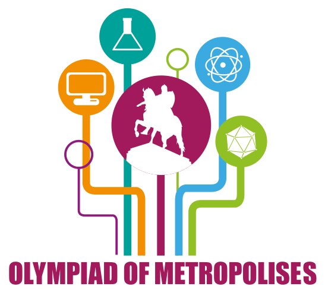

# Announcement

  Hi everybody!

These days Moscow is conducting the 3rd International Olympiad of Metropolises that is an international competition for high school students from biggest cities and capitals all around the world. One of the disciplines of the competition is informatics. Rounds of the competition were prepared by the jury members invited from St. Petersburg, Minsk, Belgrade and Moscow olympiad scientific committee which you may know by Moscow team Olympiad, Open Olympiad in Informatics and Moscow Olympiad for young students (rounds [327](https://codeforces.com/blog/entry/21185), [342](https://codeforces.com/blog/entry/23309), [345](https://codeforces.com/blog/entry/43615), [376](https://codeforces.com/blog/entry/47769), [401](https://codeforces.com/blog/entry/50613), [433](https://codeforces.com/blog/entry/54350), [441](https://codeforces.com/blog/entry/55201), [466](https://codeforces.com/blog/entry/57981), [469](https://codeforces.com/blog/entry/58229)).

Scientific Committee of the olympiad consists of: [darnley](https://codeforces.com/profile/darnley "Grandmaster darnley"), [Endagorion](https://codeforces.com/profile/Endagorion "International Grandmaster Endagorion"), Jelena Hadži-Purić, Elena Andreeva, [Zlobober](https://codeforces.com/profile/Zlobober "International Grandmaster Zlobober"), [GlebsHP](https://codeforces.com/profile/GlebsHP "International Grandmaster GlebsHP"). The problems were developed by [kraskevich](https://codeforces.com/profile/kraskevich "International Grandmaster kraskevich"), [ch_egor](https://codeforces.com/profile/ch_egor "International Grandmaster ch_egor"), [cdkrot](https://codeforces.com/profile/cdkrot "Grandmaster cdkrot"), [Schemtschik](https://codeforces.com/profile/Schemtschik "Candidate Master Schemtschik"), [GoToCoding](https://codeforces.com/profile/GoToCoding "Candidate Master GoToCoding"), [malcolm](https://codeforces.com/profile/malcolm "Master malcolm"), [akvasha](https://codeforces.com/profile/akvasha "Expert akvasha"), [darnley](https://codeforces.com/profile/darnley "Grandmaster darnley"), [wrg0ababd](https://codeforces.com/profile/wrg0ababd "Expert wrg0ababd"), [achulkov2](https://codeforces.com/profile/achulkov2 "Expert achulkov2"), [vintage_Vlad_Makeev](https://codeforces.com/profile/vintage_Vlad_Makeev "International Grandmaster vintage_Vlad_Makeev") under the guidance of [GlebsHP](https://codeforces.com/profile/GlebsHP "International Grandmaster GlebsHP") and [Zlobober](https://codeforces.com/profile/Zlobober "International Grandmaster Zlobober").

Problems were adapted for codeforces by [KAN](https://codeforces.com/profile/KAN "Grandmaster KAN") and [cdkrot](https://codeforces.com/profile/cdkrot "Grandmaster cdkrot"), also thanks for [MikeMirzayanov](https://codeforces.com/profile/MikeMirzayanov "Headquarters, MikeMirzayanov") for systems codeforces and polygon, which was used to prepare problems of this olympiad. Also, thanks [LHiC](https://codeforces.com/profile/LHiC "Legendary Grandmaster LHiC") and [V--o_o--V](https://codeforces.com/profile/V--o_o--V "International Grandmaster V--o_o--V") for testing!

Good luck and high ratings for everybody!

Round will happen on [Wednesday, September 5, 2018 at 22:35UTC+6](https://codeforces.com/https://www.timeanddate.com/worldclock/fixedtime.html?day=5&month=9&year=2018&hour=19&min=35&sec=0&p1=166) and will last for two hours. There will be 5 problems for each division.

**P.S.** We kindly ask everybody who knows problems of an onsite event not to participate in a round and not to discuss them in public, as this may be a subject for disqualification.

**Upd**: Editorial was published [here](Tutorial_(en).md)!

Aaaand congratulations to winners!

Div1:

 1. [Um_nik](https://codeforces.com/profile/Um_nik "Legendary Grandmaster Um_nik")
2. [300iq](https://codeforces.com/profile/300iq "International Grandmaster 300iq")
3. [webmaster](https://codeforces.com/profile/webmaster "International Grandmaster webmaster")
4. [ksun48](https://codeforces.com/profile/ksun48 "International Grandmaster ksun48")
5. [Anadi](https://codeforces.com/profile/Anadi "Grandmaster Anadi")

Div2:

 1. [GSHSIF](https://codeforces.com/profile/GSHSIF "Unrated, GSHSIF")
2. [gosuto](https://codeforces.com/profile/gosuto "Expert gosuto")
3. [Onjo](https://codeforces.com/profile/Onjo "Expert Onjo")
4. [sturdyplum](https://codeforces.com/profile/sturdyplum "Expert sturdyplum")
5. [LYJabc](https://codeforces.com/profile/LYJabc "Unrated, LYJabc")
