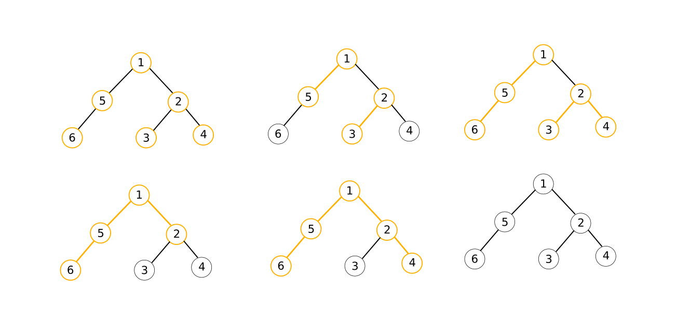

<h1 style='text-align: center;'> D. You Are Given a Tree</h1>

<h5 style='text-align: center;'>time limit per test: 7 seconds</h5>
<h5 style='text-align: center;'>memory limit per test: 512 megabytes</h5>

A tree is an undirected graph with exactly one simple path between each pair of vertices. We call a set of simple paths $k$-valid if each vertex of the tree belongs to no more than one of these paths (including endpoints) and each path consists of exactly $k$ vertices.

You are given a tree with $n$ vertices. For each $k$ from $1$ to $n$ inclusive find what is the maximum possible size of a $k$-valid set of simple paths.

#### Input

The first line of the input contains a single integer $n$ ($2 \le n \le 100\,000$) — the number of vertices in the tree.

Then following $n - 1$ lines describe the tree, each of them contains two integers $v$, $u$ ($1 \le v, u \le n$) — endpoints of the corresponding edge.

It is guaranteed, that the given graph is a tree. 

#### Output

#### Output

 $n$ numbers, the $i$-th of which is the maximum possible number of paths in an $i$-valid set of paths.

## Examples

#### Input


```text
7  
1 2  
2 3  
3 4  
4 5  
5 6  
6 7  

```
#### Output


```text
7  
3  
2  
1  
1  
1  
1  
  

```
#### Input


```text
6  
1 2  
2 3  
2 4  
1 5  
5 6  

```
#### Output


```text
6  
2  
2  
1  
1  
0  
  

```
## Note

One way to achieve the optimal number of paths for the second sample is illustrated in the following picture:




#### Tags 

#2800 #NOT OK #data_structures #dp #trees 

## Blogs
- [All Contest Problems](../Codeforces_Round_507_(Div._1,_based_on_Olympiad_of_Metropolises).md)
- [Announcement](../blogs/Announcement.md)
- [Tutorial (en)](../blogs/Tutorial_(en).md)
