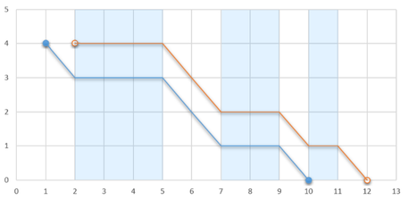

<h1 style='text-align: center;'> D. Glider</h1>

<h5 style='text-align: center;'>time limit per test: 2 seconds</h5>
<h5 style='text-align: center;'>memory limit per test: 256 megabytes</h5>

A plane is flying at a constant height of $h$ meters above the ground surface. Let's consider that it is flying from the point $(-10^9, h)$ to the point $(10^9, h)$ parallel with $Ox$ axis.

A glider is inside the plane, ready to start his flight at any moment (for the sake of simplicity let's consider that he may start only when the plane's coordinates are integers). After jumping from the plane, he will fly in the same direction as the plane, parallel to $Ox$ axis, covering a unit of distance every second. Naturally, he will also descend; thus his second coordinate will decrease by one unit every second.

There are ascending air flows on certain segments, each such segment is characterized by two numbers $x_1$ and $x_2$ ($x_1 < x_2$) representing its endpoints. No two segments share any common points. When the glider is inside one of such segments, he doesn't descend, so his second coordinate stays the same each second. The glider still flies along $Ox$ axis, covering one unit of distance every second. 

  If the glider jumps out at $1$, he will stop at $10$. Otherwise, if he jumps out at $2$, he will stop at $12$. Determine the maximum distance along $Ox$ axis from the point where the glider's flight starts to the point where his flight ends if the glider can choose any integer coordinate to jump from the plane and start his flight. After touching the ground the glider stops altogether, so he cannot glide through an ascending airflow segment if his second coordinate is $0$.

##### Input

The first line contains two integers $n$ and $h$ $(1 \le n \le 2\cdot10^{5}, 1 \le h \le 10^{9})$ — the number of ascending air flow segments and the altitude at which the plane is flying, respectively.

Each of the next $n$ lines contains two integers $x_{i1}$ and $x_{i2}$ $(1 \le x_{i1} < x_{i2} \le 10^{9})$ — the endpoints of the $i$-th ascending air flow segment. No two segments intersect, and they are given in ascending order.

##### Output

Print one integer — the maximum distance along $Ox$ axis that the glider can fly from the point where he jumps off the plane to the point where he lands if he can start his flight at any integer coordinate.

## Examples

##### Input


```text
3 4  
2 5  
7 9  
10 11  

```
##### Output


```text
10  

```
##### Input


```text
5 10  
5 7  
11 12  
16 20  
25 26  
30 33  

```
##### Output


```text
18  

```
##### Input


```text
1 1000000000  
1 1000000000  

```
##### Output


```text
1999999999  

```
## Note

In the first example if the glider can jump out at $(2, 4)$, then the landing point is $(12, 0)$, so the distance is $12-2 = 10$.

In the second example the glider can fly from $(16,10)$ to $(34,0)$, and the distance is $34-16=18$.

In the third example the glider can fly from $(-100,1000000000)$ to $(1999999899,0)$, so the distance is $1999999899-(-100)=1999999999$.


#### Tags 

#1700 #NOT OK #binary_search #data_structures #two_pointers 

## Blogs
- [All Contest Problems](../Codeforces_Round_509_(Div._2).md)
- [Announcement](../blogs/Announcement.md)
- [Tutorial #1 (en)](../blogs/Tutorial_1_(en).md)
- [Tutorial #2 (ru)](../blogs/Tutorial_2_(ru).md)
- [Tutorial #3 (en)](../blogs/Tutorial_3_(en).md)
- [Tutorial #4 (ru)](../blogs/Tutorial_4_(ru).md)
