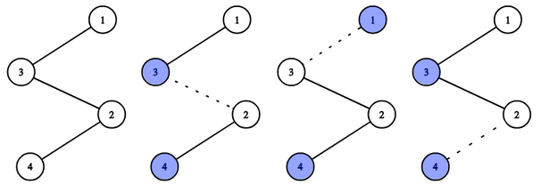

<h1 style='text-align: center;'> E. Tree Reconstruction</h1>

<h5 style='text-align: center;'>time limit per test: 1 second</h5>
<h5 style='text-align: center;'>memory limit per test: 256 megabytes</h5>

Monocarp has drawn a tree (an undirected connected acyclic graph) and then has given each vertex an index. All indices are distinct numbers from $1$ to $n$. For every edge $e$ of this tree, Monocarp has written two numbers: the maximum indices of the vertices of the two components formed if the edge $e$ (and only this edge) is erased from the tree.

Monocarp has given you a list of $n - 1$ pairs of numbers. He wants you to provide an example of a tree that will produce the said list if this tree exists. If such tree does not exist, say so.

##### Input

The first line contains one integer $n$ ($2 \le n \le 1\,000$) — the number of vertices in the tree.

Each of the next $n-1$ lines contains two integers $a_i$ and $b_i$ each ($1 \le a_i < b_i \le n$) — the maximal indices of vertices in the components formed if the $i$-th edge is removed.

##### Output

If there is no such tree that can produce the given list of pairs, print "NO" (without quotes).

Otherwise print "YES" (without quotes) in the first line and the edges of the tree in the next $n - 1$ lines. Each of the last $n - 1$ lines should contain two integers $x_i$ and $y_i$ ($1 \le x_i, y_i \le n$) — vertices connected by an edge.

## Note

: The numeration of edges doesn't matter for this task. Your solution will be considered correct if your tree produces the same pairs as given in the input file (possibly reordered). That means that you can print the edges of the tree you reconstructed in any order.

## Examples

##### Input


```text
4  
3 4  
1 4  
3 4  

```
##### Output


```text
YES  
1 3  
3 2  
2 4  

```
##### Input


```text
3  
1 3  
1 3  

```
##### Output


```text
NO  

```
##### Input


```text
3  
1 2  
2 3  

```
##### Output


```text
NO  

```
## Note

Possible tree from the first example. Dotted lines show edges you need to remove to get appropriate pairs. 

  

#### Tags 

#1900 #NOT OK #constructive_algorithms #data_structures #graphs #greedy 

## Blogs
- [All Contest Problems](../Codeforces_Round_509_(Div._2).md)
- [Announcement](../blogs/Announcement.md)
- [Tutorial #1 (en)](../blogs/Tutorial_1_(en).md)
- [Tutorial #2 (ru)](../blogs/Tutorial_2_(ru).md)
- [Tutorial #3 (en)](../blogs/Tutorial_3_(en).md)
- [Tutorial #4 (ru)](../blogs/Tutorial_4_(ru).md)
