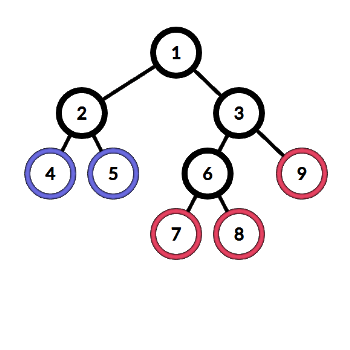

<h1 style='text-align: center;'> F. Leaf Sets</h1>

<h5 style='text-align: center;'>time limit per test: 3 seconds</h5>
<h5 style='text-align: center;'>memory limit per test: 256 megabytes</h5>

You are given an undirected tree, consisting of $n$ vertices.

The vertex is called a leaf if it has exactly one vertex adjacent to it.

The distance between some pair of vertices is the number of edges in the shortest path between them.

Let's call some set of leaves beautiful if the maximum distance between any pair of leaves in it is less or equal to $k$.

You want to split all leaves into non-intersecting beautiful sets. What is the minimal number of sets in such a split?

##### Input

The first line contains two integers $n$ and $k$ ($3 \le n \le 10^6$, $1 \le k \le 10^6$) — the number of vertices in the tree and the maximum distance between any pair of leaves in each beautiful set.

Each of the next $n - 1$ lines contains two integers $v_i$ and $u_i$ ($1 \le v_i, u_i \le n$) — the description of the $i$-th edge. 

It is guaranteed that the given edges form a tree.

##### Output

Print a single integer — the minimal number of beautiful sets the split can have. 

## Examples

##### Input


```text
9 3  
1 2  
1 3  
2 4  
2 5  
3 6  
6 7  
6 8  
3 9  

```
##### Output


```text
2  

```
##### Input


```text
5 3  
1 2  
2 3  
3 4  
4 5  

```
##### Output


```text
2  

```
##### Input


```text
6 1  
1 2  
1 3  
1 4  
1 5  
1 6  

```
##### Output


```text
5  

```
## Note

Here is the graph for the first example:

  

#### Tags 

#2400 #NOT OK #data_structures #dfs_and_similar #dsu #graphs #greedy #sortings #trees 

## Blogs
- [All Contest Problems](../Codeforces_Round_510_(Div._2).md)
- [Announcement (ru)](../blogs/Announcement_(ru).md)
- [Tutorial](../blogs/Tutorial.md)
