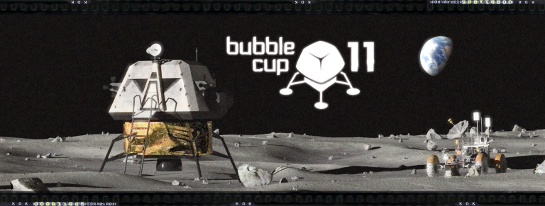

# Announcement_(en)

Hello, Codeforces!

It's our pleasure to announce the the finals of the 11th [Bubble Cup](https://codeforces.com/http://www.bubblecup.org/)! Bubble Cup is a programming competition organized by [Microsoft Development Center Serbia (MDCS)](https://codeforces.com/https://www.microsoft.com/sr-latn-rs/mdcs). The contest will take place on [Saturday, 22nd of September at 11:00 UTC+2](https://codeforces.com/https://www.timeanddate.com/worldclock/fixedtime.html?msg=Bubble+Cup+11+Finals+-+onsite&iso=20180922T11&p1=35&ah=5) in Belgrade, and will last for 5 hours. Live results will be available on the [official Bubble Cup website](https://codeforces.com/http://www.bubblecup.org/CompetitorsCorner/Finals/358). Results will be frozen during the last hour of the competition. The winners will be announced at the closing ceremony.

The format of the competition is very similar to ACM-ICPC — teams consisting of up to three people are allowed, and they have one computer and five hours to solve problems without partial scoring. Ties are broken using the usual time penalty rules. 

Just like in the previous years, there will be an online mirror of the finals here at Codeforces, starting on [Saturday, 22nd of September at 12:35 UTC+2](https://codeforces.com/https://www.timeanddate.com/worldclock/fixedtime.html?msg=Bubble+Cup+11+finals+-+mirror&iso=20180922T1235&p1=35&ah=5). Unlike in the previous years, the mirror will be on the same day as the onsite finals.

This year, the onsite competition is divided in two "divisions", called Premier League and Rising Stars. The two contests will have most of their problems in common, but the Rising Stars competition will feature some easier tasks targeted at high school contestants. We do not guarantee that every problems unique to Div2 is easier than every problem that is not.

Both of the contests will be mirrored here on Codeforces, with Premier League mapping to the Div1 contest and Rising Stars mapping to the Div2 contest. The mirror will use native Codeforces ACM-ICPC team contest rules.

Both contests will be **unrated**, due to the format and the length of the mirror being dissimilar to the standard Codeforces rated rounds. Note that this is a **team contest**, i.e. competing in teams up to three people is allowed. (Of course, you can also compete in a 1-person team.) There will be at least 9 problems in each division.

*As of now, Codeforces does not support rating-based divisions in team contests, so we came with the following ad-hoc rule:* *teams with the maximum rated member having rating less than 1900 should enter the Div2 contest. Teams with the maximum rated member having rating at least 2100 should definitely enter the Div1 contest. The teams not covered by the previous two criteria are free to choose.*

Here are the past Bubble Cup mirrors on Codeforces:

[Bubble Cup 8 — Finals [Online Mirror]](https://codeforces.com/contest/575)

[Bubble Cup 9 — Finals [Online Mirror]](https://codeforces.com/contest/717)

[Bubble Cup X — Finals [Online Mirror]](https://codeforces.com/contest/852) 

The problems and their solutions were created by employees and interns of Microsoft: [Milanin](https://codeforces.com/profile/Milanin "Master Milanin"), [ibra](https://codeforces.com/profile/ibra "Expert ibra"), [balsa_knez](https://codeforces.com/profile/balsa_knez "Candidate Master balsa_knez"), [Kole](https://codeforces.com/profile/Kole "Expert Kole"), [radras](https://codeforces.com/profile/radras "Specialist radras"), [fulu](https://codeforces.com/profile/fulu "Expert fulu"), [pedja](https://codeforces.com/profile/pedja "Specialist pedja"), [niksmiljkovic](https://codeforces.com/profile/niksmiljkovic "Expert niksmiljkovic"), [davidmilicevic97](https://codeforces.com/profile/davidmilicevic97 "Expert davidmilicevic97"), [FilipVesovic](https://codeforces.com/profile/FilipVesovic "Candidate Master FilipVesovic"), yours truly, and many more. Most of the team works in MDCS. 

We express gratitude to [KAN](https://codeforces.com/profile/KAN "Grandmaster KAN") and [300iq](https://codeforces.com/profile/300iq "International Grandmaster 300iq") for round coordination, and [MikeMirzayanov](https://codeforces.com/profile/MikeMirzayanov "Headquarters, MikeMirzayanov") and the rest of the team for the great Codeforces and the wonderful Polygon platform. We thank testers [DBradac](https://codeforces.com/profile/DBradac "International Grandmaster DBradac") and especially the extremely helpful [knightL](https://codeforces.com/profile/knightL "Grandmaster knightL"), for helping prevail various difficulties.

The full editorial, together with the statements and solutions of the tasks from the qualification rounds, will be available in the [booklet section](https://codeforces.com/http://www.bubblecup.org/Home/Booklets) of the Bubble Cup website on Sunday. An editorial with short descriptions of solutions may appear on Codeforces before that.

Good luck to all participants!

EDIT: Congrats to everyone that competed! In total, there were over 800 teams that solved at least one problem.

The winners of Div1 are:

 1. [Merkurev](https://codeforces.com/profile/Merkurev "International Grandmaster Merkurev"), [I_love_Tanya_Romanova](https://codeforces.com/profile/I_love_Tanya_Romanova "International Grandmaster I_love_Tanya_Romanova"), [Um_nik](https://codeforces.com/profile/Um_nik "Legendary Grandmaster Um_nik") — a special congratulations for being the only team on the mirror to solve all problems, two of them in the last 5 minutes!
2. [LHiC](https://codeforces.com/profile/LHiC "Legendary Grandmaster LHiC") — the best one-man team, with 9 problems solved
3. [xtalclr](https://codeforces.com/profile/xtalclr "Master xtalclr"), [nong](https://codeforces.com/profile/nong "Candidate Master nong"), [ko_osaga](https://codeforces.com/profile/ko_osaga "Legendary Grandmaster ko_osaga") — also solved 9 problems

The winning team of Div2 is:

 1. [fengyecong](https://codeforces.com/profile/fengyecong "Candidate Master fengyecong"), [Als123](https://codeforces.com/profile/Als123 "Candidate Master Als123"), [200815147](https://codeforces.com/profile/200815147 "Candidate Master 200815147") — winning with three problems to spare!

This post will be updated again when the booklet is online, which should be before the end of the day in UTC+2. Also, onsite results won't be known until the awards ceremony in the evening.

Thanks all for participating!

EDIT 2: **The [editorial](https://codeforces.com/http://bubblecup.org/Content/Media/Booklet2018.pdf) is up!**

