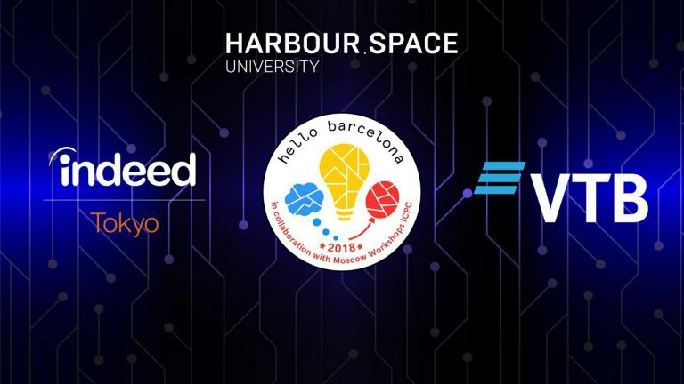

# Announcement

On [Thursday, September 20, 2018 at 20:45UTC+6](https://codeforces.com/https://www.timeanddate.com/worldclock/fixedtime.html?day=20&month=9&year=2018&hour=17&min=45&sec=0&p1=166) [Educational Codeforces Round 51 (Rated for Div. 2)](https://codeforces.com/contest/1051 "Educational Codeforces Round 51 (Rated for Div. 2)") will start.

Series of Educational Rounds continue being held as [Harbour.Space University](https://codeforces.com/https://harbour.space/) initiative! You can read the details about the cooperation between [Harbour.Space University](https://codeforces.com/https://harbour.space/) and Codeforces in the [blog post](//codeforces.com/blog/entry/51208).

This round will be **rated for the participants with rating lower than 2100**. It will be held on extented ACM ICPC rules. The penalty for each incorrect submission until the submission with a full solution is 10 minutes. After the end of the contest you will have 12 hours to hack any solution you want. You will have access to copy any solution and test it locally.

You will be given **7 problems** and **2 hours** to solve them.

The problems were invented and prepared by Roman [Roms](https://codeforces.com/profile/Roms "Master Roms") Glazov, Ivan [BledDest](https://codeforces.com/profile/BledDest "Grandmaster BledDest") Androsov and me.

Good luck to all participants!

Our friends at Harbour.Space also have a message for you:

Harbour.Space University is proud to announce new partnerships for this year’s [Hello Barcelona Programming Bootcamp](https://codeforces.com/http://in.harbour.space/icpc/acm-icpc-hello-barcelona-bootcamp-autumn-2018/) — VTB and Indeed Tokyo, with the addition of team sponsors Phaze Ventures and Spark Labs. 

VTB, the largest international bank based in Eastern Europe, continues to be an official partner of our Hello Programming Bootcamp series, adding further quality to the 3rd edition of the Hello Barcelona Programming Bootcamp by bringing their own participants, as well as by supporting top teams from around the world. 

Indeed Tokyo is Japan’s branch of the #1 employment website in the world, giving job seekers free access to millions of jobs from thousands of company websites and job boards. As they sponsor for the second year in a row, Indeed continues to offer the best job opportunities to the boot camp participants as they gather in Barcelona from September 26 to October 4, 2018.

**UPD:** There was a bug in testset and validator for problem F, we are currently fixing the issue. The statement included the correct resrictions. We will rejudge all the solutions as soon as possible. The round can become unrated, we are discussing this at the moment.

Congratulations to the winners: 

| Rank | Competitor | Problems Solved | Penalty |
| --- | --- | --- | --- |
| 1 | [kmjp](https://codeforces.com/profile/kmjp "Grandmaster kmjp") | 6 | 210 |
| 2 | [MrDindows](https://codeforces.com/profile/MrDindows "Grandmaster MrDindows") | 6 | 223 |
| 3 | [elykuil](https://codeforces.com/profile/elykuil "Expert elykuil") | 6 | 242 |
| 4 | [Nisiyama_Suzune](https://codeforces.com/profile/Nisiyama_Suzune "International Master Nisiyama_Suzune") | 6 | 274 |
| 5 | [Fekete](https://codeforces.com/profile/Fekete "Candidate Master Fekete") | 6 | 274 |

Congratulations to the best hackers: 

| Rank | Competitor | Hack Count |
| --- | --- | --- |
| 1 | [halyavin](https://codeforces.com/profile/halyavin "Legendary Grandmaster halyavin") | **299****:-14** |
| 2 | [Laggy](https://codeforces.com/profile/Laggy "Pupil Laggy") | **100****:-10** |
| 3 | [greencis](https://codeforces.com/profile/greencis "International Master greencis") | **29****:-2** |
| 4 | [Volkov_Ivan](https://codeforces.com/profile/Volkov_Ivan "Candidate Master Volkov_Ivan") | **19** |
| 5 | [dorijanlendvaj](https://codeforces.com/profile/dorijanlendvaj "Candidate Master dorijanlendvaj") | **13** |

 694 successful hacks and 497 unsuccessful hacks were made in total!And finally people who were the first to solve each problem: 

| Problem | Competitor | Penalty |
| --- | --- | --- |
| A | [traxex](https://codeforces.com/profile/traxex "Master traxex") | 0:03 |
| B | [answhldkd](https://codeforces.com/profile/answhldkd "Unrated, answhldkd") | 0:02 |
| C | [ainta](https://codeforces.com/profile/ainta "Legendary Grandmaster ainta") | 0:06 |
| D | [greencis](https://codeforces.com/profile/greencis "International Master greencis") | 0:07 |
| E | [tfg](https://codeforces.com/profile/tfg "Master tfg") | 0:38 |
| F | [baggins](https://codeforces.com/profile/baggins "Candidate Master baggins") | 0:26 |
| G | [yasugongshang](https://codeforces.com/profile/yasugongshang "International Grandmaster yasugongshang") | 0:56 |

**UPD2:** We investigated the issue to get the following results. 10 people were noticeably affected (that took them more than 3 minutes of the working time). Round will surely be rated for other participants. As for the affected participants, we will look into the rating changes and revert them in case they are negative (set the participant into the unofficial participation mode).

**UPD3:** [Editorial is out](Tutorial.md) 

