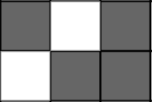

<h1 style='text-align: center;'> D. Bicolorings</h1>

<h5 style='text-align: center;'>time limit per test: 2 seconds</h5>
<h5 style='text-align: center;'>memory limit per test: 256 megabytes</h5>

You are given a grid, consisting of $2$ rows and $n$ columns. Each cell of this grid should be colored either black or white.

Two cells are considered neighbours if they have a common border and share the same color. Two cells $A$ and $B$ belong to the same component if they are neighbours, or if there is a neighbour of $A$ that belongs to the same component with $B$.

Let's call some bicoloring beautiful if it has exactly $k$ components.

Count the number of beautiful bicolorings. The number can be big enough, so print the answer modulo $998244353$.

##### Input

The only line contains two integers $n$ and $k$ ($1 \le n \le 1000$, $1 \le k \le 2n$) — the number of columns in a grid and the number of components required.

##### Output

Print a single integer — the number of beautiful bicolorings modulo $998244353$.

## Examples

##### Input


```text
3 4  

```
##### Output


```text
12  

```
##### Input


```text
4 1  

```
##### Output


```text
2  

```
##### Input


```text
1 2  

```
##### Output


```text
2  

```
## Note

One of possible bicolorings in sample $1$:

  

#### Tags 

#1700 #NOT OK #bitmasks #dp 

## Blogs
- [All Contest Problems](../Educational_Codeforces_Round_51_(Rated_for_Div._2).md)
- [Announcement](../blogs/Announcement.md)
- [Tutorial](../blogs/Tutorial.md)
