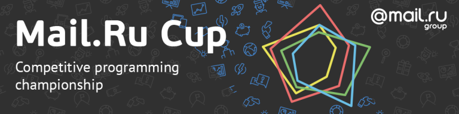

# Mail.Ru_Cup_2018_Round_2

Hi all!

I'm happy to invite everyone to a combined for Div.1 and Div.2 Mail.Ru Cup 2018 Round 2, that is starting at this time: [Saturday, November 10, 2018 at 20:35UTC+6](https://codeforces.com/https://www.timeanddate.com/worldclock/fixedtime.html?day=10&month=11&year=2018&hour=17&min=35&sec=0&p1=166). The problems were prepared by [Kuyan](https://codeforces.com/profile/Kuyan "Candidate Master Kuyan") and [Jacob](https://codeforces.com/profile/Jacob "Grandmaster Jacob"). Thanks to [cdkrot](https://codeforces.com/profile/cdkrot "Grandmaster cdkrot") and [300iq](https://codeforces.com/profile/300iq "Legendary Grandmaster 300iq") for coordination and help in preparation.

Also huge thanks to [majk](https://codeforces.com/profile/majk "International Grandmaster majk"), [Lewin](https://codeforces.com/profile/Lewin "International Grandmaster Lewin"), [vintage_Vlad_Makeev](https://codeforces.com/profile/vintage_Vlad_Makeev "International Grandmaster vintage_Vlad_Makeev"), [demon1999](https://codeforces.com/profile/demon1999 "Grandmaster demon1999") for testing, and also to [MikeMirzayanov](https://codeforces.com/profile/MikeMirzayanov "Headquarters, MikeMirzayanov") for Codeforces and Polygon platforms.

This round is the second round in the new championship called [Mail.Ru Cup](https://codeforces.com/blog/entry/62355), you can learn more about it following the link. The round will be rated for everybody!

The championship feature the following prizes:

 * First place — **Apple MacBook Air**
* Second and third place — **Apple iPad**
* Fourth, fifth, sixth places — **Samsung Gear S3**
* Traditionally, the top **100** championship participants will get cool **T-shirts**!

In each round, top 100 participants get prize points according to the [table](https://codeforces.com/https://pastebin.com/QT5sXEaT). The championship's result of a participant is the sum of the two largest results he gets on the three rounds.

There will be 7 problems for two and a half hours. The scoring will be available later.

I hope you will like the problems and wish you a rating increase!

**UPD1: Scoring distribution:**

**500 1000 1500 2250 2750 3500 4000**

The round is over, congratulations to the winners!

 1. [aid](https://codeforces.com/profile/aid "Legendary Grandmaster aid")
2. [LHiC](https://codeforces.com/profile/LHiC "Legendary Grandmaster LHiC")
3. [V--o_o--V](https://codeforces.com/profile/V--o_o--V "Legendary Grandmaster V--o_o--V")
4. [mnbvmar](https://codeforces.com/profile/mnbvmar "Legendary Grandmaster mnbvmar")
5. [tourist](https://codeforces.com/profile/tourist "Legendary Grandmaster tourist")

The current results of Mail.Ru Cup (summing up the two rounds) are [published](https://codeforces.com/blog/entry/63096).

The [analysis](Tutorial.md) is also published.

