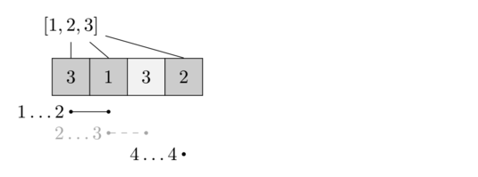

<h1 style='text-align: center;'> E. Segments on the Line</h1>

<h5 style='text-align: center;'>time limit per test: 2 seconds</h5>
<h5 style='text-align: center;'>memory limit per test: 256 megabytes</h5>

You are a given a list of integers $a_1, a_2, \ldots, a_n$ and $s$ of its segments $[l_j; r_j]$ (where $1 \le l_j \le r_j \le n$).

You need to select exactly $m$ segments in such a way that the $k$-th order statistic of the multiset of $a_i$, where $i$ is contained in at least one segment, is the smallest possible. If it's impossible to select a set of $m$ segments in such a way that the multiset contains at least $k$ elements, print -1.

The $k$-th order statistic of a multiset is the value of the $k$-th element after sorting the multiset in non-descending order.

##### Input

The first line contains four integers $n$, $s$, $m$ and $k$ ($1 \le m \le s \le 1500$, $1 \le k \le n \le 1500$) — the size of the list, the number of segments, the number of segments to choose and the statistic number.

The second line contains $n$ integers $a_i$ ($1 \le a_i \le 10^9$) — the values of the numbers in the list.

Each of the next $s$ lines contains two integers $l_i$ and $r_i$ ($1 \le l_i \le r_i \le n$) — the endpoints of the segments.

It is possible that some segments coincide.

##### Output

Print exactly one integer — the smallest possible $k$-th order statistic, or -1 if it's impossible to choose segments in a way that the multiset contains at least $k$ elements.

## Examples

##### Input


```text
4 3 2 2  
3 1 3 2  
1 2  
2 3  
4 4  

```
##### Output


```text
2  

```
##### Input


```text
5 2 1 1  
1 2 3 4 5  
2 4  
1 5  

```
##### Output


```text
1  

```
##### Input


```text
5 3 3 5  
5 5 2 1 1  
1 2  
2 3  
3 4  

```
##### Output


```text
-1  

```
## Note

In the first example, one possible solution is to choose the first and the third segment. Together they will cover three elements of the list (all, except for the third one). This way the $2$-nd order statistic for the covered elements is $2$.




#### Tags 

#2500 #NOT OK #binary_search #dp 

## Blogs
- [All Contest Problems](../Mail.Ru_Cup_2018_Round_2.md)
- [Mail.Ru Cup 2018 Round 2](../blogs/Mail.Ru_Cup_2018_Round_2.md)
- [Tutorial](../blogs/Tutorial.md)
