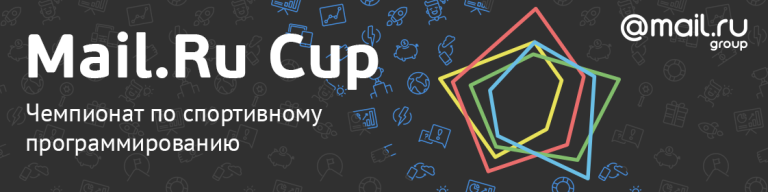

# Mail.Ru_Cup_2018_Round_3

Hi!

Tomorrow, at [Sunday, November 25, 2018 at 22:35UTC+6](https://codeforces.com/https://www.timeanddate.com/worldclock/fixedtime.html?day=25&month=11&year=2018&hour=19&min=35&sec=0&p1=166) we will host the final round of Mail.Ru Cup 2018. The problems were authored and prepared by Codeforces team: me, Dmitry [cdkrot](https://codeforces.com/profile/cdkrot "Grandmaster cdkrot") Sayutin, Ildar [300iq](https://codeforces.com/profile/300iq "Legendary Grandmaster 300iq") Gainullin and Mike [MikeMirzayanov](https://codeforces.com/profile/MikeMirzayanov "Headquarters, MikeMirzayanov") Mirzayanov, and also Maxim [Neon](https://codeforces.com/profile/Neon "Candidate Master Neon") Mezhcheryakov. Huge thanks to Grigory [vintage_Vlad_Makeev](https://codeforces.com/profile/vintage_Vlad_Makeev "Specialist vintage_Vlad_Makeev") Reznikov abd Kamil [Errichto](https://codeforces.com/profile/Errichto "International Grandmaster Errichto") Debowski for problems' testing!

This round is the final in the new championship called [Mail.Ru Cup](https://codeforces.com/blog/entry/62355), you can learn more about it following the link. The round will be rated for everybody!

After the round we will know who will get the following prizes:

 * First place — **Apple MacBook Air**
* Second and third place — **Apple iPad**
* Fourth, fifth, sixth places — **Samsung Gear S3**
* Traditionally, the top **100** championship participants will get cool **T-shirts**!

In each round, top 100 participants get prize points according to the [table](https://codeforces.com/https://pastebin.com/QT5sXEaT). The championship's result of a participant is the sum of the two largest results he gets on the three rounds. The results of the two first rounds are published [here](https://codeforces.com/blog/entry/63096). In case of ties in the top six places, they will be broken by the sum of in-round scores in the corresponding (best for the participant) two rounds.

There will be eight problems and two and a half hours to solve them.

Good luck!

P. S. [MikeMirzayanov](https://codeforces.com/profile/MikeMirzayanov "Headquarters, MikeMirzayanov") invites everybody to the official Codeforces channel in Telegram: [t.me/codeforces_official](https://t.me/codeforces_official).

The round has finished, thanks everybody, hope you liked the problems!

Congratolations to the winners of the third round of Mail.Ru Cup 2018:

 1. [Radewoosh](https://codeforces.com/profile/Radewoosh "Legendary Grandmaster Radewoosh")
2. [V--o_o--V](https://codeforces.com/profile/V--o_o--V "Legendary Grandmaster V--o_o--V")
3. [ch_egor](https://codeforces.com/profile/ch_egor "International Grandmaster ch_egor")
4. [ksun48](https://codeforces.com/profile/ksun48 "Legendary Grandmaster ksun48")
5. [RAVEman](https://codeforces.com/profile/RAVEman "International Grandmaster RAVEman")

The results of the Cup will be announced shortly.

The editorial is [here](Tutorial.md).

