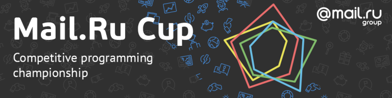

# Announcement

Mail.Ru Group together with Codeforces invites everyone to take part in the new Mail.Ru Cup competitive programming championship.

Rules
-----

The championship is holding on the Codeforces platform in the format of four rounds: one practice round and three main rounds. Each round is open to all comers. There are no restrictions on participants in any of the rounds.

The practice round is intended for familiarization with the championship platform, participation in it is optional, the results of performances in the practice round do not affect the results of participation in the championship. It is unrated, the duration is 72 hours.

All three main rounds are independent, the results of participation in each of it do not affect the possibility of participation in next rounds. A competitor may take part in any number of main rounds. Each main round lasts 2.5 hours. All of them are open for everyone and rated for all participants. Each rounds follows [Codeforces rules](https://codeforces.com/blog/entry/456).

In each main round, participants who take places from the 1st to the 100th receive bonus points using the "Grand Prix 100" system. If a participant misses a round or takes place below 100, he receives 0 reward points. After conducting all the main rounds, for each participant, two rounds are selected where this participant has scored the most points. The final result of participation in the championship is the sum of these two results. Participants form a rating by descending points. The participant with the most amount of points becomes the winner of the championship.

Prize points for each place are listed in the [table](https://codeforces.com/https://pastebin.com/QT5sXEaT). If several participants share a place in a particular round, the prize points for all divided places are divided equally between them.

Schedule
--------

 

|  | start | finish |
| --- | --- | --- |
| Practice Round | October 12, 2018 09:05 | October 15, 2018 09:05 |
| Round 1 | October 18, 2018 16:35 | October 18, 2018 19:05 |
| Round 2 | November 10, 2018 14:35 | November 10, 2018 17:05 |
| Round 3 | November 25, 2018 16:35 | November 25, 2018 19:05 |

The times are listed in UTC.

Prizes
------

 * First place — **Apple MacBook Air**
* Second and third place — **Apple iPad**
* Fourth, fifth, sixth places — **Samsung Gear S3**
* Traditionally, the top **100** championship participants will get cool **T-shirts**!

Community
---------

The ecosystem of Mail.Ru Group Championships includes a community of beginners and "rock stars" of the IT industry, who regularly share their experience and knowledge on specialized resources. The experience and achievements gained in the championships are highly appreciated — many contestants aroused the interest of employers and investors after the publication of their projects and decisions.

Join the Russian group in [Telegram](https://codeforces.com/http://t.me/mrgrcc) (@mrgrcc) and subscribe to our facebook [public page](https://codeforces.com/https://www.facebook.com/cupmrg/).

Organizer
---------

In just a few years, more than 60 thousand people around the world took part in championships for IT specialists organized by Mail.Ru Group. Tasks for the championships of the best teachers of relevant universities, together with leading experts and practitioners of the company and the industry.

This approach allows us to solve complex and large-scale tasks, to improve people's lives (health, ecology, and others), learn modern technologies and at the same time acquire unique practical experience.

To help talented programmers to get a decent education and work, the team of Mail.Ru IT Championships is heading to develop competitive platforms for the most popular specializations in the industry. Among the projects of the direction are the largest in Russia artificial intelligence championship “Russian AI Cup”, the competition for machine learning and data analysis “ML Boot Camp”, the contest for designers “Russian Design Cup”, the championship for designing high-loaded systems “Highload Cup”, and even a programming contest for schoolchildren "Technocup".

Contacts
--------

All questions can be addressed to our official email address: [cups@corp.mail.ru](https://codeforces.com/mailto:cups@corp.mail.ru).

Good luck!
----------

