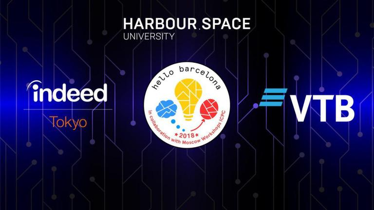

# Announcement_(en)

  On [Thursday, October 4, 2018 at 13:05UTC+6](https://codeforces.com/https://www.timeanddate.com/worldclock/fixedtime.html?day=4&month=10&year=2018&hour=10&min=5&sec=0&p1=166), the [Codeforces Round 513 by Barcelona Bootcamp (rated, Div. 1 + Div. 2)](https://codeforces.com/contest/1060) will start. This is a special round for the Hello Barcelona Programming Bootcamp, in collaboration with Moscow Workshops ICPC. **It is rated for all participants, everybody can register on it regardless of a rating.**

Hello Barcelona Programming Bootcamp is sponsored by VTB and Indeed Tokyo, with the addition of team sponsors Phaze Ventures, Spark Labs and REMY Robotics. 

VTB, the largest international bank based in Eastern Europe, continues to be an official partner of the Hello Programming Bootcamp series, adding further quality to the 3rd edition of the Hello Barcelona Programming Bootcamp by bringing their own participants, as well as by supporting top teams from around the world.

Indeed Tokyo is Japan's branch of the #1 employment website in the world, giving job seekers free access to millions of jobs from thousands of company websites and job boards. As they sponsor for the second year in a row, Indeed continues to offer the best job opportunities to the boot camp participants.

Wish good luck to all the participants!

There will be **8** problems, common for both division. Score distribution: `500 750 1250 1500 1750 2250 2750 3000`.

The problems are prepared by me, [Arterm](https://codeforces.com/profile/Arterm "International Grandmaster Arterm") and [GlebsHP](https://codeforces.com/profile/GlebsHP "International Grandmaster GlebsHP"), with assistance from [300iq](https://codeforces.com/profile/300iq "International Grandmaster 300iq"), [ifsmirnov](https://codeforces.com/profile/ifsmirnov "Grandmaster ifsmirnov") and [vintage_Vlad_Makeev](https://codeforces.com/profile/vintage_Vlad_Makeev "International Grandmaster vintage_Vlad_Makeev"). Have fun!

