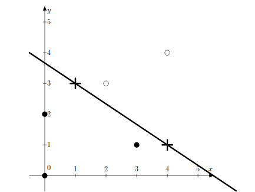

<h1 style='text-align: center;'> C. Dwarves, Hats and Extrasensory Abilities</h1>

<h5 style='text-align: center;'>time limit per test: 2 seconds</h5>
<h5 style='text-align: center;'>memory limit per test: 256 megabytes</h5>

This is an interactive problem.

In good old times dwarves tried to develop extrasensory abilities:

* Exactly *n* dwarves entered completely dark cave.
* Each dwarf received a hat — white or black. While in cave, none of the dwarves was able to see either his own hat or hats of other Dwarves.
* Dwarves went out of the cave to the meadow and sat at an arbitrary place one after the other. When a dwarf leaves the cave, he sees the colors of all hats of all dwarves that are seating on the meadow (i.e. left the cave before him). However, he is not able to see the color of his own hat and none of the dwarves can give him this information.
* The task for dwarves was to got diverged into two parts — one with dwarves with white hats and one with black hats.

After many centuries, dwarves finally managed to select the right place on the meadow without error. Will you be able to repeat their success?

You are asked to successively name *n* different integer points on the plane. After naming each new point you will be given its color — black or white. Your task is to ensure that the named points can be split by a line in such a way that all points of one color lie on the same side from the line and points of different colors lie on different sides. Moreover, no points can belong to the line. Also, you need to report any such line at the end of the process.

In this problem, the interactor is adaptive — the colors of the points in the tests are not fixed beforehand and the jury program can select them arbitrarily, in particular, depending on your program output.

## Interaction

The first line of the standard input stream contains an integer *n* (1 ≤ *n* ≤ 30) — the number of points your program should name.

Then *n* times your program must print two integer coordinates *x* and *y* (0 ≤ *x* ≤ 109, 0 ≤ *y* ≤ 109). All points you print must be distinct.

In response to each coordinate pair your program will receive the string "black", if the point is black, or "white", if the point is white.

When all *n* points are processed, you need to print four integers *x*1, *y*1, *x*2 and *y*2 (0 ≤ *x*1, *y*1 ≤ 109, 0 ≤ *x*2, *y*2 ≤ 109) — coordinates of points (*x*1, *y*1) and (*x*2, *y*2), which form a line, which separates *n* points into black and white. Points (*x*1, *y*1) and (*x*2, *y*2) should not coincide.

Hacks

To hack solution use the following format. The first line must contain word "hack", the second line should contain the number *n* and the last line should contain the sequence of 0 and 1 — colors of points, which will be reported to the solution. Unlike the jury tests, colors of points in hacks are always fixed in advance. Of course, the hacked solution wouldn't be able to get the information about the colors in advance.

For example, the hack corresponding to sample test will look like this: 


```text
  
hack  
5  
0 0 1 1 0  

```
## Example

#Input
```text
5  
  
black  
  
black  
  
white  
  
white  
  
black  

```
#Output
```text
  
0 0  
  
3 1  
  
2 3  
  
4 4  
  
0 2  
  
1 3 4 1  

```
## Note

In the sample input and output values are aligned only for simplicity of interpreting them chronologically. In real interaction no "extra" line breaks should appear.

The following picture illustrates the first test.

  

#### Tags 

#1900 #NOT OK #binary_search #constructive_algorithms #geometry #interactive 

## Blogs
- [All Contest Problems](../Codeforces_Round_516_(Div._1,_by_Moscow_Team_Olympiad).md)
- [Announcement](../blogs/Announcement.md)
- [Editorial (en)](../blogs/Editorial_(en).md)
