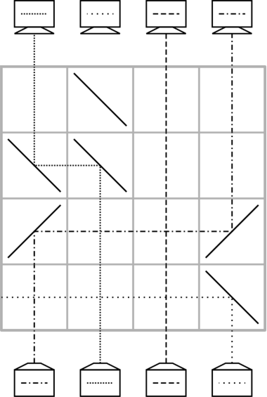

<h1 style='text-align: center;'> E. Lasers and Mirrors</h1>

<h5 style='text-align: center;'>time limit per test: 1 second</h5>
<h5 style='text-align: center;'>memory limit per test: 256 megabytes</h5>

Oleg came to see the maze of mirrors. The maze is a $n$ by $n$ room in which each cell is either empty or contains a mirror connecting opposite corners of this cell. Mirrors in this maze reflect light in a perfect way, which causes the interesting visual effects and contributes to the loss of orientation in the maze.

Oleg is a person of curious nature, so he decided to install $n$ lasers facing internal of the maze on the south wall of the maze. On the north wall of the maze, Oleg installed $n$ receivers, also facing internal of the maze. Let's number lasers and receivers from west to east with distinct integers from $1$ to $n$. Each laser sends a beam of some specific kind and receiver with number $a_i$ should receive the beam sent from laser number $i$. Since two lasers' beams can't come to the same receiver, these numbers form a permutation — each of the receiver numbers occurs exactly once.

You came to the maze together with Oleg. Help him to place the mirrors in the initially empty maze so that the maximum number of lasers' beams will come to the receivers they should. There are no mirrors outside the maze, so if the laser beam leaves the maze, it will not be able to go back.

### Input

The first line contains a single integer $n$ ($1 \le n \le 1000$) — the size of the maze.

The second line contains a permutation of $n$ integers $a_i$ ($1 \le a_i \le n$), where $a_i$ defines the number of the receiver, to which the beam from $i$-th laser should come.

### Output

In the first line print the maximum possible number of laser beams, which can come to the receivers they should.

In the next $n$ lines of length $n$ print the arrangement of mirrors, causing such number of laser beams to come where they should. If the corresponding cell is empty, print ".", otherwise print "/" or "\", depending on the orientation of the mirror.

In your output north should be above, south should be below, and west and east should be on left and on the right respectively.

It is allowed for laser beams to come not to the receivers they correspond to, but they are not counted in the answer.

If there are multiple arrangements of mirrors leading to the optimal answer — print any of them.

## Example

### Input


```text
4  
4 1 3 2  

```
### Output


```text
3  
...  
\..  
/../  
...  

```
## Note

The picture illustrates the arrangements of the mirrors in the first example.

  

#### Tags 

#3000 #NOT OK #constructive_algorithms #math 

## Blogs
- [All Contest Problems](../Codeforces_Round_516_(Div._1,_by_Moscow_Team_Olympiad).md)
- [Announcement](../blogs/Announcement.md)
- [Editorial (en)](../blogs/Editorial_(en).md)
