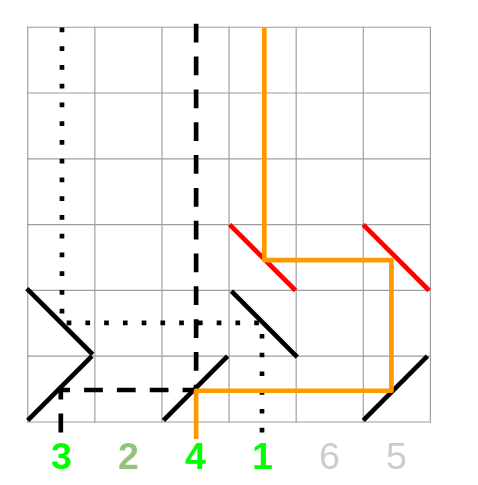

# Tutorial

**Credits**:

Div2A (Make a Trianle): Idea by [Zlobober](https://codeforces.com/profile/Zlobober "International Grandmaster Zlobober"), development by [vintage_Vlad_Makeev](https://codeforces.com/profile/vintage_Vlad_Makeev "International Master vintage_Vlad_Makeev")

Div2B (Equations of Mathematical Magic): Idea and development: [Glebodin](https://codeforces.com/profile/Glebodin "Candidate Master Glebodin")

Div1A (Oh Those Palindromes): Idea by [Endagorion](https://codeforces.com/profile/Endagorion "International Grandmaster Endagorion"), development by [Andreikkaa](https://codeforces.com/profile/Andreikkaa "Master Andreikkaa")

Div1B (Labyrinth): Idea and development by [qoo2p5](https://codeforces.com/profile/qoo2p5 "Grandmaster qoo2p5")

Div1C (Dwarves, Hats and Extrasensory Abilities): Idea and development by [mingaleg](https://codeforces.com/profile/mingaleg "Candidate Master mingaleg") 

Div1D (Candies for Children): Idea by [Endagorion](https://codeforces.com/profile/Endagorion "International Grandmaster Endagorion"), development by [Flyrise](https://codeforces.com/profile/Flyrise "Master Flyrise")

Div1E (Lasers and Mirrors): Idea and development by [mingaleg](https://codeforces.com/profile/mingaleg "Candidate Master mingaleg")

Div1F (String Journey): Original idea by [GreenGrape](https://codeforces.com/profile/GreenGrape "Candidate Master GreenGrape"),  solution by [vintage_Vlad_Makeev](https://codeforces.com/profile/vintage_Vlad_Makeev "International Master vintage_Vlad_Makeev"), development [vintage_Vlad_Makeev](https://codeforces.com/profile/vintage_Vlad_Makeev "International Master vintage_Vlad_Makeev") and [GreenGrape](https://codeforces.com/profile/GreenGrape "Candidate Master GreenGrape")

 
### [1064A - Make a triangle!](../problems/A._Make_a_triangle!.md "Codeforces Round 516 (Div. 2, by Moscow Team Olympiad)")

Suppose c is the largest stick. It is known, that we can build a triangle iff c≤a+b−1.

So if we can build a triangle the answer is zero. Otherwise we can just increase a or b until the inequality above holds.

So the answer is max(0,c−(a+b−1)).

Another approach: just bruteforce all possible triangles we can extend to (with sides ≤100) and select the one with smallest a+b+c.

 
### [1064B - Equations of Mathematical Magic](../problems/B._Equations_of_Mathematical_Magic.md "Codeforces Round 516 (Div. 2, by Moscow Team Olympiad)")

Rewriting equation we have a⊕x=a−x.

If you look in the xor definition, it is easy to see, that a⊕x≥a−x, no matter a and x (just look at the each bit of the a⊕x).

And the equality handles only if bits of x form a subset of bits of a.

So the answer is 2t, where t is the number of bits in a (also known as popcount).

 
### [1063A - Oh Those Palindromes](https://codeforces.com/contest/1063/problem/A "Codeforces Round 516 (Div. 1, by Moscow Team Olympiad)")

One possible solution is just to sort the string.

Why so?

Note that each palindrome have equal character at their ends. Suppose this character is c with x number of occurences. Then there are at most x(x+1)/2 palindromes with this character.

So we have a clear upper bound on answer. It is easy to see, that the sorted string fulfills that bound and hence it is the optimal answer.

 
### [1063B - Labyrinth](https://codeforces.com/contest/1063/problem/B "Codeforces Round 516 (Div. 1, by Moscow Team Olympiad)")

Suppose we started in cell (*i*0, *j*0) and examining whether we can reach cell (*i*1, *j*1).

Let's denote the number of taken moves to the right as *R* and number of moves to the left as *L*

Clearly, *j*0 + *R* - *L* = *j*1

That is, *R* - *L* = *j*1 - *j*0 = *const*. Or, put otherwise *R* = *L* + *const*, where *const* only depends on the starting cell and the target cell.

So in fact we just need to minimize any of the left or right moves — the other one will be optimal as well.

To calculate the minimum possible number of L-moves to reach some cell we can use 0-1 bfs.

Solution is *O*(*nm*).

 Tutorial is loading... 
### [1063D - Candies for Children](https://codeforces.com/contest/1063/problem/D "Codeforces Round 516 (Div. 1, by Moscow Team Olympiad)")

Solution works in min(n2,k/n) time. Also I will drop the case about the last person being sweet tooth and eating one candy instead of two.

This adds few more cases but the idea stays the same. Basically in the formulas below just few −1 will appear, however there must be condition that there is at least one sweet tooth in corresponding part of the circle.

So how to solve problem in n2?

Note, that basically we have two parts of the circle — the part between [l;r] which get's candies one times more than the rest and the other one.

Since we don't care about absolute values we can only worry about the lengths of this parts, let's denote them as x and y.

To solve in n2 let's bruteforce the number of sweet tooth on first part (a) and the number of sweet tooth on the second part (b).

Suppose that there were full t loops. This way the number of eaten candies is a∗2∗(t+1)+(x−a)∗1∗(t+1)+b∗2∗t+(y−b)∗1∗t.

This should be equal to k. Since we just bruteforced the values of a and b we now just have linear equation. If it is solvable, consider relaxing answer with a+b.

How to solve problem in k/n?

So as the asymptotic suggests the amount of turns ≤k/n, so we can bruteforce it instead.

Also it is worthy to handle case of 0 turns specifically here since it produces some unpleasant effects otherwise.

So each person in "x" part of the circle eats candies t+1 times (so each person contributes t+1 or 2t+2) and the other persons have eaten candies t times (so each person contributes t or 2t).

Let's account all persons as if they are not sweet tooths.

So now each person in x contributes 0 or t+1 and each person in y contributes 0 or t.

So we basically have (t+1)a+tb=γ. A Diophantine equation.

Careful analysis or bits of theory suggest that the solutions are

a=a0−tz, b=b0+(t+1)z, for all integer z.

Where a0 and b0 some arbitrary solutions which we can get with formulas.

Also we need to have 0≤a≤x, 0≤b≤y, and the a+b→max.

These bounds imply that t takes values only in some range [t1;t2].

Since the a+b is linear function we can only consider t1 and t2 while searching for maximum a+b.

 
### [1063E - Lasers and Mirrors](https://codeforces.com/contest/1063/problem/E "Codeforces Round 516 (Div. 1, by Moscow Team Olympiad)")

The answer is always n (if the permutation is identity) lasers or n−1 (otherwise).

Clearly, we can't have more than n−1 matching lasers if the permutation is not identity. Consider just the very first line with mirrors. If the first mirror in this line is «\» then we miss the laser below this mirror, if the very last mirror is «/» we miss the laser below it. Otherwise there are neighbouring «/» and «\» and we lost two lasers now.

The proof of n−1 is constructive one.

Ignore all fixed points in permutation (all x, that px=x).

Select arbitrary cycle and select one point in it as «dead». We can spend |cycle|−1 operations to fix all points in this cycle.

But we also need to fix all other cycles. We can do it in |cycle|+1 operations: move arbitrary beam to the wasted laser, fix all other points and move that point back.

But this is a bit too much lines.

The trick is that we can perform movement of arbitrary beam to the wasted point and the first operation of fixing in just one line, if we select as the trash beam the rightmost point.

See the following picture for an example (trash beam is the rightmost column):

   
### [1063F - String Journey](https://codeforces.com/contest/1063/problem/F "Codeforces Round 516 (Div. 1, by Moscow Team Olympiad)")

This problem required quite a lot of nice observations!

Observation 1. We can only consider journeys in which neighboring strings differ exactly by removing one symbol.

All other journeys can be modified a bit to match the criterion above.

Observation 2. If it is possible to start a journey at the symbol *i* with lengths of strings *k*, *k* - 1, ..., 1, it is always possible to start a journey at the same symbol *i* with lengths *t*, *t* - 1, ..., 1, given that *t* ≤ *k*.

This suggests doing dynamic programming: *dp*[*i*] is the maximum possible *k* such that there is a journey starting at position *i* of *k* strings with lengths *k*, ..., 1.

Due to observation 1 we only care about maximum – if we know maximum, we also known that all lesser values are also OK.

So let's calculate this dynamic programming from right to left.

How to check whether *dp*[*i*] ≥ *k* (given that tool, we can just use binary search for example)?

There must be such *j*, that *j* ≥ *i* + *k*, *dp*[*j*] ≥ *k* - 1 and string *s**j*, ..., *s**j* + *k* - 2 must be a substring of string *s**i**s**i* + 1... *s**i* + *k* - 1 (basically just two cases "left substring" or "right substring").

This almost gives us a solution, but we need few more observations to have , and not .

Observation 3. If *dp*[*i*] = *k*, then *dp*[*i* + 1] ≥ *k* - 1.

We can use this to kick binary search from the solution — when you calculate *dp*[*i*] you can start trying with *dp*[*i* + 1] + 1, descending until the success.

Since there are exactly *n* grows, there will be at most *n* descendings and the total number of checks is linear. 

?Observation? 4. We need to check whether such *j* exists in a fast way.

Recall there are few conditions for us to follow, *dp*[*j*] ≥ *const*, *j* ≥ *const* and some string equality.

If you carefully look at the restriction *j* ≥ *const* you can see, that when we move our dp calculation *i* → *i* - 1 or make dp[i] -= 1 this lower bound on *j* also moves only left, like in two pointers. So each moment some indexes *j* are "available" and some are not, and the border moves only left.

Finally, time for some structures. Build Suffix Array and build segment tree over it. Let's store in the leaf of the segment tree *dp*[*j*] if it's already available or  - 1 otherwise.

Let's check whether *dp*[*i*] = *k* is good. We want for string starting at *j* be either *s**i*, *s**i* + 1, ..., *s**i* + *k* - 2, or *s**i* + 1, *s**i* + 2, ..., *s**i* + *k* - 1. Consider these cases independently (however the procedure is pretty much same).

All such strings form a segment of Suffix Array, we can for example use LCP + binary search over sparse tables to find corresponding bounds.

Then we just need to query this segment and check if the maximum on it is at least *k* - 1.

The solution is 

