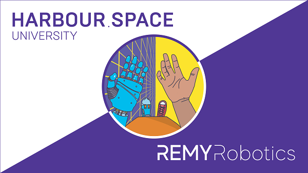

# https:_codeforces.com_blog_entry_62357

My friends from Harbour.Space and Remy Robotics asked to publish the news. I am excited and glad to do it, because for our community this is a true exclusive offer. In short, they offer to study robotics in Barcelona, paying for your studies and even with a scholarship! It's so cool!

Here is a direct speech from Harbour.Space.

=

Hi Codeforces! 

We are excited to announce our new Master’s in Robotics programme scholarship, which will be paired alongside an internship with our partner Remy Robotics! The programme will begin on January 7th, 2019, at our university in Barcelona, Spain.

Harbour.Space’s Robotics programme is the bridge between a personal interest in the world of Robotics, Artificial Intelligence, and a top-level professional future in one of the most exciting and fastest growing fields of technology. Students who enter the programme will either graduate as Control Engineers (theoretical specialists who ensure that robots interact with the environment in safe and effective manner), or CV Engineers (industrial manufacturers of robots, based more on practical experience).

Students will learn the Design and Control for Dexterous Manipulation; Kinematics, Dynamics and Control; Advanced Manipulation Algorithms robots use to physically interact with their world; Dynamic Optimisation for behavioral control; Integrated Intelligence in Robotics: Vision, Language, and Planning which builds upon the cognitive development; Mechanics of Manipulation focusing on using intelligent development of kinematic constraint, gravity, and friction; Manipulation, Estimation, and Control allowing for robots to locomote and navigate the world; Reinforcement learning in Robotics.

**SCHOLARSHIP VALUE: €34,900**

  

 [Apply →](https://codeforces.com/userForm/89f420923cb55373)  The scholarship includes: 

 * Complete coverage of the University tuition fee (€22,900)
* Living allowance (€1,000 per month during 1 year)
* Internship at Remy Robotics (20h per week during 1 year)

**REQUIRED EDUCATION:**

Bachelor's or Master's Degree in Robotics or Computer, Electrical, Mechanical Engineering or related disciplines.

**QUALIFICATIONS AND SKILLS:**

 * Hands-on robotic programming
* Ideally experience within the automotive manufacturing sector
* Knowledge understanding of robot control interface with ancillary equipment
* Use of robot simulation packages
* Deep experience with all things robotic, from infrastructure-free autonomy to ROS, computer vision, and machine learning
* Experience working with robot parts and components, developing robotics devices
* Ability to concurrently manage multiple diverse and often complex issues and / or projects at the nexus of software, sensors, and hardware

To be selected for this programme, you will need to go through the following steps:

 1. Fill out the given form by the link: <https://codeforces.com/userForm/89f420923cb55373>
2. Attend a series of online tests and interviews with our admissions office and partners
3. Pack your bags for Barcelona!
