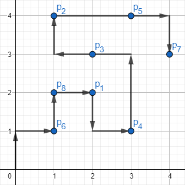
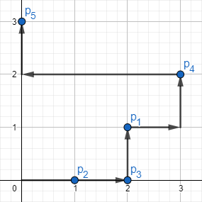

<h1 style='text-align: center;'> F. Yet another 2D Walking</h1>

<h5 style='text-align: center;'>time limit per test: 4 seconds</h5>
<h5 style='text-align: center;'>memory limit per test: 256 megabytes</h5>

Maksim walks on a Cartesian plane. Initially, he stands at the point $(0, 0)$ and in one move he can go to any of four adjacent points (left, right, up, down). For example, if Maksim is currently at the point $(0, 0)$, he can go to any of the following points in one move: 

* $(1, 0)$;
* $(0, 1)$;
* $(-1, 0)$;
* $(0, -1)$.

There are also $n$ distinct key points at this plane. The $i$-th point is $p_i = (x_i, y_i)$. It is guaranteed that $0 \le x_i$ and $0 \le y_i$ and there is no key point $(0, 0)$.

Let the first level points be such points that $max(x_i, y_i) = 1$, the second level points be such points that $max(x_i, y_i) = 2$ and so on. Maksim wants to visit all the key points. But he shouldn't visit points of level $i + 1$ if he does not visit all the points of level $i$. He starts visiting the points from the minimum level of point from the given set.

The distance between two points $(x_1, y_1)$ and $(x_2, y_2)$ is $|x_1 - x_2| + |y_1 - y_2|$ where $|v|$ is the absolute value of $v$.

Maksim wants to visit all the key points in such a way that the total distance he walks will be minimum possible. Your task is to find this distance.

If you are Python programmer, consider using PyPy instead of Python when you submit your code.

#### Input

The first line of the input contains one integer $n$ ($1 \le n \le 2 \cdot 10^5$) — the number of key points.

Each of the next $n$ lines contains two integers $x_i$, $y_i$ ($0 \le x_i, y_i \le 10^9$) — $x$-coordinate of the key point $p_i$ and $y$-coordinate of the key point $p_i$. It is guaranteed that all the points are distinct and the point $(0, 0)$ is not in this set.

#### Output

Print one integer — the minimum possible total distance Maksim has to travel if he needs to visit all key points in a way described above.

## Examples

#### Input


```text
8  
2 2  
1 4  
2 3  
3 1  
3 4  
1 1  
4 3  
1 2  

```
#### Output


```text
15  

```
#### Input


```text
5  
2 1  
1 0  
2 0  
3 2  
0 3  

```
#### Output


```text
9  

```
## Note

The picture corresponding to the first example: 

There is one of the possible answers of length $15$.

The picture corresponding to the second example: 

There is one of the possible answers of length $9$.


#### Tags 

#2100 #NOT OK #dp 

## Blogs
- [All Contest Problems](../Codeforces_Round_515_(Div._3).md)
- [Tutorial](../blogs/Tutorial.md)
