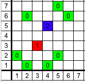

<h1 style='text-align: center;'> C. Knights</h1>

<h5 style='text-align: center;'>time limit per test: 1 second</h5>
<h5 style='text-align: center;'>memory limit per test: 256 megabytes</h5>

Ivan places knights on infinite chessboard. Initially there are $n$ knights. If there is free cell which is under attack of at least $4$ knights then he places new knight in this cell. Ivan repeats this until there are no such free cells. One can prove that this process is finite. One can also prove that position in the end does not depend on the order in which new knights are placed.

Ivan asked you to find initial placement of exactly $n$ knights such that in the end there will be at least $\lfloor \frac{n^{2}}{10} \rfloor$ knights.

#### Input

The only line of input contains one integer $n$ ($1 \le n \le 10^{3}$) — number of knights in the initial placement.

#### Output

Print $n$ lines. Each line should contain $2$ numbers $x_{i}$ and $y_{i}$ ($-10^{9} \le x_{i}, \,\, y_{i} \le 10^{9}$) — coordinates of $i$-th knight. For all $i \ne j$, $(x_{i}, \,\, y_{i}) \ne (x_{j}, \,\, y_{j})$ should hold. In other words, all knights should be in different cells.

It is guaranteed that the solution exists.

## Examples

#### Input


```text
4  

```
#### Output


```text
1 1  
3 1  
1 5  
4 4  

```
#### Input


```text
7  

```
#### Output


```text
2 1  
1 2  
4 1  
5 2  
2 6  
5 7  
6 6  

```
## Note

Let's look at second example:



Green zeroes are initial knights. Cell $(3, \,\, 3)$ is under attack of $4$ knights in cells $(1, \,\, 2)$, $(2, \,\, 1)$, $(4, \,\, 1)$ and $(5, \,\, 2)$, therefore Ivan will place a knight in this cell. Cell $(4, \,\, 5)$ is initially attacked by only $3$ knights in cells $(2, \,\, 6)$, $(5, \,\, 7)$ and $(6, \,\, 6)$. But new knight in cell $(3, \,\, 3)$ also attacks cell $(4, \,\, 5)$, now it is attacked by $4$ knights and Ivan will place another knight in this cell. There are no more free cells which are attacked by $4$ or more knights, so the process stops. There are $9$ knights in the end, which is not less than $\lfloor \frac{7^{2}}{10} \rfloor = 4$.


#### Tags 

#2600 #NOT OK #constructive_algorithms 

## Blogs
- [All Contest Problems](../Codeforces_Round_518_(Div._1)_[Thanks,_Mail.Ru!].md)
- [Announcement (en)](../blogs/Announcement_(en).md)
- [Tutorial (en)](../blogs/Tutorial_(en).md)
