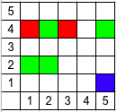
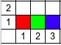
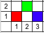

<h1 style='text-align: center;'> C. Colored Rooks</h1>

<h5 style='text-align: center;'>time limit per test: 1 second</h5>
<h5 style='text-align: center;'>memory limit per test: 256 megabytes</h5>

Ivan is a novice painter. He has $n$ dyes of different colors. He also knows exactly $m$ pairs of colors which harmonize with each other.

Ivan also enjoy playing chess. He has $5000$ rooks. He wants to take $k$ rooks, paint each of them in one of $n$ colors and then place this $k$ rooks on a chessboard of size $10^{9} \times 10^{9}$.

Let's call the set of rooks on the board connected if from any rook we can get to any other rook in this set moving only through cells with rooks from this set. Assume that rooks can jump over other rooks, in other words a rook can go to any cell which shares vertical and to any cell which shares horizontal.

Ivan wants his arrangement of rooks to have following properties:

* For any color there is a rook of this color on a board;
* For any color the set of rooks of this color is connected;
* For any two different colors $a$ $b$ union of set of rooks of color $a$ and set of rooks of color $b$ is connected if and only if this two colors harmonize with each other.

Please help Ivan find such an arrangement.

##### Input

The first line of input contains $2$ integers $n$, $m$ ($1 \le n \le 100$, $0 \le m \le min(1000, \,\, \frac{n(n-1)}{2})$) — number of colors and number of pairs of colors which harmonize with each other.

In next $m$ lines pairs of colors which harmonize with each other are listed. Colors are numbered from $1$ to $n$. It is guaranteed that no pair occurs twice in this list.

##### Output

Print $n$ blocks, $i$-th of them describes rooks of $i$-th color.

In the first line of block print one number $a_{i}$ ($1 \le a_{i} \le 5000$) — number of rooks of color $i$. In each of next $a_{i}$ lines print two integers $x$ and $y$ ($1 \le x, \,\, y \le 10^{9}$) — coordinates of the next rook.

All rooks must be on different cells.

Total number of rooks must not exceed $5000$.

It is guaranteed that the solution exists.

## Examples

##### Input


```text
3 2  
1 2  
2 3  

```
##### Output


```text
2  
3 4  
1 4  
4  
1 2  
2 2  
2 4  
5 4  
1  
5 1  

```
##### Input


```text
3 3  
1 2  
2 3  
3 1  

```
##### Output


```text
1  
1 1  
1  
1 2  
1  
1 3  

```
##### Input


```text
3 1  
1 3  

```
##### Output


```text
1  
1 1  
1  
2 2  
1  
3 1  

```
## Note

Rooks arrangements for all three examples (red is color $1$, green is color $2$ and blue is color $3$).








#### Tags 

#1700 #NOT OK #constructive_algorithms #graphs 

## Blogs
- [All Contest Problems](../Codeforces_Round_518_(Div._2)_[Thanks,_Mail.Ru!].md)
- [A (en)](../blogs/A_(en).md)
- [E (en)](../blogs/E_(en).md)
