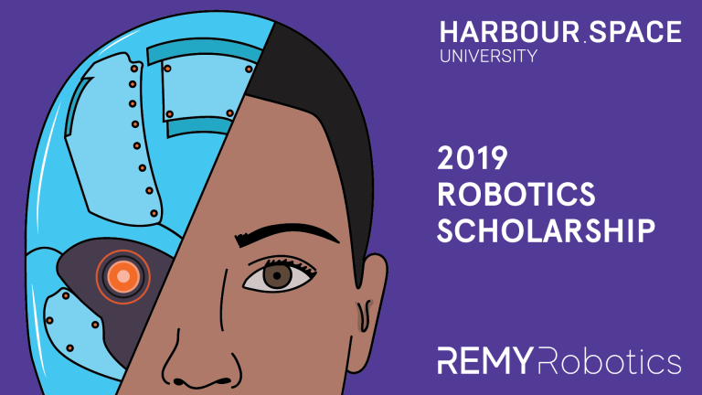

# Announcement

On [Thursday, October 25, 2018 at 20:35UTC+6](https://codeforces.com/https://www.timeanddate.com/worldclock/fixedtime.html?day=25&month=10&year=2018&hour=17&min=35&sec=0&p1=166) [Educational Codeforces Round 53 (Rated for Div. 2)](https://codeforces.com/contest/1073 "Educational Codeforces Round 53 (Rated for Div. 2)") will start.

Series of Educational Rounds continue being held as [Harbour.Space University](https://codeforces.com/https://harbour.space/) initiative! You can read the details about the cooperation between [Harbour.Space University](https://codeforces.com/https://harbour.space/) and Codeforces in the [blog post](//codeforces.com/blog/entry/51208).

This round will be **rated for the participants with rating lower than 2100**. It will be held on extented ACM ICPC rules. The penalty for each incorrect submission until the submission with a full solution is 10 minutes. After the end of the contest you will have 12 hours to hack any solution you want. You will have access to copy any solution and test it locally.

You will be given **7 problems** and **2 hours** to solve them.

The problems were invented and prepared by Roman [Roms](https://codeforces.com/profile/Roms "Master Roms") Glazov, Adilbek [adedalic](https://codeforces.com/profile/adedalic "Master adedalic") Dalabaev, Vladimir [vovuh](https://codeforces.com/profile/vovuh "Candidate Master vovuh") Petrov, Ivan [BledDest](https://codeforces.com/profile/BledDest "Grandmaster BledDest") Androsov and me.

Good luck to all participants!

Our friends at Harbour.Space also have a message for you:

Hey Codeforces! We want to remind you that the [Scholarship for the Master’s in Robotics](https://codeforces.com/https://in.harbour.space/remy-robotics-scholarship/) programme, which starts on January 7th 2019, **has an application deadline of November 12th, 2018.**

[Harbour.Space University](https://codeforces.com/http://harbour.space/) and [Remy Robotics](https://codeforces.com/https://www.remyrobotics.com/) are collaborating to offer graduate students from anywhere in the world a once in a lifetime opportunity, a fully funded scholarship for Harbour.Space University’s Master’s Programme in Robotics. 

**The scholarship value is €34.900 and it includes:**

 * Complete coverage of the University tuition fee (€22,900)
* Internship at Remy Robotics (20h per week during 1 year)
* €1,000 per month during 1 year (Internship earnings)

Apply hereUPD: [vovuh](https://codeforces.com/profile/vovuh "Candidate Master vovuh") and me will be waiting for you on the [community Discord server](https://codeforces.com/blog/entry/52778) shortly after the contest to discuss the problems.

Congratulations to the winners: 

| Rank | Competitor | Problems Solved | Penalty |
| --- | --- | --- | --- |
| 1 | [pekempey](https://codeforces.com/profile/pekempey "Candidate Master pekempey") | 7 | 305 |
| 2 | [ko_osaga](https://codeforces.com/profile/ko_osaga "Legendary Grandmaster ko_osaga") | 7 | 578 |
| 3 | [Lewin](https://codeforces.com/profile/Lewin "International Grandmaster Lewin") | 6 | 216 |
| 4 | [fanache99](https://codeforces.com/profile/fanache99 "Grandmaster fanache99") | 6 | 226 |
| 5 | [natsugiri](https://codeforces.com/profile/natsugiri "International Master natsugiri") | 6 | 257 |

Congratulations to the best hackers: 

| Rank | Competitor | Hack Count |
| --- | --- | --- |
| 1 | [halyavin](https://codeforces.com/profile/halyavin "Legendary Grandmaster halyavin") | **238****:-15** |
| 2 | [Laggy](https://codeforces.com/profile/Laggy "Specialist Laggy") | **64****:-14** |
| 3 | [MarcosK](https://codeforces.com/profile/MarcosK "Expert MarcosK") | **59****:-9** |
| 4 | [Mistra](https://codeforces.com/profile/Mistra "Candidate Master Mistra") | **8****:-1** |
| 5 | [LordVoldebug](https://codeforces.com/profile/LordVoldebug "Expert LordVoldebug") | **7****:-1** |

 482 successful hacks and 684 unsuccessful hacks were made in total!And finally people who were the first to solve each problem: 

| Problem | Competitor | Penalty |
| --- | --- | --- |
| A | [Dalgerok](https://codeforces.com/profile/Dalgerok "Candidate Master Dalgerok") | 0:01 |
| B | [dorijanlendvaj](https://codeforces.com/profile/dorijanlendvaj "Master dorijanlendvaj") | 0:02 |
| C | [fanache99](https://codeforces.com/profile/fanache99 "Grandmaster fanache99") | 0:10 |
| D | [bazsi700](https://codeforces.com/profile/bazsi700 "Grandmaster bazsi700") | 0:13 |
| E | [DAyamaCTF](https://codeforces.com/profile/DAyamaCTF "Candidate Master DAyamaCTF") | 0:21 |
| F | [Noam527](https://codeforces.com/profile/Noam527 "Master Noam527") | 0:48 |
| G | [ko_osaga](https://codeforces.com/profile/ko_osaga "Legendary Grandmaster ko_osaga") | 0:24 |

UPD2: [Editorial is published](Tutorial.md)

