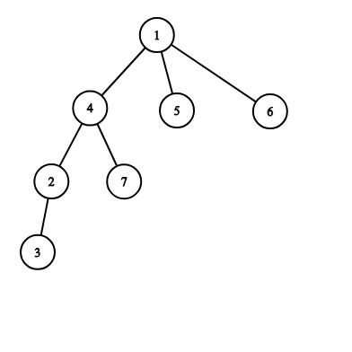
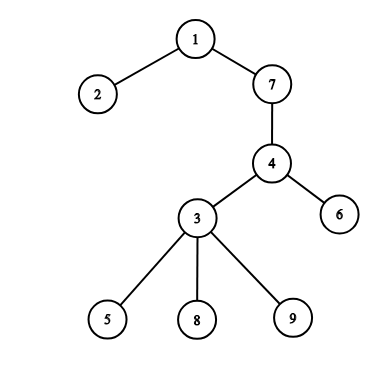
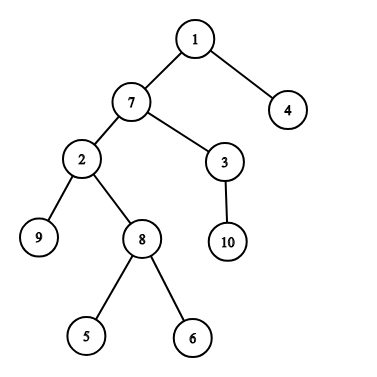
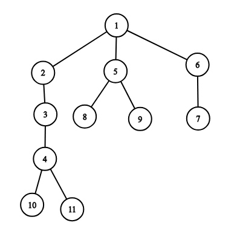

<h1 style='text-align: center;'> F. Choosing Two Paths</h1>

<h5 style='text-align: center;'>time limit per test: 2 seconds</h5>
<h5 style='text-align: center;'>memory limit per test: 256 megabytes</h5>

You are given an undirected unweighted tree consisting of $n$ vertices.

An undirected tree is a connected undirected graph with $n - 1$ edges.

Your task is to choose two pairs of vertices of this tree (all the chosen vertices should be distinct) $(x_1, y_1)$ and $(x_2, y_2)$ in such a way that neither $x_1$ nor $y_1$ belong to the simple path from $x_2$ to $y_2$ and vice versa (neither $x_2$ nor $y_2$ should not belong to the simple path from $x_1$ to $y_1$).

It is guaranteed that it is possible to choose such pairs for the given tree.

Among all possible ways to choose such pairs you have to choose one with the maximum number of common vertices between paths from $x_1$ to $y_1$ and from $x_2$ to $y_2$. And among all such pairs you have to choose one with the maximum total length of these two paths.

It is guaranteed that the answer with at least two common vertices exists for the given tree.

The length of the path is the number of edges in it.

The simple path is the path that visits each vertex at most once.

###### Input

The first line contains an integer $n$ — the number of vertices in the tree ($6 \le n \le 2 \cdot 10^5$).

Each of the next $n - 1$ lines describes the edges of the tree.

Edge $i$ is denoted by two integers $u_i$ and $v_i$, the labels of vertices it connects ($1 \le u_i, v_i \le n$, $u_i \ne v_i$).

It is guaranteed that the given edges form a tree.

It is guaranteed that the answer with at least two common vertices exists for the given tree.

###### Output

Print any two pairs of vertices satisfying the conditions described in the problem statement.

It is guaranteed that it is possible to choose such pairs for the given tree.

## Examples

###### Input


```text
7  
1 4  
1 5  
1 6  
2 3  
2 4  
4 7  

```
###### Output


```text
3 6  
7 5  

```
###### Input


```text
9  
9 3  
3 5  
1 2  
4 3  
4 7  
1 7  
4 6  
3 8  

```
###### Output


```text
2 9  
6 8  

```
###### Input


```text
10  
6 8  
10 3  
3 7  
5 8  
1 7  
7 2  
2 9  
2 8  
1 4  

```
###### Output


```text
10 6  
4 5  

```
###### Input


```text
11  
1 2  
2 3  
3 4  
1 5  
1 6  
6 7  
5 8  
5 9  
4 10  
4 11  

```
###### Output


```text
9 11  
8 10  

```
## Note

The picture corresponding to the first example: 

The intersection of two paths is $2$ (vertices $1$ and $4$) and the total length is $4 + 3 = 7$.

The picture corresponding to the second example: 

The intersection of two paths is $2$ (vertices $3$ and $4$) and the total length is $5 + 3 = 8$.

The picture corresponding to the third example: 

The intersection of two paths is $3$ (vertices $2$, $7$ and $8$) and the total length is $5 + 5 = 10$.

The picture corresponding to the fourth example: 

The intersection of two paths is $5$ (vertices $1$, $2$, $3$, $4$ and $5$) and the total length is $6 + 6 = 12$.


#### Tags 

#2500 #NOT OK #dfs_and_similar #dp #greedy #trees 

## Blogs
- [All Contest Problems](../Educational_Codeforces_Round_53_(Rated_for_Div._2).md)
- [Announcement](../blogs/Announcement.md)
- [Tutorial](../blogs/Tutorial.md)
