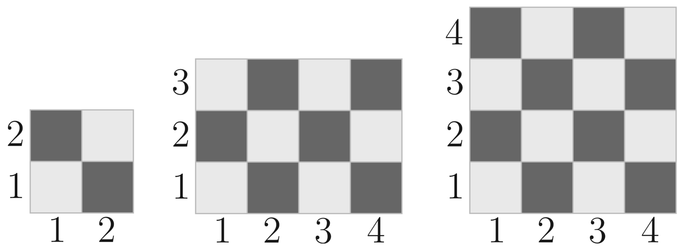

# Tutorial

### [1080A - Petya and Origami](../problems/A._Petya_and_Origami.md "Codeforces Round 524 (Div. 2)")

Let's calculate how many notebooks we need for each color separately, and the answer, obviously, will be their sum. We need 2⋅n2⋅n red sheets, 5⋅n5⋅n green sheets, and 8⋅n8⋅n blue sheets. So we need ⌈2nk⌉⌈2nk⌉ notebooks with red sheets, ⌈5nk⌉⌈5nk⌉ and ⌈8nk⌉⌈8nk⌉ notebooks with of green sheets and blue sheets, respectively.

C++ code: [46178226](https://codeforces.com/contest/1080/submission/46178226 "Submission 46178226 by stanislav.bezkorovainyi")

 Tutorial is loading...C++ code: [46178084](https://codeforces.com/contest/1080/submission/46178084 "Submission 46178084 by stanislav.bezkorovainyi")

 
### [1080C - Masha and two friends](../problems/C._Masha_and_two_friends.md "Codeforces Round 524 (Div. 2)")

At first let's define a function w(a,b)w(a,b), which returns the number of white cells on the subrectangle, the left bottom corner of which has coordinates (1,1)(1,1) and the top right one has coordinates (a,b)(a,b). (I will tell you how to implement the function later).

How do we solve the problem using this function?

Let's define functions W(a,b,c,d)W(a,b,c,d) and B(a,b,c,d)B(a,b,c,d), which return the number of white cells on the subrectangle which has coordinates (a,b,c,d)(a,b,c,d) and the number of black cells on the subrectangle which has coordinates (a,b,c,d)(a,b,c,d). (The definition of what we call the coordinates of a rectangle can be found in the statements)

It can be easily proven that 

W(a,b,c,d)=w(c,d)−w(a−1,d)−w(c,b−1)+w(a−1,b−1)W(a,b,c,d)=w(c,d)−w(a−1,d)−w(c,b−1)+w(a−1,b−1)

The value of B(a,b,c,d)B(a,b,c,d) can be found as the number of all cells substracted by the number of the white cells: 

B(a,b,c,d)=(c−a+1)⋅(d−b+1)−W(a,b,c,d)B(a,b,c,d)=(c−a+1)⋅(d−b+1)−W(a,b,c,d)

It means that in order to calculate the value of functions WW and BB efficiently it is enough to be able to calculate the value of ww efficiently.

How de solve the problem using the funcitons defined above?

Step 1. We should find the number of black cells and white cells in the initial chessboard (these values will be stored in the variables called blackblack and whitewhite respectivly):

black=B(1,1,m,n)black=B(1,1,m,n) white=W(1,1,m,n)white=W(1,1,m,n)

Step 2. All the black cells in the rectangle (x1,y1,x2,y2)(x1,y1,x2,y2) will become white. So now:

black:=black−B(x1,y1,x2,y2)black:=black−B(x1,y1,x2,y2) white:=white+B(x1,y1,x2,y2)white:=white+B(x1,y1,x2,y2)

Step 3. Now all the white cells in the rectangle (x3,y3,x4,y4)(x3,y3,x4,y4) will become black. So now:

white:=white−W(x3,y3,x4,y4)white:=white−W(x3,y3,x4,y4) black:=black+W(x3,y3,x4,y4)black:=black+W(x3,y3,x4,y4)

But since the functions functions BB and WW return the number of cells black and white cells respectively in the initial board, so it isn't enough. What we did in the intersection of the rectangles:

On step 2 we took the cells that were initially black and coloured them in white (everything is ok by now), but on step 3 we took only the cells that were initially white and coloured them in black. The cells that were initially black and coloured in white on step 2 were not coloured in black. 

In order to fix this we should find the rectangle which is an intersection of the rectangles (x1,y2,x2,y2)(x1,y2,x2,y2) and (x3,y3,x4,y4)(x3,y3,x4,y4), find the number of black cells in it and then colour them in black.

It is obvious that the coordinates of the itersection of the rectangle are (max(x1,x3),max(y1,y3),min(x2,x4),min(y2,y4))(max(x1,x3),max(y1,y3),min(x2,x4),min(y2,y4)).

If max(x1,x3)>min(x2,x4)max(x1,x3)>min(x2,x4) or max(y1,y3)>min(y2,y4)max(y1,y3)>min(y2,y4) then there is no intersection, so we can just terminate the program.

In another case we should apply:

white:=white−B(max(x1,x3),max(y1,y3),min(x2,x4),min(y2,y4))white:=white−B(max(x1,x3),max(y1,y3),min(x2,x4),min(y2,y4)) black:=black+B(max(x1,x3),max(y1,y3),min(x2,x4),min(y2,y4))black:=black+B(max(x1,x3),max(y1,y3),min(x2,x4),min(y2,y4))

So we solved the task. Now it's time to tell how to implement function w(a,b)w(a,b).

Let's consider following chessboards from the examples:

  In order to explain more easily, I will name the pattern like this the pattern type 1

  And the pattern like this the pattern type 2:

  It can be easily seen that if the number of rows is even, then the number of rows of both types is equal to b2b2.If the number of rows is odd, then the number of rows of the type 2 is equal to ⌈b2⌉⌈b2⌉ and the number of rows of the type 1 is equal to ⌊b2⌋⌊b2⌋. 

Since ⌈b2⌉=⌊b2⌋⌈b2⌉=⌊b2⌋ if bb is even then we can just assume that the number of rows with pattern type 1 is ⌊b2⌋⌊b2⌋ and the number of rows with pattern type 2 is ⌈b2⌉⌈b2⌉.

In the same way we can prove that the number of white cells in one row with pattern type 1 is equal to ⌊a2⌋⌊a2⌋ and in the pattern type 2 it is equal to ⌈a2⌉⌈a2⌉.

So now:

w(a,b)=⌈b2⌉⋅⌈a2⌉+⌊b2⌋⋅⌊a2⌋w(a,b)=⌈b2⌉⋅⌈a2⌉+⌊b2⌋⋅⌊a2⌋

Overall complexity O(1)O(1).

C++ code: [46178118](https://codeforces.com/contest/1080/submission/46178118 "Submission 46178118 by stanislav.bezkorovainyi")

 
### [1080D - Olya and magical square](../problems/D._Olya_and_magical_square.md "Codeforces Round 524 (Div. 2)")

At first let's check if the value of k is not too large. This can be done greedily in the folllowing way:

First splitting operation would be applied on the only existing inital square. 

After that we have 4 squares with sides 2n−1. Now we will do 4 spliiting operations each on one of them. Then we will have 16 squares with sides 2n−2. If we repeat the action n−1 times we would end up having 4n squares with size 1. After that we can't do any more operations. Of course we don't do this manually — we just substract the number of splitting operations we did on each step from the number k′ (that's the variable that is a copy of variable k — we will need the value of k later).

If at some point of the algorithm we have to do more splitting operations than there remains to, then the value of k is smaller than the maximum number of operations we can apply, thus k is not too large, so we can just stop checking. If the algorithm successfuly did n−1 iterations and k′ is still greater than 0, it means that k is greater than the maximum number of operations we can apply, so the answer is "NO". It can easily proven that for any n>30 there are no too large numbers k for them within the constraints of the task. 

Now we know that we can do k operations, but can we do them in such a way the the condition of Olya's happiness is fuldilled?

Let's imagine that the constraints are not so big and we can emulate the process. We can do it in the following way:

Step 0. We split the only existing square.

Step 1. If we can apply splitting opertation to all of the squares on the path from leftmost bottom point to rigthmost top point with the reamining operations, we should do it and after that we return to Step 1. Otherwise, the size of the squares of which the path consists is equal to the size of the squares the path consits now. Go to Step 2.

Step 2. When we first did Step 1, we left one square of size 2n−1 untouched. All the remaining spliiting operations will be used in arbitrary way on it or the squares that appear from it.

Let's prove that with relatively big n we can always solve the problem with the following algorithm.

If we can build the path from leftmost bottom point to rightmost top point with squares of size 20 than everything is ok, since the remaining splitting operations can be done (we already checked that the value of k is not too large).

Otherwise, we can easily see that the number of squares to which you need to apply the splitting operation on each step changes like this: 3,7,15,⋯. It can be proven that the number of splitting operations on the i-th step is equal to:

needi=4∗2i−1−1

Let's assume that we stopped on x-th iteration of Step 1. It means that the number of splitting operations remaining is less than 4∗2x−1−1. It also means that we can do at least 1+4+16+⋯+4x−1 operations on the 2n−1 square that was left untouched after the first iteration of the algorithm. Let's find the set of such numbers x that 1+4+16+⋯+4x−1 is greater or equal to 4∗2x−1−1:

1+4+16+⋯+4x−1≥4∗2x−1−1 

Since, in numerical system with base 4 1+4+16+⋯+4x−1 can be represented as number with length x+1 that consists only of ones, it follows that:

1+4+16+⋯+4x−1=4x−13

Now, back to our inequality:

4x−13≥4∗2x−1−1

4x−1≥12∗2x−1−3 4x≥12∗2x−1−2

It's obvious that function f1(x)=4x grows faster than f2(x)=12∗2x−1−2, so once the value of f1 becomes greater than the value of f2 it will never beome smaller. For x=3:

f1(3)=43=64, f2(3)=12∗22−2=46,f1(3)>f2(3)

For x=2:

f1(3)=42=16, f2(3)=12∗21−2=22,f1(2)<f2(2)

Now we know that the following algorithm always finds solution for all n≥3. The rest tests cases can be solved with if's, but still the algorithms works for them. The only exception is test "2 3" — there is no solution for this test, though k is smaller than the maximum number of splitting operations you can apply. 

Like the first part of the solution we shouldn't do the algorthm manually – we can just on each step substract the length of the path from the variable k. (For i-th step it's needi).

Overall complexity O(logn+logk).

C++ code: [46178228](https://codeforces.com/contest/1080/submission/46178228 "Submission 46178228 by stanislav.bezkorovainyi")

 Tutorial is loading...C++ code: [46178239](https://codeforces.com/contest/1080/submission/46178239 "Submission 46178239 by stanislav.bezkorovainyi")

 Tutorial is loading...C++ code: [46178244](https://codeforces.com/contest/1080/submission/46178244 "Submission 46178244 by stanislav.bezkorovainyi")

