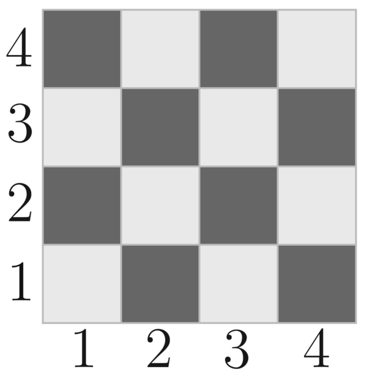
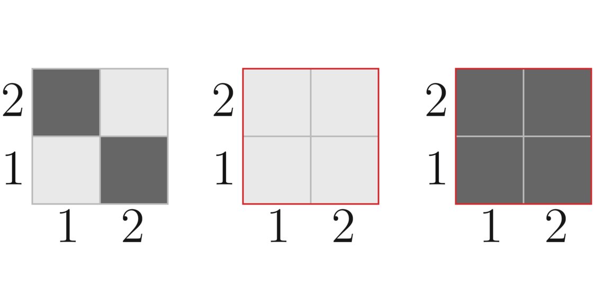
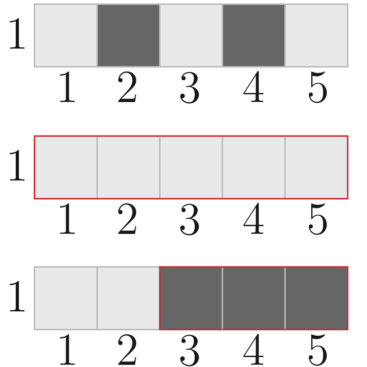
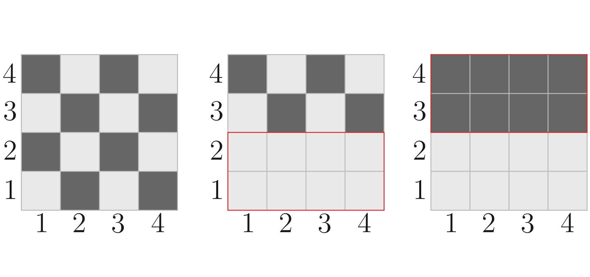

<h1 style='text-align: center;'> C. Masha and two friends</h1>

<h5 style='text-align: center;'>time limit per test: 1 second</h5>
<h5 style='text-align: center;'>memory limit per test: 256 megabytes</h5>

Recently, Masha was presented with a chessboard with a height of $n$ and a width of $m$.

The rows on the chessboard are numbered from $1$ to $n$ from bottom to top. The columns are numbered from $1$ to $m$ from left to right. Therefore, each cell can be specified with the coordinates $(x,y)$, where $x$ is the column number, and $y$ is the row number (do not mix up).

Let us call a rectangle with coordinates $(a,b,c,d)$ a rectangle lower left point of which has coordinates $(a,b)$, and the upper right one — $(c,d)$.

The chessboard is painted black and white as follows:

   An example of a chessboard. Masha was very happy with the gift and, therefore, invited her friends Maxim and Denis to show off. The guys decided to make her a treat — they bought her a can of white and a can of black paint, so that if the old board deteriorates, it can be repainted. When they came to Masha, something unpleasant happened: first, Maxim went over the threshold and spilled white paint on the rectangle $(x_1,y_1,x_2,y_2)$. Then after him Denis spilled black paint on the rectangle $(x_3,y_3,x_4,y_4)$.

To spill paint of color $color$ onto a certain rectangle means that all the cells that belong to the given rectangle become $color$. The cell dyeing is superimposed on each other (if at first some cell is spilled with white paint and then with black one, then its color will be black).

Masha was shocked! She drove away from the guests and decided to find out how spoiled the gift was. For this, she needs to know the number of cells of white and black color. Help her find these numbers!

### Input

The first line contains a single integer $t$ ($1 \le t \le 10^3$) — the number of test cases.

Each of them is described in the following format:

The first line contains two integers $n$ and $m$ ($1 \le n,m \le 10^9$) — the size of the board.

The second line contains four integers $x_1$, $y_1$, $x_2$, $y_2$ ($1 \le x_1 \le x_2 \le m, 1 \le y_1 \le y_2 \le n$) — the coordinates of the rectangle, the white paint was spilled on.

The third line contains four integers $x_3$, $y_3$, $x_4$, $y_4$ ($1 \le x_3 \le x_4 \le m, 1 \le y_3 \le y_4 \le n$) — the coordinates of the rectangle, the black paint was spilled on.

### Output

### Output

 $t$ lines, each of which contains two numbers — the number of white and black cells after spilling paint, respectively.

## Example

### Input


```text
5
2 2
1 1 2 2
1 1 2 2
3 4
2 2 3 2
3 1 4 3
1 5
1 1 5 1
3 1 5 1
4 4
1 1 4 2
1 3 4 4
3 4
1 2 4 2
2 1 3 3
```
### Output


```text
0 4
3 9
2 3
8 8
4 8
```
## Note

Explanation for examples:

The first picture of each illustration shows how the field looked before the dyes were spilled. The second picture of each illustration shows how the field looked after Maxim spoiled white dye (the rectangle on which the dye was spilled is highlighted with red). The third picture in each illustration shows how the field looked after Denis spoiled black dye (the rectangle on which the dye was spilled is highlighted with red).

In the first test, the paint on the field changed as follows:

  In the second test, the paint on the field changed as follows:

  In the third test, the paint on the field changed as follows:

  In the fourth test, the paint on the field changed as follows:

  In the fifth test, the paint on the field changed as follows:

  

#### Tags 

#1500 #NOT OK #implementation 

## Blogs
- [All Contest Problems](../Codeforces_Round_524_(Div._2).md)
- [Announcement](../blogs/Announcement.md)
- [Tutorial](../blogs/Tutorial.md)
