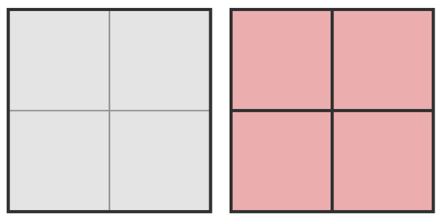
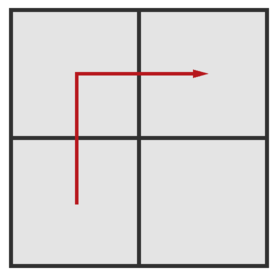
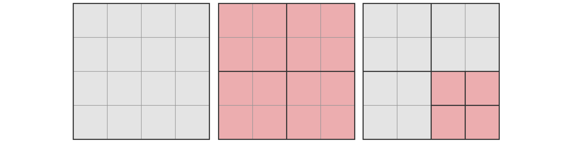
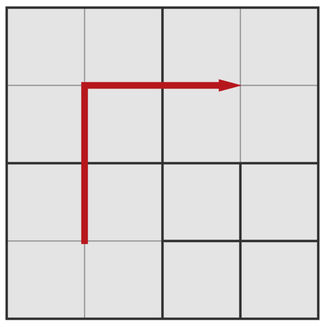
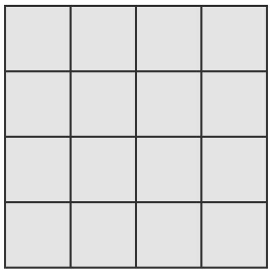

<h1 style='text-align: center;'> D. Olya and magical square</h1>

<h5 style='text-align: center;'>time limit per test: 1 second</h5>
<h5 style='text-align: center;'>memory limit per test: 256 megabytes</h5>

Recently, Olya received a magical square with the size of $2^n\times 2^n$.

It seems to her sister that one square is boring. Therefore, she asked Olya to perform exactly $k$ splitting operations.

A Splitting operation is an operation during which Olya takes a square with side $a$ and cuts it into 4 equal squares with side $\dfrac{a}{2}$. If the side of the square is equal to $1$, then it is impossible to apply a splitting operation to it (see examples for better understanding).

Olya is happy to fulfill her sister's request, but she also wants the condition of Olya's happiness to be satisfied after all operations.

The condition of Olya's happiness will be satisfied if the following statement is fulfilled:

Let the length of the side of the lower left square be equal to $a$, then the length of the side of the right upper square should also be equal to $a$. There should also be a path between them that consists only of squares with the side of length $a$. All consecutive squares on a path should have a common side.

Obviously, as long as we have one square, these conditions are met. So Olya is ready to fulfill her sister's request only under the condition that she is satisfied too. Tell her: is it possible to perform exactly $k$ splitting operations in a certain order so that the condition of Olya's happiness is satisfied? If it is possible, tell also the size of the side of squares of which the path from the lower left square to the upper right one will consist.

### Input

The first line contains one integer $t$ ($1 \le t \le 10^3$) — the number of tests.

Each of the following $t$ lines contains two integers $n_i$ and $k_i$ ($1 \le n_i \le 10^9, 1 \le k_i \le 10^{18}$) — the description of the $i$-th test, which means that initially Olya's square has size of $2^{n_i}\times 2^{n_i}$ and Olya's sister asks her to do exactly $k_i$ splitting operations.

### Output

Print $t$ lines, where in the $i$-th line you should output "YES" if it is possible to perform $k_i$ splitting operations in the $i$-th test in such a way that the condition of Olya's happiness is satisfied or print "NO" otherwise. If you printed "YES", then also print the $log_2$ of the length of the side of the squares through space, along which you can build a path from the lower left square to the upper right one.

You can output each letter in any case (lower or upper).

If there are multiple answers, print any.

## Example

### Input


```text
3
1 1
2 2
2 12
```
### Output


```text
YES 0
YES 1
NO
```
## Note

In each of the illustrations, the pictures are shown in order in which Olya applied the operations. The recently-created squares are highlighted with red.

In the first test, Olya can apply splitting operations in the following order:

   Olya applies one operation on the only existing square. The condition of Olya's happiness will be met, since there is a path of squares of the same size from the lower left square to the upper right one:

  The length of the sides of the squares on the path is $1$. $log_2(1) = 0$.

In the second test, Olya can apply splitting operations in the following order:

   Olya applies the first operation on the only existing square. She applies the second one on the right bottom square. The condition of Olya's happiness will be met, since there is a path of squares of the same size from the lower left square to the upper right one:

  The length of the sides of the squares on the path is $2$. $log_2(2) = 1$.

In the third test, it takes $5$ operations for Olya to make the square look like this:

  Since it requires her to perform $7$ splitting operations, and it is impossible to perform them on squares with side equal to $1$, then Olya cannot do anything more and the answer is "NO".


#### Tags 

#2000 #NOT OK #constructive_algorithms #implementation #math 

## Blogs
- [All Contest Problems](../Codeforces_Round_524_(Div._2).md)
- [Announcement](../blogs/Announcement.md)
- [Tutorial](../blogs/Tutorial.md)
