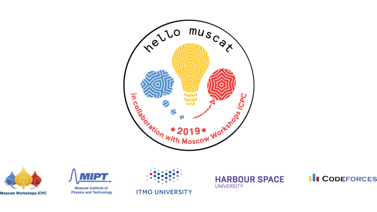

# Announcement

On [Wednesday, November 28, 2018 at 20:35UTC+6](https://codeforces.com/https://www.timeanddate.com/worldclock/fixedtime.html?day=28&month=11&year=2018&hour=17&min=35&sec=0&p1=166) [Educational Codeforces Round 55 (Rated for Div. 2)](https://codeforces.com/contest/1082 "Educational Codeforces Round 55 (Rated for Div. 2)") will start.

Series of Educational Rounds continue being held as [Harbour.Space University](https://codeforces.com/https://harbour.space/) initiative! You can read the details about the cooperation between [Harbour.Space University](https://codeforces.com/https://harbour.space/) and Codeforces in the [blog post](//codeforces.com/blog/entry/51208).

This round will be **rated for the participants with rating lower than 2100**. It will be held on extented ACM ICPC rules. The penalty for each incorrect submission until the submission with a full solution is 10 minutes. After the end of the contest you will have 12 hours to hack any solution you want. You will have access to copy any solution and test it locally.

You will be given **7 problems** and **2 hours** to solve them.

The problems were invented and prepared by Mike [MikeMirzayanov](https://codeforces.com/profile/MikeMirzayanov "Headquarters, MikeMirzayanov") Mirzayanov, Roman [Roms](https://codeforces.com/profile/Roms "Master Roms") Glazov, Adilbek [adedalic](https://codeforces.com/profile/adedalic "International Master adedalic") Dalabaev, Vladimir [vovuh](https://codeforces.com/profile/vovuh "Candidate Master vovuh") Petrov, Ivan [BledDest](https://codeforces.com/profile/BledDest "Grandmaster BledDest") Androsov and me.

Good luck to all participants!

Our friends at Harbour.Space also have a message for you:

Hello Codeforces!

We are excited to announce that the [Hello Muscat Programming Bootcamp](https://in.harbour.space/icpc/icpc-hello-muscat-bootcamp-2019/?utm_source=codeforces) registration is open! The camp will take place from March 9th to March 15th, 2019, and our early bird discount of 15% is going until December 15th!

This next edition in our Hello Programming Bootcamp will run in parallel with the traditional Moscow ICPC Workshop — both Bootcamps’ contests will be identical, and contestants will be able to see their position in the General Leaderboard. Every day, both camps will be competing simultaneously, 4,000 kilometers from each other!

  [REGISTER FOR THE BOOTCAMP](https://in.harbour.space/icpc/icpc-hello-muscat-bootcamp-2019/?utm_source=codeforces) We would also like to remind you that the deadline for applying to the [Master’s in Robotics programme scholarship](https://in.harbour.space/remy-robotics-scholarship/?utm_source=codeforces) will close November 30th, so we encourage you to check out the website to see the all the requirements and apply!

  [APPLY HERE](https://in.harbour.space/remy-robotics-scholarship/?utm_source=codeforces) **UPD:** You can discuss the problems after the contest at a [local Discord server](https://codeforces.com/blog/entry/52778).

**UPD2:** 

Congratulations to the winners: 

| Rank | Competitor | Problems Solved | Penalty |
| --- | --- | --- | --- |
| 1 | [I_love_Tanya_Romanova](https://codeforces.com/profile/I_love_Tanya_Romanova "International Grandmaster I_love_Tanya_Romanova") | 7 | 157 |
| 2 | [theodor.moroianu](https://codeforces.com/profile/theodor.moroianu "Master theodor.moroianu") | 7 | 330 |
| 3 | [halyavin](https://codeforces.com/profile/halyavin "Legendary Grandmaster halyavin") | 7 | 361 |
| 4 | [Radewoosh](https://codeforces.com/profile/Radewoosh "Legendary Grandmaster Radewoosh") | 6 | 158 |
| 5 | [palayutm2001](https://codeforces.com/profile/palayutm2001 "Master palayutm2001") | 6 | 190 |

Congratulations to the best hackers: 

| Rank | Competitor | Hack Count |
| --- | --- | --- |
| 1 | [halyavin](https://codeforces.com/profile/halyavin "Legendary Grandmaster halyavin") | **131****:-8** |
| 2 | [zdw1999](https://codeforces.com/profile/zdw1999 "Candidate Master zdw1999") | **55****:-4** |
| 3 | [MarcosK](https://codeforces.com/profile/MarcosK "Candidate Master MarcosK") | **42****:-1** |
| 4 | [ismagilov.code](https://codeforces.com/profile/ismagilov.code "Master ismagilov.code") | **64****:-48** |
| 5 | [garipov.roma](https://codeforces.com/profile/garipov.roma "Specialist garipov.roma") | **48****:-24** |

1354 successful hacks and 1065 unsuccessful hacks were made in total!

And finally people who were the first to solve each problem: 

| Problem | Competitor | Penalty |
| --- | --- | --- |
| A | [I_love_Tanya_Romanova](https://codeforces.com/profile/I_love_Tanya_Romanova "International Grandmaster I_love_Tanya_Romanova") | 0:02 |
| B | [Dalgerok](https://codeforces.com/profile/Dalgerok "Master Dalgerok") | 0:04 |
| C | [I_love_Tanya_Romanova](https://codeforces.com/profile/I_love_Tanya_Romanova "International Grandmaster I_love_Tanya_Romanova") | 0:08 |
| D | [hitman623](https://codeforces.com/profile/hitman623 "Master hitman623") | 0:15 |
| E | [lqs2015](https://codeforces.com/profile/lqs2015 "Master lqs2015") | 0:11 |
| F | [ko_osaga](https://codeforces.com/profile/ko_osaga "Legendary Grandmaster ko_osaga") | 0:47 |
| G | [RomaWhite](https://codeforces.com/profile/RomaWhite "International Grandmaster RomaWhite") | 0:08 |

**UPD3:** [Editorial is out](//codeforces.com/blog/entry/63544)

