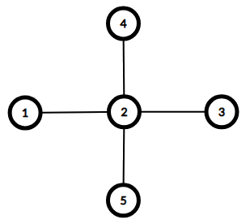

<h1 style='text-align: center;'> D. Maximum Diameter Graph</h1>

<h5 style='text-align: center;'>time limit per test: 2 seconds</h5>
<h5 style='text-align: center;'>memory limit per test: 256 megabytes</h5>

Graph constructive problems are back! This time the graph you are asked to build should match the following properties.

The graph is connected if and only if there exists a path between every pair of vertices.

The diameter (aka "longest shortest path") of a connected undirected graph is the maximum number of edges in the shortest path between any pair of its vertices.

The degree of a vertex is the number of edges incident to it.

Given a sequence of $n$ integers $a_1, a_2, \dots, a_n$ construct a connected undirected graph of $n$ vertices such that:

* the graph contains no self-loops and no multiple edges;
* the degree $d_i$ of the $i$-th vertex doesn't exceed $a_i$ (i.e. $d_i \le a_i$);
* the diameter of the graph is maximum possible.

##### Output

 the resulting graph or report that no solution exists.

##### Input

The first line contains a single integer $n$ ($3 \le n \le 500$) — the number of vertices in the graph.

The second line contains $n$ integers $a_1, a_2, \dots, a_n$ ($1 \le a_i \le n - 1$) — the upper limits to vertex degrees.

##### Output

Print "NO" if no graph can be constructed under the given conditions.

Otherwise print "YES" and the diameter of the resulting graph in the first line.

The second line should contain a single integer $m$ — the number of edges in the resulting graph.

The $i$-th of the next $m$ lines should contain two integers $v_i, u_i$ ($1 \le v_i, u_i \le n$, $v_i \neq u_i$) — the description of the $i$-th edge. The graph should contain no multiple edges — for each pair $(x, y)$ you output, you should output no more pairs $(x, y)$ or $(y, x)$.

## Examples

##### Input


```text
3
2 2 2
```
##### Output


```text
YES 2
2
1 2
2 3
```
##### Input


```text
5
1 4 1 1 1
```
##### Output


```text
YES 2
4
1 2
3 2
4 2
5 2
```
##### Input


```text
3
1 1 1
```
##### Output


```text
NO
```
## Note

Here are the graphs for the first two example cases. Both have diameter of $2$.

  $d_1 = 1 \le a_1 = 2$$d_2 = 2 \le a_2 = 2$

$d_3 = 1 \le a_3 = 2$ 

  $d_1 = 1 \le a_1 = 1$$d_2 = 4 \le a_2 = 4$

$d_3 = 1 \le a_3 = 1$

$d_4 = 1 \le a_4 = 1$ 


#### Tags 

#1800 #NOT OK #constructive_algorithms #graphs #implementation 

## Blogs
- [All Contest Problems](../Educational_Codeforces_Round_55_(Rated_for_Div._2).md)
- [Announcement](../blogs/Announcement.md)
- [Tutorial](../blogs/Tutorial.md)
