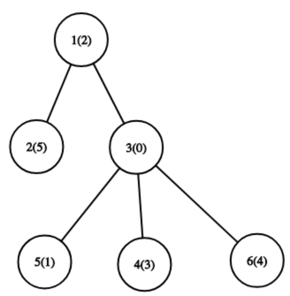
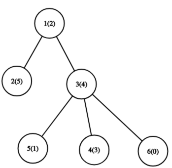
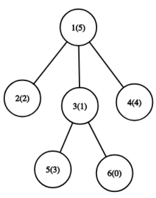
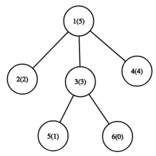
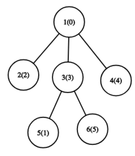
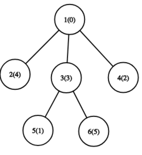
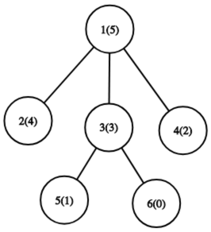

<h1 style='text-align: center;'> C. Max Mex</h1>

<h5 style='text-align: center;'>time limit per test: 3 seconds</h5>
<h5 style='text-align: center;'>memory limit per test: 256 megabytes</h5>

Once Grisha found a tree (connected graph without cycles) with a root in node $1$.

But this tree was not just a tree. A permutation $p$ of integers from $0$ to $n - 1$ is written in nodes, a number $p_i$ is written in node $i$.

As Grisha likes to invent some strange and interesting problems for himself, but not always can solve them, you need to help him deal with two types of queries on this tree.

Let's define a function $MEX(S)$, where $S$ is a set of non-negative integers, as a smallest non-negative integer that is not included in this set.

Let $l$ be a simple path in this tree. So let's define indices of nodes which lie on $l$ as $u_1$, $u_2$, $\ldots$, $u_k$. 

Define $V(l)$ as a set {$p_{u_1}$, $p_{u_2}$, $\ldots$ , $p_{u_k}$}. 

Then queries are: 

1. For two nodes $i$ and $j$, swap $p_i$ and $p_j$.
2. Find the maximum value of $MEX(V(l))$ in all possible $l$.
#### Input

The first line contains a single integer $n$ ($2 \leq n \leq 2 \cdot 10^5$) — the number of nodes of a tree.

The second line contains $n$ integers — $p_1$, $p_2$, $\ldots$, $p_n$ ($0\leq p_i < n$) — the permutation $p$, it's guaranteed that all numbers are different .

The third line contains $n - 1$ integers — $d_2$, $d_3$, $\ldots$, $d_n$ ($1 \leq d_i < i$), where $d_i$ is a direct ancestor of node $i$ in a tree.

The fourth line contains a single integer $q$ ($1 \leq q \leq 2 \cdot 10^5$) — the number of queries.

The following $q$ lines contain the description of queries:

At the beginning of each of next $q$ lines, there is a single integer $t$ ($1$ or $2$) — the type of a query: 

1. If $t = 1$, the line also contains two integers $i$ and $j$ ($1 \leq i, j \leq n$) — the indices of nodes, where values of the permutation should be swapped.
2. If $t = 2$, you need to find the maximum value of $MEX(V(l))$ in all possible $l$.

 
#### Output

For each type 2 query print a single integer — the answer for this query.

## Examples

#### Input


```text
6
2 5 0 3 1 4
1 1 3 3 3
3
2
1 6 3
2
```
#### Output


```text
3
2
```
#### Input


```text
6
5 2 1 4 3 0
1 1 1 3 3
9
2
1 5 3
2
1 6 1
2
1 4 2
2
1 1 6
2
```
#### Output


```text
3
2
4
4
2
```
## Note

Number written in brackets is a permutation value of a node. 

   In the first example, for the first query, optimal path is a path from node $1$ to node $5$. For it, set of values is $\{0, 1, 2\}$ and $MEX$ is $3$.    For the third query, optimal path is a path from node $5$ to node $6$. For it, set of values is $\{0, 1, 4\}$ and $MEX$ is $2$.    In the second example, for the first query, optimal path is a path from node $2$ to node $6$. For it, set of values is $\{0, 1, 2, 5\}$ and $MEX$ is $3$.    For the third query, optimal path is a path from node $5$ to node $6$. For it, set of values is $\{0, 1, 3\}$ and $MEX$ is $2$.    For the fifth query, optimal path is a path from node $5$ to node $2$. For it, set of values is $\{0, 1, 2, 3\}$ and $MEX$ is $4$.    For the seventh query, optimal path is a path from node $5$ to node $4$. For it, set of values is $\{0, 1, 2, 3\}$ and $MEX$ is $4$.    For the ninth query, optimal path is a path from node $6$ to node $5$. For it, set of values is $\{0, 1, 3\}$ and $MEX$ is $2$. 

#### Tags 

#2900 #NOT OK #data_structures #trees 

## Blogs
- [All Contest Problems](../Codeforces_Round_526_(Div._1).md)
- [Codeforces Round #526](../blogs/Codeforces_Round_526.md)
- [63753 (en)](../blogs/63753_(en).md)
- [63753 (ru)](../blogs/63753_(ru).md)
