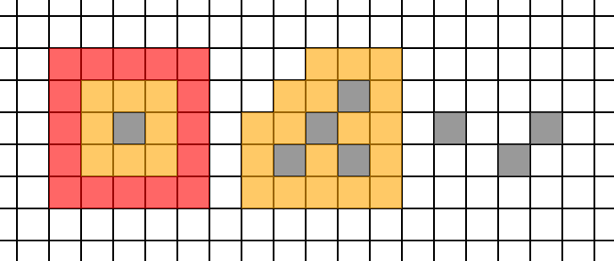

<h1 style='text-align: center;'> F. Forest Fires</h1>

<h5 style='text-align: center;'>time limit per test: 2.5 seconds</h5>
<h5 style='text-align: center;'>memory limit per test: 256 megabytes</h5>

Berland forest was planted several decades ago in a formation of an infinite grid with a single tree in every cell. Now the trees are grown up and they form a pretty dense structure.

So dense, actually, that the fire became a real danger for the forest. This season had been abnormally hot in Berland and some trees got caught on fire! 

The second fire started is considered the second $0$. Every second fire lit up all intact neightbouring trees to every currently burning tree. The tree is neighbouring if it occupies adjacent by side or by corner cell. Luckily, after $t$ seconds Berland fire department finally reached the location of fire and instantaneously extinguished it all.

Now they want to calculate the destructive power of the fire. Let $val_{x, y}$ be the second the tree in cell $(x, y)$ got caught on fire. The destructive power is the sum of $val_{x, y}$ over all $(x, y)$ of burnt trees.

Clearly, all the workers of fire department are firefighters, not programmers, thus they asked you to help them calculate the destructive power of the fire.

The result can be rather big, so print it modulo $998244353$.

##### Input

The first line contains two integers $n$ and $t$ ($1 \le n \le 50$, $0 \le t \le 10^8$) — the number of trees that initially got caught on fire and the time fire department extinguished the fire, respectively.

Each of the next $n$ lines contains two integers $x$ and $y$ ($-10^8 \le x, y \le 10^8$) — the positions of trees that initially got caught on fire.

Obviously, the position of cell $(0, 0)$ on the grid and the directions of axes is irrelevant as the grid is infinite and the answer doesn't depend on them.

It is guaranteed that all the given tree positions are pairwise distinct.

The grid is infinite so the fire doesn't stop once it reaches $-10^8$ or $10^8$. It continues beyond these borders.

##### Output

Print a single integer — the sum of $val_{x, y}$ over all $(x, y)$ of burnt trees modulo $998244353$.

## Examples

##### Input


```text
1 2
10 11
```
##### Output


```text
40
```
##### Input

```text

4 1
2 2
1 3
0 2
2 4

```
##### Output


```text
18
```
##### Input

```text

3 0
0 0
-2 1
1 1

```
##### Output


```text

0
```
## Note

Here are the first three examples. The grey cells have $val = 0$, the orange cells have $val = 1$ and the red cells have $val = 2$.

  

#### Tags 

#3500 #NOT OK #math 

## Blogs
- [All Contest Problems](../Codeforces_Round_528_(Div._1,_based_on_Technocup_2019_Elimination_Round_4).md)
- [Announcement](../blogs/Announcement.md)
- [Tutorial](../blogs/Tutorial.md)
